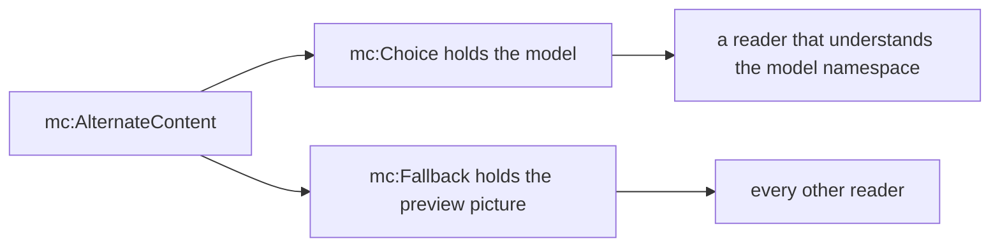

# 3D models

`slide.addModel3d()` embeds a glTF binary (`.glb`) in the `.pptx` and places it on the slide as a 3D model, the kind PowerPoint's Insert > 3D Models makes. PowerPoint 2019 and later draw the model, and a viewer can drag to rotate it.

```ts
import TsPptx from 'pptx-ts'

const pptx = new TsPptx()
pptx.addSlide().addModel3d({
  path: 'assets/engine.glb',
  preview: { path: 'assets/engine-render.png' },
  meterPerModelUnit: 1 / 240, // the model is 240 units across at its widest
  x: 1,
  y: 1,
  w: 6,
  h: 4,
})
await pptx.writeFile({ fileName: 'engine.pptx' })
```

`data` or `path` is required. Most models also need `preview` and `meterPerModelUnit`. The preview is what most readers draw, and the scale decides whether the camera frames the model. `addModel3d` returns the slide, so calls chain.

## Options at a glance

| Option | Type | Default | Effect |
| --- | --- | --- | --- |
| `data` | `string` | none | The `.glb` as base64, with or without a `data:` header |
| `path` | `string` | none | A file path or URL of a `.glb`, read when the deck is written |
| `preview` | `{ path?: string; data?: string }` | a gray placeholder, with a warning | The picture drawn wherever the model is not |
| `meterPerModelUnit` | `number` | `0.5` | Metres per model unit |
| `camera` | `Model3dCameraProps` | PowerPoint's camera for a 2 by 2 by 2 cube | The viewpoint |
| `x`, `y` | `Coord` | `0` | Top-left corner |
| `w`, `h` | `Coord` | `4`, `3` | Size |
| `objectName` | `string` | `3D Model 1`, `3D Model 2`, ... | Selection Pane name |
| `altText` | `string` | none | Alt text |
| `objectLock` | `ObjectLockProps` | none | Lock flags on the model's frame |

## Supply a preview picture

A model is written inside an `mc:AlternateContent` element with two branches. The `mc:Choice` branch holds the model and names the namespace a reader must understand to use it. The `mc:Fallback` branch holds an ordinary picture. A reader that understands the namespace draws the `mc:Choice` branch and ignores the other. Any other reader skips `mc:Choice` and draws the picture in `mc:Fallback`. An [OLE object](ole-objects.md) uses the same two branches for its cover.



| Reader | Branch it draws |
| --- | --- |
| PowerPoint 2019 and later, on screen | `mc:Choice`, the model |
| PowerPoint 2019 and later, exporting a slide to a picture | `mc:Choice`, the model |
| PowerPoint 2016 and earlier | `mc:Fallback`, the preview |
| any other application | `mc:Fallback`, the preview |

The library has no 3D renderer, so pass the preview as `preview`, by `path` or as base64 `data` with a header:

```ts
slide.addModel3d({ path: 'engine.glb', preview: { path: 'engine-render.png' } })
```

- With no `preview`, a 32 by 32 gray PNG is embedded and `model3d/preview-missing` warns. PowerPoint draws the model on screen, so the placeholder shows only where the fallback is read.
- A `preview.data` with no base64 header warns `preview-image/missing-base64-header`, and the gray PNG is embedded instead.
- The preview is stretched to the model's frame. Give it the frame's aspect ratio.
- The preview is stored once, however many branches refer to it.
- To make one, insert the model in PowerPoint, export the slide as a picture and crop it.

## Set the scale

The 3D scene is measured in metres, and `meterPerModelUnit` sets how many metres one unit of the model is. When PowerPoint inserts a model, it reads the bounding box and scales the largest dimension to 1 metre. The library does not parse the `.glb`, so it cannot measure the box. It writes `0.5`, which is right only for a model 2 units across.

Set `meterPerModelUnit` to 1 divided by the model's largest bounding-box dimension, in model units. Most exporters report that dimension. In the file it is the widest span between `min` and `max` on the `POSITION` accessors in the JSON chunk.

| Largest dimension, in model units | `meterPerModelUnit` to set | Size with that setting | Size at the default `0.5` |
| --- | --- | --- | --- |
| 0.1 | `10` | 1 m | 0.05 m |
| 2 | `0.5` | 1 m | 1 m |
| 20 | `1 / 20` | 1 m | 10 m |
| 240 | `1 / 240` | 1 m | 120 m |

The default camera sits 2.26 m from the centre of the scene. A 240-unit model left at `0.5` is 120 m across, so the camera is inside it and the slide shows a wall of shading.

- The value is stored to six decimal places. `1 / 240` is written as 0.004167.
- A value that is not a finite number above 0 throws `model3d/invalid-scale`, and so does a value below 0.0000005, which would be stored as 0.

## Set the camera

`camera` overrides the viewpoint. A field you leave out keeps its default, and the defaults are the camera PowerPoint wrote for a 2 by 2 by 2 cube:

| Field | Type | Default | Effect |
| --- | --- | --- | --- |
| `pos` | `Model3dPoint` | `{ x: 0, y: 0, z: 2.2630334 }` | Eye position, in metres |
| `lookAt` | `Model3dPoint` | `{ x: 0, y: 0, z: 0 }` | The point the camera aims at, in metres |
| `up` | `Model3dPoint` | `{ x: 0, y: 1, z: 0 }` | The up direction, not necessarily a unit vector |
| `fov` | `number` | `45` | Vertical field of view in degrees, above 0 and below 180 |

```ts
// 2.6 m from the origin, 35 degrees round and 25 degrees up
slide.addModel3d({
  path: 'cube.glb',
  preview: { path: 'cube-render.png' },
  camera: { pos: { x: 1.3516, y: 1.0988, z: 1.9303 }, lookAt: { x: 0, y: 0, z: 0 }, fov: 45 },
})
```

- With `meterPerModelUnit` scaling the model to 1 metre, the default camera frames a model that is about as deep and tall as it is wide.
- For any other shape, PowerPoint keeps `lookAt` at the origin and moves the camera back until it contains the model's bounding sphere:

  ```text
  pos.z = |halfExtents| / maxExtent / sin(fov / 2)
  ```

  `|halfExtents|` is the length of the vector of half the box's width, height and depth. For a cube at 45 degrees that is `(√3 / 2) / sin(22.5°)`, which is 2.2630334, the default. For a 1 by 1 by 8 box it is 1.32682.
- Changing `fov` does not move the default `pos`, so a narrower view zooms in.
- A `pos`, `lookAt` or `up` component that is missing or not a finite number throws `model3d/invalid-camera`. An `fov` outside its range throws `model3d/invalid-fov`.

## Size the model

- `w` and `h` default to 4 by 3 inches, and `x` and `y` to 0. A model has no aspect ratio of its own and the library does not open it, so set all four.
- `objectLock` flags go on the model's frame. The preview picture carries a fixed set of locks.

## Invalid input

Throws happen inside the `addModel3d()` call, as `InvalidOptionError`. A file that fails to load is reported when the deck is written.

| Condition | Warns or throws | Code |
| --- | --- | --- |
| neither `data` nor `path` is set | throws | `model3d/missing-source` |
| a `pos`, `lookAt` or `up` component is missing or not a finite number | throws | `model3d/invalid-camera` |
| `fov` is not a finite number above 0 and below 180 | throws | `model3d/invalid-fov` |
| `meterPerModelUnit` is not a finite number above 0, or is below 0.0000005 | throws | `model3d/invalid-scale` |
| `x`, `y`, `w` or `h` is not a finite number | throws | `coord/non-finite` |
| `w` or `h` is 0 | warns, and the zero is kept | `frame/zero-extent` |
| no `preview` | warns, and the gray placeholder is embedded | `model3d/preview-missing` |
| `preview.data` has no base64 header | warns, and the gray placeholder is embedded | `preview-image/missing-base64-header` |
| `path` or `preview.path` fails to load (when written) | throws `MediaError` | `media/load-failed` |
| the same, with `onMediaError: 'placeholder'` | still throws `MediaError`, because a placeholder picture cannot stand in for the payload | `media/load-failed` |
| `objectName` is only whitespace, longer than 255 characters, or holds control characters | warns | `object-name/empty`, `object-name/too-long`, `object-name/control-characters` |

[Errors and warnings](errors-and-warnings.md) covers the error classes and how to route warnings.

## Limits

- Linked models, which point at a file outside the package, cannot be authored.
- A model is one `.glb` file. A `.gltf` with separate `.bin` and texture files is several files, so convert it to `.glb` first.
- The library stores the bytes it is given as a `.glb` part without reading them. It measures no bounding box and does not notice a file that is not glTF.
- The lighting is fixed: one ambient light and three point lights.
- No animation settings are written, so an animation clip in the `.glb` has nothing to start it.
- `meterPerModelUnit` keeps six decimal places.
- `pptx-ts/read` has no typed accessor for a model.

## Reading it back

```ts
import { readFile } from 'node:fs/promises'
import { Presentation } from 'pptx-ts/read'

const deck = await Presentation.load(await readFile('engine.pptx'))
for (const slide of deck.slides) {
  for (const shape of slide.shapes) {
    if (shape.shapeType === 'graphicFrame') console.log(shape.name)
  }
}
```

- Before export, [`slide.objects`](groups.md#list-what-a-slide-holds) lists the model with `type: "model3d"` and `canGroup: false`.
- `pptx-ts/read` loads the model as a `graphicFrame` shape whose `name` is its `objectName`. There is no accessor for the camera, the scale or the payload. See [Kept but not decoded](reference/round-trip.md#kept-but-not-decoded).
- Loading and saving a deck leaves the slide, its relationships and the `.glb` part byte-identical. `importSlide` carries the model, its `.glb` and its preview into the target deck.
- [Inspect a package](reference/pptx-inspection.md) reports the model as a `graphicFrame` element with `graphicKind: 'other'`.
- [`pptx-ts/script`](reference/pptx-to-script.md) raises the `graphicFrame.unknown` fidelity note for a model, because it cannot write one back out.

## See also

- [OLE embedded objects](ole-objects.md)
- [Groups](groups.md), for `slide.objects`
- [Read and edit a deck](reading/read-and-edit.md)
- [Errors and warnings](errors-and-warnings.md)
- API reference: [`Model3dProps`](reference/api/index/type-aliases/Model3dProps.md), [`Model3dCameraProps`](reference/api/index/interfaces/Model3dCameraProps.md), [`Model3dPoint`](reference/api/index/interfaces/Model3dPoint.md), [`ObjectLockProps`](reference/api/index/interfaces/ObjectLockProps.md), [`SlideObjectInfo`](reference/api/index/interfaces/SlideObjectInfo.md)
