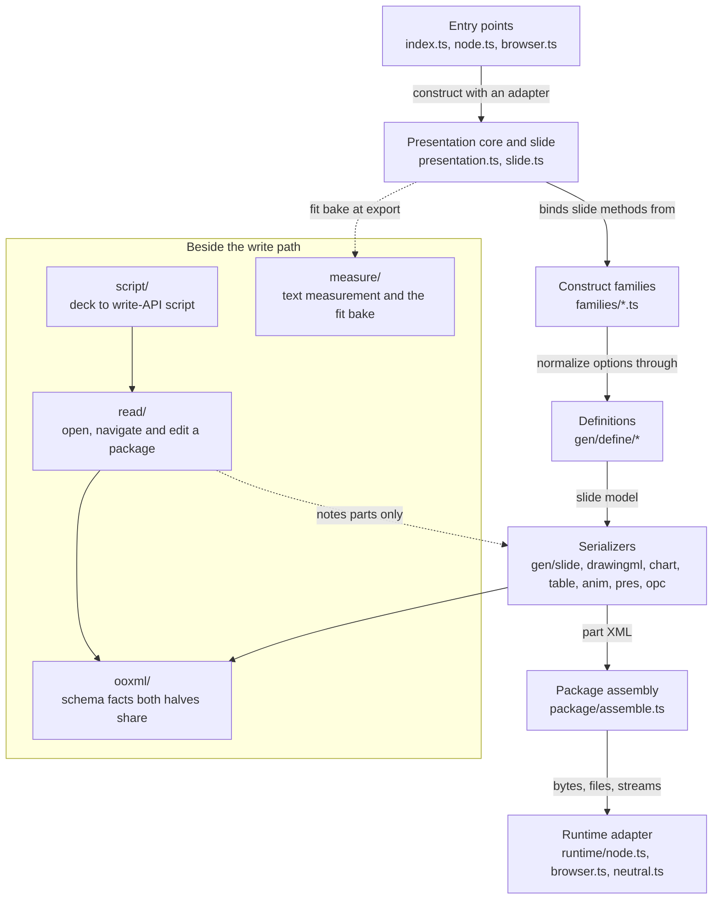
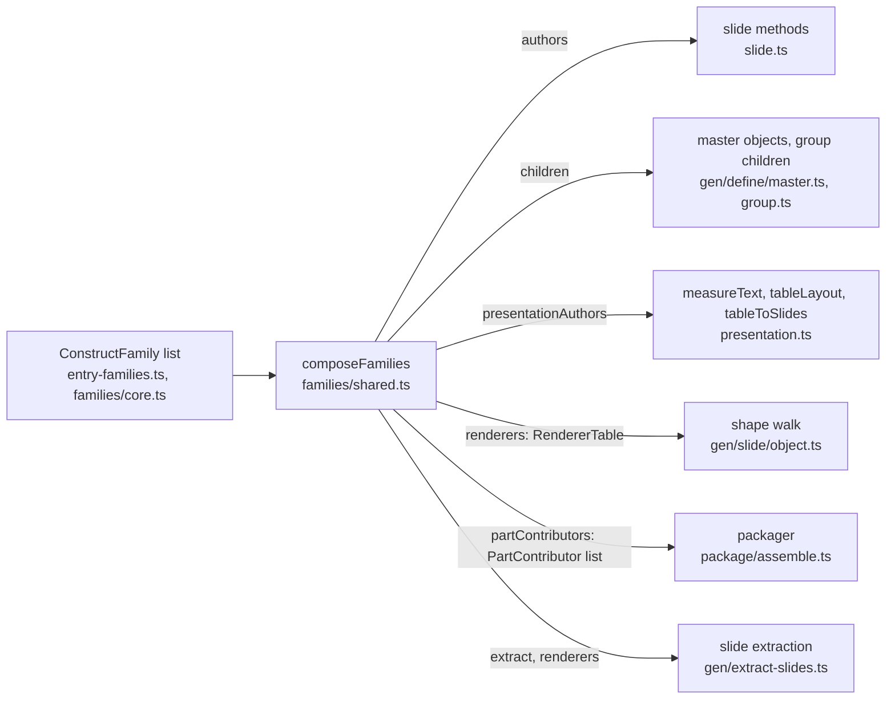

# Architecture

ts-pptx turns a presentation object model into an OOXML `.pptx` package. Consumers import the
package exports and nothing else. How the XML gets built stays on this side of that line.

## Layers

- **Entry points.** `src/index.ts`, `src/node.ts` and `src/browser.ts` each export a `TsPptx`
  subclass of `PresentationCore` and a `createPresentation`, and differ only in the
  `RuntimeAdapter` they inject. `.` resolves to one of them by condition: `node`, `browser`, or
  neither. `index.ts` is the neither case (Deno, Bun, edge workers): it authors and exports bytes,
  and refuses only what needs a host it does not have. `entry-surface.ts` and `entry-compose.ts`
  hold what the three share.
- **Presentation core and slide.** `src/presentation.ts` holds presentation-level state, the
  authoring API (`addSlide`, `defineSlideMaster`, ...) and metadata. `write`, `writeFile` and
  `stream` hand off to package assembly. Enums come from the package entry, not the instance.
  `src/slide.ts` holds slide state: the object list, the rel arrays, the slide number and the
  background. Its `add*` methods are bound onto each instance from the composed families.
- **Construct families.** One `ConstructFamily` value per construct. See
  [Extension seams](#extension-seams).
- **Definitions.** `gen/define/*` normalizes user options onto the slide model. No XML exists yet.
- **Serializers.** `gen/{slide,drawingml,chart,table,anim,pres,opc}/*` turn the model into part XML
  at export time. `gen/slide/object.ts` walks a shape tree and hands each object to its renderer
  under `gen/slide/objects/`. Chart emission splits per plot family under `gen/chart/` behind
  `makeChartType`. A chart's embedded workbook and every formula in its chart part are laid out from
  one `worksheetLayout` in `gen/chart/data-refs.ts`, and
  `test/regression/chart/chart-worksheet-invariant.test.js` resolves each formula through the
  workbook. `gen/utils.ts` holds the helpers no single part owns: XML escaping, object names, rel
  ids.
- **Package assembly.** `package/assemble.ts`. `buildPackageParts` produces every part in emission
  order, `zipPackageParts` compresses them, and `writePackage` composes the two. It reads a
  structural `PackageSource`, so it never imports the presentation class. `pptx.toParts()` exposes
  the parts as `{ path, data }`. **Part paths and their order are a stable public contract.** Adding
  a part is compatible. Renaming or reordering one breaks. Each part's bytes equal what `write()`
  compresses.
- **Runtime adapter.** `src/runtime/*`. See [Boundaries](#boundaries).

### `src/read/`

`read/opc/` is the package, part and relationship layer. `read/oxml/` is the DOM layer plus the
pure resolvers: `theme.ts` for colour and style-matrix resolution, `placeholder-inherit.ts` for what
a placeholder inherits from its layout and master. `read/api/` is the navigable object model.
`read/api/ops/` moves parts between packages: part copy, master registry, import, prune, rescale,
and the `preserve`-mode `flatten.ts`.

The line between `read/oxml/` and `read/api/ops/` is mutation. The resolvers answer "what would
this be?" and build detached elements. The ops write the answers into a live part. That line lets
the read model's getters and the import-time bake share one implementation, so a colour reported
before export equals the colour written into the file.

`read/api/presentation-imports.ts` is the one file in `read/api/` that is not object model. It
holds the bodies of `Presentation`'s four import entry points, whose contracts stay on the class as
doc comments. It is not an `ops/` module, because it reaches back into the deck for three
`@internal` members.

### `src/ooxml/`

The schema facts that belong to neither half: relationship-type URIs (`rel-types.ts`), the child
sequence of each complexType a writer or an editor inserts into (`sequence.ts`), the `ST_`
enumerations (`st-enums.ts`), the enum-validation policies (`check-enum.ts`), namespaces, content
types and the XML prolog. A private copy on each side gives no compile-time signal when the two
diverge. A wrong rel URI matches nothing, and an out-of-order child makes PowerPoint report a
corrupt file.

Each successor list is derived by slicing one declared sequence, and each `ST_` union is derived
from the tuple the validator checks (`(typeof X)[number]`), so a type and its runtime list cannot
drift. `ooxml-literals:check` fails on a schema URI or vendor content type spelled outside this
directory without an allowlist entry.

### `src/measure/`

The calibrated text-measurement engine behind `pptx-ts/measure` and the export-time autofit bake:
`font-metrics.ts` (advance widths and the registry), `text-fit.ts` (the wrap simulator and the
shrink and resize solvers), `paragraphs.ts` (authored object to simulator input), `table-fit.ts`
(`computeTableLayout` and the cell-grid walk), and `fit.ts` (the pass that measures and rewrites
slide objects before the XML build). `src/measure.ts` is the public barrel.
[Text that fits: design](design/text-fit.md) has the model.

### `src/script/`

`readModelToIr` turns a deck read through `src/read/` into a serializable description of the
write-API calls that would rebuild it, and the printers turn that description into a runnable
TypeScript module. `from-read/` knows OOXML and the read model, `print/` knows only strings, and
neither can see the other. That keeps the mapping testable without a printer, and keeps "how a
number is spelled" from changing what a deck means.

It is its own subsystem because it depends on both halves, the read model and the write option
types. `src/read/` is also isomorphic, bytes in and bytes out, and a converter that emits source
text would break that for every `pptx-ts/read` consumer. Losses are data: anything that cannot
survive becomes a `FidelityNote` on the IR, so a round-trip check can exclude exactly the declared
losses and treat every other difference as a defect.

The two printers differ only in where a deck's chrome comes from. `printScript` anchors its output
on the source deck through `Presentation.fromTemplate`, which strips the slides and leaves masters,
layouts, theme and document properties byte-identical. `printStandaloneScript` depends on nothing
but this package: it re-authors the theme and one `defineSlideMaster` per source layout from what
the read model exposes. [What the standalone output cannot rebuild](../reference/pptx-to-script.md#what-the-standalone-output-cannot-rebuild)
lists the chrome constructs neither side can reach.

- Each printer returns only the notes that apply to its output. `NOTE_CONSTRUCTS` in
  `src/script/fidelity.ts` tags every construct with the printers it describes, and
  `noteAppliesTo` filters on the tag. An entry without a tag does not type-check. On a slide it
  copies, `printScript` drops the transcription notes and keeps `slide.carried` with the frame's own
  note. That printed set, not `DeckIr.fidelity`, is what a round-trip check excludes.
- The layout walk reuses the slide shape mapper, and `layoutShapeScope` prefixes a layout note with
  `layout.`. Without the prefix the template-anchored printer, which rebuilds no layout, would report
  it, and `diffDeckIr` would let a layout note excuse the same difference on a slide, because shape
  names repeat between a layout and its slides.
- Inch-typed options (`colW`, `rowH`, `margin`, `defineLayout`'s size) print at `INCH_DECIMALS`
  (six) in `src/script/units.ts`. Six decimals move a value by at most 0.4572 EMU, under the half
  EMU `Math.round` recovers. Five allow 4.572 EMU. `appendSlides` compares slide sizes for equality,
  so an imprecise `defineLayout` throws.
- `from-read/transition.ts` admits a transition only when its namespace is `p` and its name is in
  `TRANSITION_TYPES`. The modern effect names are disjoint from the base names today, so only the
  namespace check stops a `p14:fade` printing as `<p:fade/>`. `test/read/script-ir.test.js` authors
  that case.
- The standalone printer emits no layout placeholders. `addPlaceholdersToSlideLayouts` in
  `src/gen/define/placeholder.ts` gives every slide an empty shape for each layout placeholder it
  does not fill, and the mapper writes every source shape as positioned content, so declaring them
  would add empty shapes to every slide.
- `printScript` binds a batch by layout name when the name is unique and by gallery position
  otherwise, because `appendSlides` throws on an ambiguous name and binds one layout per call.

`verify/` holds the round-trip check. `canonicalDeckIr` drops only values whose explicit and absent
spellings are the same OOXML default. `diffDeckIr` compares the source deck's IR with the IR of the
deck the script produced, with the printer's notes as the exclusion list. It compares IRs because
the output is never byte-identical: rel ids and shape ids are regenerated. It detects asymmetry
only. [What a clean run does not prove](../reference/pptx-to-script.md#what-a-clean-run-does-not-prove)
states the rest, and [Deck to script](../reference/pptx-to-script.md) is the user guide.

### `src/types/`

`src/types/index.ts` is a re-export barrel over `src/types/*`, split by domain, and with
`src/enums.ts` it is the public typed contract. The generator-internal `*Internal` shapes live in
`src/types/internal.ts`, which is not re-exported. `units-internal.ts` (lenient unit conversion) and
`constants-internal.ts` (generator defaults, fixed ids, palettes) follow the same convention beside
the public modules they extend.

## Extension seams

A construct family reaches the write path through three values it is handed, never through an
import.

All three exist for one bundling fact. A named import inside a reachable function body is retained
unconditionally, and a class method body is never shaken. A slide method that called
`addChartDefinition` itself would link every plot module into every program that makes a slide, and
a packager that named `createExcelWorksheet` would link all of `gen/chart/` into every program that
writes a deck.

They are passed rather than registered in module-level maps. A never-reset module global, the
chart-part-id counter in `package/assemble.ts`, once made the same input produce different bytes.
And two presentations composed differently in one process must each keep their own families.

- **The family list.** `TsPptx` composes `ALL_CONSTRUCT_FAMILIES` (`entry-families.ts`), and the
  browser entry adds `families/table-dom.ts`, the one piece that needs a `document`.
  `createPresentation({ use })` composes the core tier in `families/core.ts` (text, shape, image,
  group, notes) plus what it is given, and writes the same deck part for part. `pptx-ts/families`
  (`families.ts`) is where a caller takes the values from. `addSlide()` answers a slide typed with
  exactly the composed methods. A method whose family was not composed throws
  `family/not-composed`, naming the family. There is no second lean entry point: it would need the
  same three-condition treatment `.` gets, for nothing export-level shaking does not give.
- **The renderer table.** `RendererTable` (`gen/slide/objects/shared.ts`) is keyed by object kind,
  and every renderer takes one `RenderContext`. It travels from `PackageSource.renderers` through
  `makeXmlSlide`, `makeXmlLayout` and `makeXmlMaster` into the walk, so `gen/slide/object.ts` is the
  only module that knows which object kinds exist. An object whose kind the table lacks throws
  `slide/object-type-not-routed`. It has already reserved a `<p:cNvPr>` id that connector bindings,
  animation targets and group bounds may point at, and PowerPoint repairs a dangling reference.
- **The part contributors.** `PartContributor` (`package/parts/shared.ts`). Charts, comments and
  notes add parts. Zip part order and `[Content_Types].xml` are byte-significant, so each
  contributor declares an `order` and the packager sorts by it. Content-type entries arrive as data
  grouped by slot, so `gen/opc/content-types.ts` keeps its fixed sequence.

What stays core is what no tier can drop: the slide background, `createSlideMaster` (handed the
child table), the shape-id allocator and `resolveObjectName`, and the export-time autofit bake.
Three package concerns also stay in `package/assemble.ts`:

- The chart-part-id pass is package-wide ordering. It must number identically for a deck with no
  charts, and `gen/chart/chartex-xml.ts` derives its series GUIDs from the id it assigns.
- Media parts stay, because any deck can carry a picture. The chart contributor runs immediately
  before them per target, which keeps the zip's chart-then-media interleaving.
- `ppt/theme/theme2.xml` stays with the theme it pairs with, although only
  `notesMaster1.xml.rels` references it.

### Core files must not import a family

> **A static import from `slide.ts`, `gen/slide/object.ts` or `package/assemble.ts` into a family
> module is what the tier budget is watching for.**

Every program that builds a deck reaches those three files, so one such import puts that family in
every program's graph again, including the ones composed without it.

Nothing else catches it. The types check, the tests pass, the emitted bytes are identical, and
`bundle-size:check` does not move, because `dist/` ships the same files. Only `bundle-tier:check`
sees it: its composed rows climb toward the `TsPptx` rows until the budget fails. That is why the
tier budget measures composed programs, with the `full` row beside them as a control. The numbers
are on [Smaller bundles](../bundle-size.md).

A family module importing from `gen/` is ordinary, since its emitters live there. What must never
happen is the core path naming a family.

## Where does X live?

Most content follows two phases: an `add*Definition` in `gen/define/*` normalizes options onto the
slide model, then a serializer emits OOXML at export time. Each module opens with a TSDoc header
stating its job, and larger files carry `// ===== region =====` banners to grep for. Paths are under
`src/`.

| Task | File | Function |
| --- | --- | --- |
| Normalize text options | `gen/define/text.ts` | `addTextDefinition` |
| Emit a text body | `gen/drawingml/text-body.ts` | `genXmlTextBody` |
| Normalize shape options | `gen/define/shape.ts` | `addShapeDefinition` |
| Emit preset or custom geometry | `gen/drawingml/geometry.ts` | `genXmlPresetGeom`, `genXmlCustGeom` |
| Normalize a connector | `gen/define/connector.ts` | `addConnectorDefinition` |
| Emit a connector | `gen/slide/objects/connector.ts` | `renderConnectorObject` |
| Normalize an image | `gen/define/image.ts` | `addImageDefinition` |
| Emit a picture | `gen/slide/objects/image.ts` | `renderImageObject` |
| Normalize audio or video | `gen/define/media.ts` | `addMediaDefinition` |
| Emit audio or video | `gen/slide/objects/media.ts`, `gen/anim/timing.ts` | `renderMediaObject`, `slideTimingToXml` |
| Normalize a chart | `gen/define/chart.ts` | `addChartDefinition` |
| Emit a chart part | `gen/chart/chart-xml.ts` | `makeXmlCharts`, `makeChartType` |
| Emit a chart's embedded workbook | `gen/chart/embed-xlsx.ts` | `buildEmbeddedWorksheet` |
| Normalize a table | `gen/define/table.ts` | `addTableDefinition` |
| Page a table across slides | `gen/table/autopage.ts` | `getSlidesForTableRows` |
| Emit a table | `gen/slide/objects/table.ts` | `renderTableObject` |
| Convert an HTML `<table>` | `html.ts`, `gen/table/html-dom.ts` | `tableToSlides`, `genTableToSlides` |
| Group objects | `gen/define/group.ts` | `addGroupDefinition`, `groupObjectsDefinition` |
| Walk a shape tree, including groups | `gen/slide/object.ts` | `slideObjectToXml` |
| Normalize speaker notes | `gen/define/notes.ts` | `addNotesDefinition` |
| Emit a notes slide | `gen/slide/notes.ts` | `makeXmlNotesSlide` |
| Normalize a comment | `gen/define/comment.ts` | `addCommentDefinition` |
| Emit comments | `gen/slide/comments.ts` | `makeXmlComments` |
| Emit the slide-number placeholder | `gen/slide/object.ts` | `slideNumberPlaceholderXml` |
| Emit a transition | `gen/anim/transition.ts` | `slideTransitionToXml` |
| Emit animations | `gen/anim/animation.ts` | `buildAnimationSeq` |
| Define a slide master | `gen/define/master.ts` | `createSlideMaster` |
| Emit a master or layout | `gen/slide/master.ts`, `gen/slide/layout.ts` | `makeXmlMaster`, `makeXmlLayout` |
| Emit the theme | `gen/pres/theme.ts` | `makeXmlTheme`, `buildThemeClrScheme` |
| Convert units to EMU | `units.ts` (strict, public), `units-internal.ts` (lenient) | `getSmartParseNumber` |
| Emit a colour | `gen/drawingml/color.ts` | `createColorElement` |
| Emit a fill | `gen/drawingml/fill.ts` | `genXmlColorSelection` |
| Emit a line | `gen/drawingml/line.ts` | `genXmlLineFill`, `createLineCap` |
| Emit a shadow or glow | `gen/drawingml/effect.ts` | `createShadowElement`, `createGlowElement` |
| Build the package parts | `package/assemble.ts` | `buildPackageParts` |
| Zip and write the package | `package/assemble.ts` | `zipPackageParts`, `writePackage` |
| Emit content types and root rels | `gen/opc/content-types.ts`, `gen/opc/root-rels.ts` | `makeXmlContTypes`, `makeXmlRootRels` |
| Public enums and constants | `enums.ts`, `constants-internal.ts` (generator-only) | |
| Option and type definitions | `types/index.ts` (barrel over `types/*`) | |

## Boundaries

- **One build.** One ESM build ships, and every consumer loads it: Node (including through
  `require()`), bundlers, and browsers through a bundler or an ESM CDN. `dist/` is generated output,
  never hand-edited.
- **Internal generators stay internal.** OOXML generators are implementation details unless
  deliberately exposed through `package.json` exports and public declarations. Public API is added
  only through the entry points and their generated declarations. A change to exports, runtime
  targets or declaration output needs `pnpm run check:package`, and a new subpath needs a row in
  `EXPORT_MATRIX` in `scripts/package-smoke.mjs`.
- **Platform differences go through `RuntimeAdapter`.** Each entry injects its adapter into the
  shared core class. The live-DOM half of the table family (`families/table-dom.ts`) needs a
  `document`, so only the browser entry's `TsPptx` composes it. A composed program opts in through
  `domTables` on `pptx-ts/families`.
- **The neutral adapter is a fallback.** A runtime that resolves neither the `node` nor the
  `browser` condition gets `runtime/neutral.ts`. It implements what is host-neutral (`fetch`,
  `btoa`, `TextEncoder`, so remote media and fonts load) and throws
  `runtime/file-output-unavailable` from `writeFile` rather than inventing a host. A capability
  missing from a real host is a bug in that host's adapter, not something the neutral one should
  cover.
- **`src/read/` imports `src/gen/` in exactly two places.** `read/api/ops/notes-author.ts` and
  `read/api/ops/notes-master.ts` build a notes slide and a notes master through `gen/slide/notes.ts`
  (`makeXmlNotesMaster`, `makeXmlNotesSlideSkeleton`, the element builder). Adding a notes page to a
  loaded deck has to produce the part the write path produces, and two builders for one part come to
  disagree. The cost is that `pptx-ts/read` bundles `gen/slide/notes.ts` and its `drawingml` and
  `opc` graph. Everything else the halves share lives in `src/ooxml/`.
- **`src/ooxml/` imports neither half.** At run time its modules import nothing outside the
  directory, except `sequence.ts`, which imports `errors.ts`, and `check-enum.ts`, a warn-or-throw
  policy, which imports `errors.ts` and `diagnostics.ts`. A new fact a writer and a reader both name
  belongs there: a namespace, a relationship or content type, a schema sequence or enumeration.
- **Core files must not import a family.** See
  [the rule above](#core-files-must-not-import-a-family).
- **Emitted OOXML changes carry evidence.** A serialization change needs a schema fixture, and
  [OOXML agent context](ooxml.md) says what else counts.
