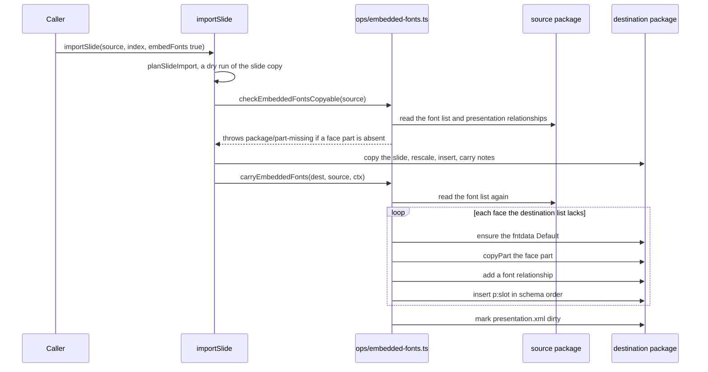

# Embedded fonts: design

The user guide is [Embedded fonts](../../embedded-fonts.md). This page is how the code behind it is
shaped.

## The package target

PresentationML stores an embedded font in three coordinated pieces:

| Piece | Where | Content |
| --- | --- | --- |
| font part | `/ppt/fonts/fontN.fntdata`, one per face | the raw TTF or OTF bytes; PresentationML does not obfuscate fonts, unlike WordprocessingML's `.odttf` |
| content type | `[Content_Types].xml` | one `Default Extension="fntdata" ContentType="application/x-fontdata"` covering every font part |
| relationship | `ppt/_rels/presentation.xml.rels`, one per face | type `http://schemas.openxmlformats.org/officeDocument/2006/relationships/font`, target `fonts/fontN.fntdata` |
| font list | `p:embeddedFontLst` in `presentation.xml` | one `p:embeddedFont` per typeface, naming each face by `r:id` |

```xml
<p:embeddedFontLst>
  <p:embeddedFont>
    <p:font typeface="Silkscreen" pitchFamily="2" charset="0"/>
    <p:regular r:id="rId3"/>
    <p:bold r:id="rId4"/>
  </p:embeddedFont>
</p:embeddedFontLst>
```

- `p:embeddedFontLst` is child 7 of `CT_Presentation`, after `smartTags` and before `custShowLst`. The
  generator writes neither of those, so in its output the list sits between `p:notesSz` and
  `p:defaultTextStyle`.
- `CT_EmbeddedFontListEntry` is `font`, then `regular`, `bold`, `italic`, `boldItalic`. `p:font` is
  required and takes `typeface` plus optional `panose`, `pitchFamily` and `charset`. Each face is
  `0..1`.
- `p:presentation` carries `embedTrueTypeFonts` and `saveSubsetFonts`, both `xsd:boolean` defaulting to
  `false`. The generator writes `embedTrueTypeFonts="1" saveSubsetFonts="0"` when any face has bytes,
  because it embeds whole faces, and `saveSubsetFonts="1"` alone otherwise.

## The shared model

`src/embedded-fonts.ts` holds the representation both directions use, and only knowledge of the
OOXML shape. Relationship id allocation and part placement stay with each caller, because the
generator writes a fresh zip and the read side edits an open package.

| Export | What it is |
| --- | --- |
| `EmbeddedFont` | `{ typeface, panose?, pitchFamily?, charset?, faces }`, one `p:embeddedFont` |
| `EmbeddedFontFace` | `{ slot, bytes? }`; `bytes` is absent in a read-side merge |
| `EMBEDDED_FONT_SLOTS` | the four face slots in schema order, declared in `src/ooxml/st-enums.ts` |
| `FONT_DATA_EXTENSION`, `FONT_DATA_CONTENT_TYPE`, `FONT_REL_TYPE` | `fntdata`, `application/x-fontdata`, and `FONT_REL` from `src/ooxml/rel-types.ts` |
| `flattenEmbeddedFaces(fonts, firstRId)` | one `FlatEmbeddedFace` per face with bytes, in font order then slot order, with a 1-based `partIndex` and sequential `rId` |
| `serializeEmbeddedFontLst(fonts, rIdForFace)` | the `<p:embeddedFontLst>` string, or `''` when no face has an id; assumes the `p:` and `r:` prefixes are declared |

The module must not import from `src/gen/`, because `src/read/api/ops/embedded-fonts.ts` imports it.
Its attribute escaper is `encodeXmlAttrValue` from `src/xml-escape.ts`, which strips the characters
XML 1.0 forbids, so a `typeface` holding a control character cannot corrupt `presentation.xml`.

`src/ooxml/sequence.ts` derives the two insertion orders the read side needs from the same slot list:
`PRESENTATION_AFTER_EMBEDDED_FONT_LST` and `EMBEDDED_FONT_ENTRY_AFTER`.

## Writing a generated deck

`TsPptx.embedFont` (`src/presentation.ts`) validates its arguments, resolves the bytes through
`resolveFontBytes` (`src/font-source.ts`, where a string is a path unless `base64: true`), and adds the
face to `_embeddedFonts`, one `EmbeddedFont` per typeface. That list reaches the writers as
`PresentationPropsInternal.embeddedFonts` (`src/types/internal.ts`).

| Part | Writer | What it writes |
| --- | --- | --- |
| `[Content_Types].xml` | `makeXmlContTypes` (`src/gen/opc/content-types.ts`) | the `fntdata` Default, when any face has bytes |
| `ppt/_rels/presentation.xml.rels` | `makeXmlPresentationRels` (`src/gen/pres/presentation-rels.ts`) | one `font` relationship per face, ids from `presentationFontRelStart` |
| `ppt/presentation.xml` | `makeXmlPresentation` (`src/gen/pres/presentation.ts`) | the two flags on `p:presentation` and the list between `p:notesSz` and `p:defaultTextStyle` |
| `ppt/fonts/fontN.fntdata` | `buildPackageParts` (`src/package/assemble.ts`) | each face's bytes, stored without compression |

The relationship writer and the presentation writer each call `flattenEmbeddedFaces` with the id
`presentationFontRelStart` returns, so a face's `r:id` in the list matches its relationship. That
start comes from `presentationFixedRelIds`: `rId1` is the slide master, the slides follow, then
`notesMaster`, `presProps`, `viewProps`, `theme` and `tableStyles`, then `commentAuthors` when a slide
has a comment, then the fonts. `buildPackageParts` flattens the same list for the part names, so
`partIndex` agrees across all three.

`extractSlides` (`src/gen/extract-slides.ts`) passes the same list through as
`ExtractedSlides.embeddedFonts`, which is how `appendSlides` receives it.

## Carrying fonts into an open deck

`src/read/api/ops/embedded-fonts.ts` has one reader, two producers and one merge:

| Function | Role |
| --- | --- |
| `readEmbeddedFontEntries(deck)` | reads `p:embeddedFontLst` once, resolving each face's `r:id`; a face whose id names no internal relationship gets `partName: null`, an entry with no `typeface` and a slot with no `r:id` are left out |
| `checkEmbeddedFontsCopyable(source, api)` | the dry run: throws `package/part-missing` when a face's part is `null` or absent from the source package, reading only the source |
| `carryEmbeddedFonts(dest, source, ctx)` | turns the source entries into incoming fonts whose `createPart` copies the part through `copyPart`, leaving out an entry with no faces |
| `carryGeneratedEmbeddedFonts(dest, fonts)` | turns a generator's `EmbeddedFont[]` into incoming fonts whose `createPart` reserves a `/ppt/fonts/font1.fntdata`-style name and adds the bytes |
| `mergeEmbeddedFontEntries(dest, entries)` | the shared merge |
| `Presentation.embeddedFonts` (`src/read/api/presentation.ts`) | the public getter over `readEmbeddedFontEntries`, dropping faces with no part |

The getter, the dry run and the carry all go through `readEmbeddedFontEntries`, so they skip the same
entries. The merge core:

1. Gets or creates `p:embeddedFontLst` at its schema position.
2. Indexes the existing entries by `typeface`. An incoming typeface with no entry gets a new
   `p:embeddedFont` with the incoming `p:font` attributes. An existing entry keeps its own.
3. Skips a face whose slot the entry already has. `createPart` runs only for a face being added, so a
   duplicate never leaves an orphan part.
4. For each added face, calls `ensureDefault('fntdata', ...)` before `createPart`, so the new part takes
   its content type from the Default and gets no Override.
5. Adds a `font` relationship from `presentation.xml` and inserts `p:<slot>` in schema order through
   `EMBEDDED_FONT_ENTRY_AFTER`.
6. When it added a face, sets `embedTrueTypeFonts="1"` on the destination's `p:presentation` and marks
   `presentation.xml` dirty.

PowerPoint drops `p:embeddedFontLst` and every font part from a deck without `embedTrueTypeFonts` when
it saves, so a carry that left the flag off lasted one save. The merge does not touch `saveSubsetFonts`.

`copyPart` records each copied part in the per-source registry, so repeated imports from one source
copy each font part once.

Every import runs the dry run before it writes, because the carry runs last:

| Caller | Dry run | Carry |
| --- | --- | --- |
| `importSlide` (`src/read/api/presentation-imports.ts`) | after `planSlideImport`, before the slide copy | after the slide is inserted and the notes are carried |
| `importSlides` | once per source that any request asked for, after the batch plan | once per source, after the pages are copied and rescaled, before they are wired into `p:sldIdLst` |
| `importSlideMasters` | after the size check, before the master plan | after the masters and layouts are copied, before table styles |
| `appendSlides` (`src/read/api/ops/append-slides.ts`) | none; the bytes are in memory | after every slide is wired |

`importSlide` with `embedFonts`:



## Fixtures and tests

| Fixture or test | What it pins |
| --- | --- |
| `test/read/fixtures/embedded-fonts.pptx` | a PowerPoint-authored deck whose text box uses Silkscreen regular and bold, so both faces sit under one `p:embeddedFont`; the source of every import and read test |
| `test/read/fixtures/embedded-fonts.oracle.json` | that deck's verbatim `embeddedFontLst`, font relationships, part list, presentation flags and the hashes of the raw faces; a record, read by no test |
| `test/read/fixtures/fonts/Silkscreen-*.ttf` | whole SIL OFL faces with `fsType` Installable, fed to `embedFont` in the tests |
| `test/regression/media/embed-font.test.js` | `embedFont`: byte sources, one entry per typeface, slot order, last call wins, validation, and an unchanged deck with no calls |
| `test/schema-cases.js` | a generated deck with regular and bold against the OOXML validator, with the expected list written out |
| `test/read/embedded-fonts.test.js` | `importSlide` carry, repeated imports, flag off, validator, and the dangling-`r:id` refusal for all three imports |
| `test/read/import-slides.test.js`, `test/read/import-slide-masters.test.js` | the batch and master carries, including the byte-identical refusal |
| `test/read/append-embedded-fonts.test.js` | the `appendSlides` carry, repeated appends and the validator |
| `test/read/embedded-fonts-read.test.js` | `Presentation.embeddedFonts` on the fixture and after a carry |
| `test/regression/package/xml-attribute-escaping.test.js` | a `typeface` with control characters |

PowerPoint COM saves embedded fonts only as subsets, so the fixture's parts are subsets and its
presentation carries `saveSubsetFonts="1"`. The "Embed all characters" choice has no COM property.
Subsetting changes only the part bytes and that flag, so the fixture still pins the package structure
the generator writes, and the whole faces for the generator tests are committed under `fonts/`.
`test/read/fixtures/README.md` records the fixture's provenance.
