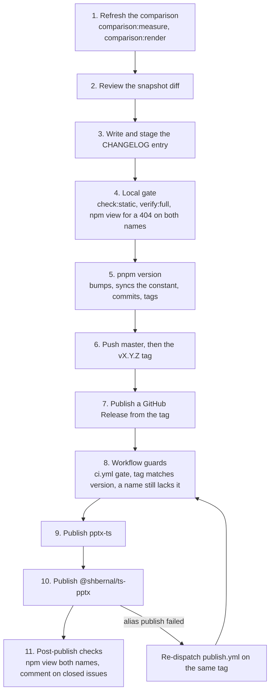

# Release workflow

Every release ships two packages with the same content. `pptx-ts` is the canonical name, and
`@shbernal/ts-pptx` is the scoped alias the project published under first. npm has no redirect, so
the alias is a second publish of the same build under a second name. `scripts/alias-package.mjs`
stages that copy: the `name` differs, the README gains a banner naming `pptx-ts`, and the `scripts`
block is dropped. You never bump, tag or stage the alias by hand.

`.github/workflows/publish.yml` publishes both, when a GitHub Release is published. The
[`release-publish` skill](https://github.com/shbernal/ts-pptx/blob/master/.agents/skills/release-publish/SKILL.md)
has the commands for each step. This page says why the steps are shaped the way they are.

## The release



## Prerequisites

- Each name, `pptx-ts` and `@shbernal/ts-pptx`, has its own trusted publisher on npm, because npm
  exchanges the OIDC token per package. Both name repository `shbernal/ts-pptx`, workflow
  `publish.yml`, environment `npm-publish`, and the action `npm publish`.
- The GitHub environment `npm-publish` exists.
- `package.json#repository.url` points at `shbernal/ts-pptx`.
- No `NPM_TOKEN` secret. The workflow authenticates through OIDC with `id-token: write`, and passes
  `--provenance` so provenance stays required if npm's default changes.

Nobody runs `npm publish` locally for a release, including to repair one. The retry path is the
workflow.

## Refreshing the comparison

The pptxgenjs comparison is refreshed first, so its numbers land in the release commit beside the
changelog entry. `comparison:measure` installs upstream pptxgenjs into a scratch directory, calls
the GitHub and npm APIs, and times both libraries for about a minute. That is why it is a release
step and not part of `verify`, which runs only `comparison:check` against the committed snapshot.
Leave the machine alone while it runs: a build in another window lands in the published timings.

`measure.mjs` refuses to write a snapshot with a hole in it. Never pass `--allow-unavailable` for a
release snapshot. A table missing rows because an API rate-limited is worse than a table one
release out of date, so re-run the fetch later instead.

### What to stop on in the snapshot diff

A diff whose only changes are `generatedAt`, a download count and the timing medians is the normal
case. A clock took the timings, so they move on every run, and a few percent either way means
nothing. Stop on these:

- **A coverage row that flipped**, in either direction. A construct one library emits and the other
  does not is the substance of the page. A flip means a real capability moved, or a probe stopped
  measuring what it claims to.
- **A validity count that moved**, ours especially. The page states how many probe decks pass the
  schema oracle, and a release is the wrong moment to find that number went down.
- **An upstream version bump.** It re-dates every claim on the page and makes the two checks above
  worth a closer look.
- **A timing row that changed sign, or a `compression` ratio near 1.** The page's reading of the
  timing tables holds only while every compressed row favours us and every stored row favours
  upstream, and the rendered page drops it when that stops being true. A ratio near 1 is the louder
  signal: one library stopped compressing when asked, so its compressed column times something else.

## Bumping the version

`package.json` holds the version of record, and the workflow refuses to publish unless the tag
matches it. `VERSION` in `src/presentation.ts`, behind `pres.version`, is derived from it by
`scripts/sync-version.mjs`, never edited by hand. `pnpm run version:check` reports a drift and
`pnpm run version:sync` repairs it. `test/regression/api/public-accessors.test.js` fails in `verify`
on a drift either way.

```bash
pnpm version minor --message 'chore(release): v%s' --no-git-checks
```

This bumps `package.json`, runs the `version` lifecycle script, which rewrites and stages the
constant, and makes one commit holding `package.json`, the constant and the staged `CHANGELOG.md`,
tagged `vX.Y.Z`. Both flags are needed:

- `--message`: pnpm's default subject is the bare version (`3.2.0`). pnpm ignores npm's `message`
  config, so setting it in `.npmrc` does nothing, and the flag is the only control.
- `--no-git-checks`: pnpm refuses to run on an unclean tree (`ERR_PNPM_UNCLEAN_WORKING_TREE`), and
  the staged `CHANGELOG.md` counts. Waiving the check keeps the release to one commit. It waives
  the check for everything, so run `git status` first and leave scratch files untracked.

The local gate runs before this command, so the tag lands on a commit that already passed
`check:static` and `verify:full`. CI runs the same gate again before it publishes.

## What the workflow checks

- It runs only in `shbernal/ts-pptx`.
- Its `gate` job calls `ci.yml` through `workflow_call`, and `publish` needs `gate`, so every CI leg
  passes first. [What gates a release](testing.md#what-gates-a-release) lists them.
- `GITHUB_REF_TYPE` must be `tag`, so a manual dispatch from a branch fails.
- The tag must equal `v` plus `package.json#version`.
- It checks both names for the version and fails only when both already have it.
- It builds once, publishes `pptx-ts`, then stages the alias with
  `node scripts/alias-package.mjs --out .tmp/alias-package` and publishes that directory. Each
  publish step is skipped when its own name already has the version.

### Retrying a half-published release

Publishing two names is not atomic. The canonical publish can succeed and the alias fail, which
leaves the version on npm under `pptx-ts` only. Re-dispatch the workflow on the same tag:

```bash
gh workflow run publish.yml --repo shbernal/ts-pptx --ref vX.Y.Z
```

The guard passes because one name still lacks the version, the `pptx-ts` step skips, and the alias
step publishes. The alias goes last on purpose, so a failure in it costs at most a re-dispatch and
never the release that already went out. The selected ref must be the tag, not `master`.

## After publishing

Comment on each issue the release closes with the version that carries the fix:

```bash
gh issue comment <N> --repo shbernal/ts-pptx --body "Released in X.Y.Z."
```

Issues here close when the fix merges, and merged-but-unreleased can last weeks. A consumer who
deletes a workaround because the issue is closed breaks against the version actually installed.
The `ts-pptx-upstream` skill tells consumers to trust the published version over the issue state,
and this comment is what makes the two agree. `CHANGELOG.md` cites the issue numbers, so the list is
the entry you just wrote.

### The site's deck preview

The demos page draws its preview with [`pptx-html`](https://www.npmjs.com/package/pptx-html), which
depends on `@shbernal/ts-pptx` at a caret range and so installs its own published copy. After a
major release the preview keeps rendering, but with the previous major's copy, so the page stops
showing the version it sits beside until `pptx-html` ships a matching release. No gate here detects that. Release anyway, then open an
issue on `pptx-html`. Do not pin the site to the workspace copy: the first breaking change would
then break the docs deploy of the release that introduced it.

That dependency is why `@shbernal/ts-pptx`, not `pptx-ts`, is in `minimumReleaseAgeExclude` in
`pnpm-workspace.yaml`. If `pptx-html` moves its dependency to `pptx-ts`, move the exclusion with it,
or the docs build cannot resolve for the 24 hours after each release.

## What the package ships

One ESM build ships, and `require()`, bundlers and ESM CDNs all load it. `scripts/package-smoke.mjs`
owns the package surface: `EXPORT_MATRIX` lists every export subpath `test:package` resolves from an
installed tarball, and its `assertFile` and `assertNoFile` calls name the files that must and must
not be in it. `package.json#files` limits the tarball to `dist/` and `skills/`. A new subpath is
covered once it has a matrix row.
