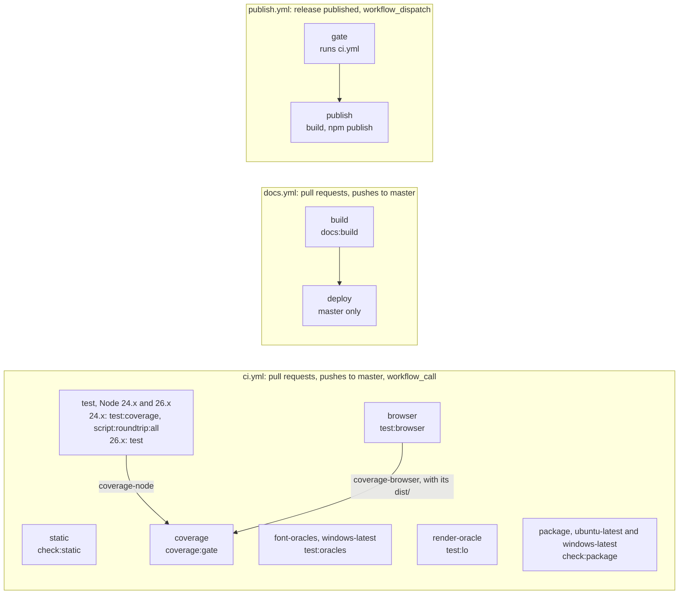
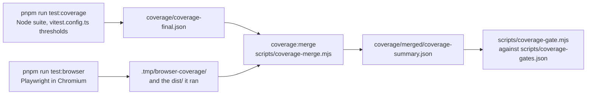

# Testing guide

This page records which gate runs where, what each suite and oracle proves, and how to run
them. Use `pnpm` for repository scripts. The package declares Node.js `>=24`.

## Gate matrix

Each cell comes from `package.json`, `lefthook.yml` or a workflow under `.github/workflows/`.
`node scripts/run-steps.mjs --list <aggregate>` prints what an aggregate runs.

| Gate | `verify` | `verify:full` | `check:static` | pre-commit | pre-push | CI job | Run when |
| --- | :-: | :-: | :-: | :-: | :-: | --- | --- |
| `typecheck` | ✓ | ✓ | ✓ | | ✓ | `static` | every change, through `verify` |
| `typecheck:scripts` | ✓ | ✓ | ✓ | | ✓ | `static` | every change, through `verify` |
| `typecheck:test` | ✓ | ✓ | ✓ | | | `static` | every change, through `verify` |
| `typecheck:site` | ✓ | ✓ | ✓ | | ✓ | `static` | every change, through `verify` |
| `raw-xml:check` | ✓ | ✓ | ✓ | | | `static` | every change, through `verify` |
| `ooxml-literals:check` | ✓ | ✓ | ✓ | | | `static` | every change, through `verify` |
| `path-refs:check` | ✓ | ✓ | ✓ | | | `static` | every change, through `verify` |
| `docs:api` | ✓ | ✓ | ✓ | | | `static` | every change, through `verify` |
| `docs:check` | ✓ | ✓ | ✓ | | | `static` | every change, through `verify` |
| `comparison:check` | ✓ | ✓ | ✓ | | | `static` | every change, through `verify` |
| `test` | ✓ | ✓ | | | | `test` (Node 26.x) | every change, through `verify` |
| `test:coverage` | | | | | | `test` (Node 24.x) | once before a commit; `coverage:probe` while editing |
| `docs:build` | | ✓ | | | | `docs.yml` `build`, and `browser` | before pushing; site, navigation or generated-docs changes |
| `script:roundtrip:all` | | ✓ | | | | `test` (Node 24.x) | before pushing a `src/script/` or `src/read/` change |
| `package:lint` | | ✓ | | | | `package` | before pushing; exports, entry points or shipped files change |
| `test:package` | | ✓ | | | | `package` | before pushing; exports, entry points or shipped files change |
| `bundle-size:check` | | ✓ | | | | `package` | before pushing; an import moves or a dependency arrives |
| `bundle-tier:check` | | ✓ | | | | `package` | before pushing; an import moves or a dependency arrives |
| `lint` | | | ✓ | staged, fixes | ✓ | `static` | the hooks run it |
| `lint:chars` | | | ✓ | staged | ✓ | `static` | the hooks run it |
| `format:check` | | | ✓ | staged, writes | ✓ | `static` | the hooks run it |
| `test:browser` | | | | | | `browser` | `src/runtime/browser.ts`, `src/browser.ts`, the zip writer, or code whose bytes could differ by runtime |
| `coverage:gate` | | | | | | `coverage` | after `test:coverage` and `test:browser`; otherwise leave it to CI |
| `test:oracles` | | | | | | `font-oracles` | an autofit or CJK case, the fit model or the metrics sidecar changes |
| `test:lo` | | | | | | `render-oracle` | SmartArt text, or a construct in `scripts/libreoffice-render-smoke.mjs` |
| `test:com` | | | | | | none | markup PowerPoint could reject, drop or leave unpainted; needs Windows and PowerPoint |
| `byte-identity:check` | | | | | | none | after each edit of a behaviour-preserving `src/gen/` refactor |
| `schema:versions` | | | | | | none | after an `ooxml-validate` bump |

Reading the matrix:

- `test` is `vitest run` over every `test/**/*.test.js` file: the regression, read, schema,
  script and font-oracle suites. `test:unit`, `test:read` and `test:schema` run parts of it.
- `test:coverage` is `test` plus the `vitest.config.ts` coverage thresholds. The Node 24.x leg
  of the `test` job runs it in place of `test`.
- The pre-commit cells run on staged files only. oxlint and oxfmt re-stage what they fix.
  charcheck reads the staged content and fixes nothing.
- A commit-msg hook also runs `no-ai-attribution` and `no-shell-quoting-leak` from
  `shbernal/lefthook-rules`.
- `package` runs `check:package` on `ubuntu-latest` and `windows-latest`, and `font-oracles`
  runs on `windows-latest`. Every other job runs on `ubuntu-latest`.
- `docs:build` reaches the `browser` job because `test:browser` builds the site before
  Playwright starts.

### Aggregates

```bash
pnpm run verify         # per change
pnpm run verify:full    # before pushing, and for package or release changes
pnpm run check:static   # what CI's static job runs
pnpm run check:package  # what CI's package job runs
```

- `check:core` is the one list of cheap checks: the four typechecks, `raw-xml:check`,
  `ooxml-literals:check`, `path-refs:check`, `docs:api`, `docs:check` and `comparison:check`.
  `docs:api` regenerates the API reference, so `docs:check` validates current pages.
- `verify` is `ensure-dist`, `check:core` and `test`. `check:static` is `lint`, `lint:chars`,
  `format:check` and `check:core`.
- Add a cheap check to `check:core`, not to an aggregate. `test/scripts/gate-parsers.test.js`
  fails when a check reaches `verify` without reaching `check:static`, because CI runs the
  static checks only through `check:static`.
- `verify:full` is `verify` plus `docs:build`, `script:roundtrip:all`, `package:lint`,
  `test:package`, `bundle-size:check` and `bundle-tier:check`. Those build the production site,
  run the read corpus through both printers, or pack and install the tarball, so they stay out
  of the per-change loop.
- `check:package` is the four package gates, which `verify:full` also runs.
- `verify` takes under a minute on a workstation, and `verify:full` one to two minutes.
- Neither `verify` nor `verify:full` runs `lint`, `lint:chars` or `format:check`. The git hooks
  run those.

`scripts/run-steps.mjs` assembles every aggregate. It expands script names into the commands
they run and executes them in one process tree, so no step pays a package-manager start.
`package.json` stays the only definition of each step. Add a step to a name list there, and
never inline its command, because an inlined command is a second copy that drifts. The runner
skips a command already run in the same invocation and logs the skip. On success it prints a
per-step breakdown.

```bash
node scripts/run-steps.mjs --list verify   # print the expansion, run nothing
```

Every one-shot script starts with `scripts/ensure-dist.mjs`, which rebuilds `dist/` only when a
source or build config is newer than it.

### Git hooks

`lefthook.yml` defines the hooks, and `prepare` installs them through
`scripts/install-hooks.mjs`.

| Hook | Runs | Scope |
| --- | --- | --- |
| pre-commit | oxlint `--fix`, then oxfmt `--write`, then charcheck `--staged --max-warnings 0`, in that order | staged files |
| commit-msg | `no-ai-attribution` and `no-shell-quoting-leak`, from `shbernal/lefthook-rules` at tag `v1` | the message |
| pre-push | `lint`, `lint:chars`, `format:check`, `typecheck`, `typecheck:scripts` and `typecheck:site`, in parallel | the whole repository |

No hook runs a test, `typecheck:test`, `docs:check` or `docs:build`. `verify` runs the first
three and `verify:full` the last.

Pre-push repeats `lint:chars` over the whole repository because pre-commit sees one commit. The
repeat catches prose that arrived through `--no-verify`, a merge or a rebase.

### CI workflows



- `ci.yml` has seven jobs. `test` and `package` are matrices, so a run has nine legs.
- Only the Node 24.x leg of `test` collects coverage and runs the script round trip, because
  neither result depends on the Node version.
- The `test` job fetches the OOXML oracle (`pnpm exec ooxml-validate --version`) before any
  suite starts, from a cache keyed on the lockfile. A failed download then fails the job with
  its own error instead of inside a suite.
- `coverage` needs `test` and `browser`. It downloads the Node report and the browser job's raw
  coverage together with the `dist/` that job ran, then runs `coverage:gate`.
- `docs.yml` builds the site on every pull request and deploys it from `master`. `check:static`
  validates the docs sources without building the site, so a fault only the built site shows
  fails in `docs.yml` or `browser`, not in `static`.

### What gates a release

`publish.yml` runs when a GitHub Release is published, or on `workflow_dispatch`. Its `gate` job
calls `ci.yml` through `workflow_call`, and the `publish` job needs `gate`. A release therefore
passes every `ci.yml` leg, listed under `CI gate /` in the run. `docs.yml` is not part of that
gate. The `publish` job then checks that the tag is `v` plus the `package.json` version and that
at least one of the two package names lacks that version, builds, and publishes. The
`release-publish` skill in `.agents/skills/` has the release procedure.

### Oracles that must not skip in CI

A machine-dependent oracle skips when its tool is missing, so a workstation without the tool
can still run `verify`. In CI a skip is a green leg that checked nothing, so each job that runs
such an oracle sets a variable that makes the missing tool a failure. Keep these variables when
editing a job.

| Variable | Set in | Effect |
| --- | --- | --- |
| `FONT_ORACLES=required`, `FONT_ORACLES_GENUINE` | `test`, `font-oracles` | a face with no source fails the suite; see [Font oracles](#font-oracles) |
| `TSPPTX_RENDER_ORACLE=required` | `render-oracle` | `test:lo` fails when LibreOffice or `pdftotext` is absent |
| `TSPPTX_COM_SMOKE=required` | no job | `test:com` fails off Windows or without PowerPoint |
| `CI` | every job | the read suites fail instead of skipping when the OOXML oracle cannot be fetched |

### The Windows leg

- `package` runs `check:package` on `windows-latest`. It is the only CI run of the Windows
  branches of `run()` in `scripts/script-utils.mjs`, which spawn `.cmd` shims. If the leg turns
  intermittent, mark it `continue-on-error: true` rather than removing it.
- `font-oracles` runs on `windows-latest` to read the fonts the runner has installed. It runs
  three test files.
- Every other job runs on Linux. CI does not see a Windows-only break outside the package
  scripts and font resolution.

## Fast inner loop

The suites import from `dist/`, not `src/`. A full `pnpm run build` is too slow for a
one-assertion edit loop, so run two watchers in two terminals:

```bash
pnpm run watch:dev    # terminal 1: rebuild dist/ on every src/ edit, without .d.ts
pnpm run test:watch   # terminal 2: rerun test/regression on every change, with no build of its own
```

`watch:dev` uses `tsdown.dev.config.ts`, which skips `.d.ts` emit and still emits every
Node-side entry the suites import. `test:watch` watches `test/regression` and builds nothing, so
it tests whatever `dist/` the watcher last wrote.

> **Run `watch:dev` beside `test:watch`.** Without it a `src/**` edit appears to have no
> effect, because the tests run the last-built `dist/`. The one-shot scripts start with
> `scripts/ensure-dist.mjs` and do not have this problem.

### Running a single test

Once `dist/` is current, drive Vitest directly. These commands skip the build.

```bash
pnpm exec vitest run test/regression/api/object-identity.test.js   # one file
pnpm exec vitest run test/regression -t "content type default"     # by test name
```

`.only` on a `test(...)` or `describe(...)` works while iterating. A package script such as
`pnpm run test:unit` rebuilds a stale `dist/` first.

## Test suites

`pnpm test` is `vitest run` with no target list. Vitest discovers every `test/**/*.test.js`
file, so a new file runs with no list to edit. It excludes `test/browser/**`, which belongs to
Playwright.

A documentation-only change needs no test, unless it changes a claim about the package, the
build or the tests.

### How the test worker pool is sized

`vitest.config.ts` sets `maxWorkers` from the memory available at startup as well as from the
CPU count. On an idle machine the CPU bound wins. Under memory pressure the pool shrinks instead
of pushing the host into swap. It never drops below one worker.

- `VITEST_MAX_WORKERS` pins the pool, for example to bisect a failure that depends on
  concurrency. The pin is taken as given. No workflow sets it.
- To shrink the suite's memory, lower `maxWorkers`. `maxConcurrency` only interleaves tests
  inside a worker, and the OOXML validator keeps one process per worker whatever it says.

The memory model and its constants are in the header of `vitest.config.ts`.

### Test files share module state

The suite runs with `isolate: false`, so each worker keeps one module registry across test
files instead of re-evaluating `dist/` for every file. A module-level variable in a test helper
is shared with every file in that worker. A cache belongs there. State that carries one test's
intent does not.

Two mechanisms replace the guarantee isolation gave:

- `test/setup-globals.js` resets `setDiagnosticHandler`, the one process-global the library
  owns, after every test. `test/regression/api/global-state-reset.test.js` guards the reset.
- `sequence.shuffle.files` randomizes file order, so an order dependence fails instead of
  hiding. Vitest prints the seed, and `--sequence.seed=<n>` reproduces a run. Tests inside a
  file keep source order, which `captureDiagnostics()` and the warn-capturing schema fixtures
  rely on.

### Regression suite layout

Regression tests live in `test/regression/`, one directory per subject: `chart/`, `table/`,
`text/`, `image/`, `shape/`, `master-layout/`, `color-fill/`, `media/`, `slide-content/`,
`html/`, `package/`, and `api/` for the cross-cutting rest. `html/` includes
`test/regression/html/html-to-slides-node.test.js`, which runs `tableToSlides` against
happy-dom.

- Name a file after the contract it tests, such as `object-identity.test.js` or
  `slide-master-placeholders.test.js`, never after a bug number.
- When a file could sit in two directories, put it with the subsystem whose emission it
  asserts on. No tooling keys on the directory, so a file can move freely.
- Paths inside a suite are relative to its directory, for example `../../helpers.js` and
  `../../../dist/node.js`.
- Every Vitest file is `*.test.js`. The Playwright specs in `test/browser/` are `*.spec.mjs`.

Each regression file calls `defineRegressionSuite(suiteName, cases)` from `test/helpers.js`,
with exactly two arguments. Put legacy provenance in the suite name, as in
`'Table margins [legacy bug-14]'`, where the reporter prints it.

A case is `{ name, fn }`, and `fn` goes to Vitest unwrapped, so a failure's stack starts at the
case. The fields `skipIf`, `runIf`, `skip`, `only`, `todo`, `fails`, `concurrent` and `timeout`
carry Vitest's modifiers. Avoid `concurrent`, because the handler `captureDiagnostics()`
installs is process-global and assumes the cases in a file run serially.

Prefer public API deck generation plus focused package and XML assertions:

- Use `build()` to create a presentation and inspect the generated package.
- Use `readEntry()` for one package part, such as `ppt/slides/slide1.xml`.
- Use `assertContentTypeDefault()`, `assertContentTypeOverride()`, `assertXmlOrder()` and
  `assertNonVisualDrawingProperty()` when they match the behaviour under test.
- Keep a raw XML substring or regex assertion local and narrow when a helper would hide the
  OOXML detail being tested.

Add a regression test when a public API call must keep producing a specific package part,
relationship, element or attribute, or must keep a part absent.

### Read/round-trip suite (`pptx-ts/read`)

```bash
pnpm run test:read
```

`test/read/roundtrip.test.js` runs its contracts against every `.pptx` in `test/read/fixtures/`,
enumerated by `fixtureNames` in `test/read/corpus.js`, so a deck added there is round-tripped on
the next run. The contracts are part-set stability, byte identity for untouched parts, lazy
parsing, save idempotence, content-type and relationship resolution, the mutate-and-reserialize
path, and schema validity. The fixtures are PowerPoint-authored, with provenance in that
directory's README.

The schema contract asserts that a round trip adds no validator errors, not that the output is
clean. `bar-chart-data-labels.pptx` carries three Microsoft365 errors as PowerPoint wrote it, all
in chart extension markup the SDK does not model (see
[What the validator cannot see](#what-the-validator-cannot-see)). Comparing verdicts keeps that
deck in the corpus, and an empty verdict before a round trip still demands an empty verdict
after it.

When the OOXML oracle cannot be fetched, the schema cases skip locally with a notice on stderr
and fail under `CI`. `validatorInstalled` in `test/validator.js` carries that policy.

The files below pin the read model and its edits. Files marked *authored* build their decks
with `test/read/authored.js`. They author a feature with the write API, load the bytes through
`pptx-ts/read`, and assert the decoded model. The write path and the read path are separate
code, so a bug in one cannot hide a bug in the other.

| File | What it pins |
| --- | --- |
| `test/read/model.test.js` | Slide and shape navigation, text, `Slide.hidden`, groups, connectors and graphic frames, proxy identity, `Slide.text`, `Slide.notesText` |
| `test/read/edit.test.js` | Run text and font setters, geometry setters, `Slide.hidden` edits, schema validity of edited packages |
| `test/read/escape-hatch-dirty.test.js` (*authored*) | An `element_` edit without `markDirty()` saves the loaded bytes; each level's `markDirty()` reserializes exactly its owning part, charts, chrome, notes and diagrams included |
| `test/read/table.test.js` | Table navigation, merge metadata, cell text edits, cell styling |
| `test/read/shapes-edit.test.js` | `addTextBox` and `Shape.delete`, with untouched parts byte-identical |
| `test/read/shape-fill-edit.test.js` | Fill and line setters, schema order, per-kind support and its error codes |
| `test/read/picture-edit.test.js` | `addPicture` (media part, content type, relationship, format sniffing) and copy-on-write `setImage` |
| `test/read/clone-slide.test.js` | `cloneSlide` wiring |
| `test/read/import-slide.test.js` | `importSlide`: the copied layout, master, theme and media, a deck templated from its source, `at`, `rescale`, `importNotes` |
| `test/read/import-slide-preserve.test.js` | `importSlide({ theme: 'preserve' })`: flattened colours and style references, background, baked placeholder values, `carryMasterGraphics` |
| `test/read/import-shape.test.js` | `importShape` and `importShapes`, placeholder lifts and `rescale` |
| `test/read/chart.test.js` | Chart part resolution and series reads; a read-only open stays byte-identical |
| `test/read/append-onto-existing.test.js` | `appendSlides` onto an existing layout, with chrome byte-identical |
| `test/read/template-masters.test.js` | `fromTemplate` stripping sample slides and normalizing a `.potx` |
| `test/read/table-borders.test.js` (*authored*) | `Table.styleId` and `TableCell.borders` |
| `test/read/chart-format.test.js` (*authored*) | Chart axes, legend, data labels and series appearance |
| `test/read/run-props.test.js` (*authored*) | Run formatting, run hyperlinks, paragraph line spacing |
| `test/read/chartex-read.test.js` (*authored*) | ChartEx reads |
| `test/read/connector-read.test.js` (*authored*) | Connector endpoint binding |
| `test/read/notes-read.test.js` (*authored*) | Speaker-notes text frames and their hyperlinks |
| `test/read/shape-effect-reads.test.js` (*authored*) | Shadow, glow, reflection, soft edge, pattern fill and line-end reads, plus authored inner shadow and pattern fill |
| `test/read/slide-read-edges.test.js` (*authored*) | Picture format sniffing, `Slide.background`, `TextFrame.autofit`, `Slide.slideNumberPlaceholder` |

Schema validity does not prove PowerPoint opens a deck without a repair prompt. Two scripts
write decks for a manual open, and neither asserts anything.

| Script | Writes | For checking that |
| --- | --- | --- |
| `pnpm run test:read:emit` | Each fixture after an unmodified load and save, to `.tmp/roundtrip/` | The round-trip output opens clean |
| `pnpm run test:read:emit:edits` | One edited deck per editing capability (added text box, added picture, deleted shape, cloned slide, edited table cells, imported slides), to `.tmp/read-edits/` | Reserialized and added parts open clean and render as intended |

The manual PowerPoint checklists and their status are in `test/read/fixtures/README.md`. A
change under `src/read/` runs this suite, and a new read or edit capability extends the suite
and its fixtures.

### Working against real-world decks

The committed fixtures are construct-targeted and minimal by design. To probe OOXML structures
or reproduce read and round-trip behaviour against larger, messier decks, point the measurement
harnesses at a directory of your own with `--dir`. `script:roundtrip` and `read:census` both
take it, absolute paths included.

Keep that directory outside the repository. Real decks are routinely large, copyrighted or
client-confidential, and a gitignore rule is one edit away from not protecting them. `.tmp/` is
ignored, but it is output scratch, so treat anything left there as disposable.

The automated suites point only at `test/read/fixtures/`, since no other checkout or CI run has
your decks. When a deck makes a good minimal, license-clean regression case, promote it. Copy it
into `test/read/fixtures/` and add it to that directory's provenance table, SHA-256 list and
purpose notes. `fixtureNames` enumerates the directory, so the round-trip contracts pick it up
on the next run.

A fixture authored here with desktop PowerPoint COM keeps its recipe in
`test/read/fixtures/authoring/` (see that directory's README). Land the recipe there, not in the
gitignored `.tmp/`, or the fixture cannot be reproduced from a clean checkout. The same
directory holds the scripts that derive the committed `*.oracle.json` and `*.cases.json`
sidecars. Each regenerates its sidecar byte for byte after an oxfmt pass, which is how you check
that a recipe still produces what it claims.

## Converter and read-coverage harnesses

Four runnable measurement tools back the `pptx-ts/script` subsystem. Run them directly to
iterate, or to point them at your own decks.

```bash
pnpm run script:roundtrip                          # deck → script → run it → deck → diff the two IRs
pnpm run script:roundtrip -- --tier a              # the standalone printer instead of template-anchored
pnpm run script:roundtrip -- --fixture mixed.pptx --verbose
pnpm run script:census                             # how many decks raise each fidelity note, per printer
pnpm run script:census -- --names 3 --dir ~/decks
pnpm run read:census                               # QNames present in a deck that no read accessor names
pnpm run read:append-ceiling                       # what survives fromTemplate + appendSlides
```

All four take `--json`, so a test can assert on them rather than re-derive the numbers. All but
`append-ceiling` take `--dir`, so a corpus of your own decks can be measured in place.
`script:roundtrip` and `read:census` add `--fixture`. `read:census` adds `--all`, to include
layouts, masters, theme and notes. `script:census` adds `--names <count>`, to name the decks
behind the long tail. `append-ceiling` takes `--template <path>` instead.

The corpus is whatever `corpusDecks` in `scripts/script-utils.mjs` returns: every `.pptx` in
`test/read/fixtures/`, sorted. `template.potx` is skipped. `test/read/corpus.js` enumerates
through the same function and fails collection below 40 decks.

### The round trip

`script:roundtrip` runs source → IR₁ → script → run it → output → IR₂ for every deck, then
`diffDeckIr(canonicalDeckIr(IR₁), canonicalDeckIr(IR₂), printed.notes)`. It fails on any
undeclared difference and on any deck whose script does not run. It is the only copy of the
whole-corpus round trip, and `verify` does not run it. `verify:full` and CI run both printers
through `script:roundtrip:all`. Run that before pushing a change to `src/script/`.

- Each script is written into a fresh directory under `.tmp/`, not the OS temp directory. The
  script imports the package by its published name, and Node resolves that self-reference only
  beneath the package root.
- `--tier b`, the default, writes the source deck beside the script as `template.pptx`.
  `--tier a` writes no template, so a standalone script that still needs one fails here instead
  of passing on the file it is meant to replace.
- The comparison is a projection of the IR, not the package bytes. Shape ids and relationship
  ids are regenerated, so a byte comparison would fail every deck. `canonicalDeckIr` drops only
  values whose explicit spelling is the OOXML default (`IMPLIED_DEFAULTS` in
  `src/script/verify/canonical.ts`, each entry citing its default), and replaces asset names
  with content digests. Line width stays in, because `a:ln/@w` defaults to a hairline and the
  write path to 1 pt.
- A note excuses a difference only inside its scope. A shape-scoped note matches the `fields`
  of its `NOTE_CONSTRUCTS` entry as a suffix of the difference's path within that shape's call.
  A slide- or deck-scoped note matches them from the root of the diff.
- An `added` difference passes only when a note covers it or its path is in `WRITER_DEFAULTS`
  in `src/script/verify/diff.ts`. That table lists the defaults the write path states where the
  source inherited a value the reader cannot resolve. `--verbose` prints them by field.
- `RoundTripReport.unmatchedNotes` is not a defect signal. Most notes name constructs that are
  absent from both IRs.

A clean run detects asymmetry, not loss in general. The guide's
[What a clean run does not prove](../reference/pptx-to-script.md#what-a-clean-run-does-not-prove)
states the limits. `test/read/script-roundtrip.test.js` and `test/read/script-standalone.test.js`
hold what the round trip rests on and cannot establish itself: the diff fails when an IR is
perturbed, a note excuses only its own field, the canonicaliser is an equivalence, and the
standalone chrome matches `pptx-ts/read`'s own accessors rather than the converter's output.

`read:census` measures the other half. It under-reports by construction, because it counts
element names that appear in comments and error strings as read. A listed element is a real
gap, and an absent one is not proof of coverage.

### The note census

`script:census` prints both printers' notes for every deck without running the scripts, and
counts the fixtures that raise each construct at least once. It gates nothing. The round trip
cannot tell a note that excuses a difference from one that never fires, so these counts drift
as reader gaps close and fixtures land. They are published in the guide's
[Known losses](../reference/pptx-to-script.md#known-losses) tables, with the corpus size and the
per-deck note totals. Rerun the census after closing a reader gap, retiring a note or landing a
fixture, and update those tables in the same commit. On the fixture corpus the counts measure
coverage. `--dir` over a folder of real decks measures frequency.

## Coverage gate



```bash
pnpm run test:coverage   # the Node suite, with its own floor
pnpm run test:browser    # the browser tests, which write raw V8 coverage
pnpm run coverage:gate   # merge both, then check scripts/coverage-gates.json
```

The suites import `dist/`, so v8 instruments the bundled `dist/**` output and remaps it to
`src/` through the sourcemaps tsdown emits. Instrumenting `src/**` would report almost nothing,
because almost nothing under `src/` executes directly.

The four thresholds in `vitest.config.ts` are the Node suite's floor. They sit below the
measured numbers, so an accidental regression fails without the gate flaking. Raise them as
coverage improves, and never lower one to make a build pass. In CI the floor fails the Node
24.x leg of `test`, and the merged gate runs in the `coverage` job.

### Merged coverage

The Node suite cannot execute `src/runtime/browser.ts`, which needs `fetch`, `FileReader` and a
canvas. That file still counts in the Node report's denominator, because nothing of this
repository's own is excluded from coverage. The browser tests give it a collector, and
`scripts/coverage-merge.mjs` folds their hits in on one rule:

> **The Node report defines the shape. The browser tests contribute hits.**

- Both sides remap V8 coverage with the `ast-v8-to-istanbul` version Vitest uses, pinned as a
  devDependency for that reason.
- The merge projects browser hits onto the Node report's statement, function and branch maps
  by source location. The merged denominator is identical to the Node report's, so only the
  numerator moves.
- Browser locations that match no Node location are dropped and counted on every run. Past 5%
  the merge fails, because the two sides are then measuring different builds.

### Coverage must clear its threshold by one point

The slack of an axis is its merged percentage minus its threshold in
`scripts/coverage-gates.json`. `minimumSlack` there is 1, so every axis must clear its threshold
by at least one point, the point of slack. `scripts/coverage-gate.mjs` fails two ways:

| Failure | Meaning | Fix |
|---|---|---|
| below the notch | coverage regressed past the gate | cover it, or explain what changed |
| inside the point of slack | still above the notch, but by less than 1.00 | coverage has to come back up |

A malformed input fails the gate before any number is compared. Each axis needs a finite
threshold and a numeric `pct`, and `minimumSlack` must be finite.

The rule holds against the merged report, not against `vitest.config.ts`. The Node report
counts code no Node run can reach. Demanding slack there would leave two ways to comply,
lowering the notch or hiding the file again, and the rule exists to prevent both.

### Probing coverage while editing

```bash
pnpm run coverage:probe test/read/chart.test.js   # named files only, thresholds zeroed
```

`coverage:probe` instruments the same `dist/` bundle over the files you name and writes to
`coverage/probe/`, so it never overwrites the full run's report. `coverage-final.json` holds the
per-line data and `coverage-summary.json` the per-file rollup, in the same shapes the full run
writes.

Read a probe in one direction only. A line it reports as covered is covered. A line it reports
as uncovered is only unreached by the files you named, so confirm against `test:coverage` before
deleting or rewriting a test.

Re-measure before reasoning from a number. A figure recorded earlier, or a report left in
`coverage/` by another run, can be stale.

### Deciding whether a red branch needs a test

Coverage shows that behaviour is pinned. A test that feeds an input no caller can produce pins
nothing, moves the number, and leaves a fixture to maintain. Prefer honest coverage with a
written reason over a green metric. Before writing a case for a red branch, answer these in
order:

1. **Does an existing test already run it?** A test that imports from `src/` executes the code
   but cannot move a `dist/` number. Check the import path of the tests that name the file.
2. **Which entry path reaches it?** On the read side, ask whether a package PowerPoint could
   write contains the input. On the write side, list every public entry that reaches the
   emitter, such as `addTable`, `addChart`, `tableLayout()` and the `pptx-ts/measure` subpath.
   An arm dead from one entry can be live from another, because some entries normalize input
   and others do not.
3. **Is that path in scope?** Cover the branch from an in-scope entry that reaches it. Leave it
   when only an out-of-scope path does.
4. **Can the branch go?** An identity assignment, or a function only another module's path can
   call, is a false signal. Delete it rather than test or fence it, and gate that `src/` edit on
   `byte-identity:baseline` and `byte-identity:check`.

The answers put a branch in one of three classes:

| Class | How to recognize it | What to do |
| --- | --- | --- |
| Schema-impossible | The child, attribute or root is `minOccurs="1"` (check with `ooxml_children` or `ooxml_attributes`), or the relationship is required for the package to resolve | Leave it red. Do not fence it with `v8 ignore`, which is for code the bundle cannot reach |
| Unreachable by construction | The caller already established the condition, or no public entry supplies the input | Leave it red, and list it with its reason in the header of the test file that covers the module |
| Schema-legal but unrepresented | A deck PowerPoint could write, or an in-scope entry, supplies the input and no test does | Cover it. Promote a real deck, or splice the variant into an authored deck as `test/read/slide-background-edges.test.js` does |

Three checks prevent a wrong classification:

- **Probe before classifying.** A branch counter records that an operand was evaluated, not that
  it was true. The second operand of `!x || isNaN(x)` is reached by any truthy `x`.
- **Read a statement gap as a missing caller.** Low statements on a file means a whole input
  shape or outcome never ran. On a small emitter, find the caller that should reach it before
  writing a test.
- **Cover a documented debug option.** A `verbose` trace that throws on a documented option is
  a bug. Say in the test header that the case pins the trace, not the engine underneath.

`test/read/chrome-read-edges.test.js` and `test/read/import-slide-preserve.test.js` are the
worked examples. Their headers list every remaining arm with the content model that rules it
out.

## Raw-XML ratchet

```bash
pnpm run raw-xml:check   # in verify and check:static
pnpm run raw-xml:list    # every occurrence, with line numbers
pnpm run raw-xml:freeze  # rewrite the budget from source
```

`src/gen/oxml/el.ts` builds OOXML without hand concatenation, which prevents escaping,
attribute-order and child-sequence bugs. The chart emitters still build strings, so a flat ban
is not possible. `scripts/raw-xml-budget.json` freezes a per-file count of XML tag delimiters
(`<ns:name`, `</ns:name`) in string and template literals under `src/`. A count may not rise,
and a file absent from the budget must be at zero.

The check also fails when a count falls. Re-freeze in the same commit, so the budget never
holds slack a later regression could hide behind. Re-freeze only once you know which change
moved the count.

The scan walks the TypeScript AST, so a doc comment is never a finding. It exempts:

- `src/gen/oxml/` itself, whose job is emitting those delimiters;
- a declaration marked `@raw-xml-asset`, for XML captured verbatim from Office;
- a literal handed straight to `warn`, `notes.note` or `new *Error`, because a diagnostic that
  names an element is prose.

The ratchet says nothing about whether the XML is correct. That is the job of
[schema validation](#ooxml-schema-validation).

## OOXML literal gate

```bash
pnpm run ooxml-literals:check                # in verify and check:static
node scripts/ooxml-literal-gate.mjs --list   # every literal outside src/ooxml/, with line numbers
```

A schema URI (`http://schemas.`) or vendor content type (`application/vnd.`) in `src/` belongs
in `src/ooxml/`, so a writer's copy and a reader's copy of a format fact cannot drift apart. The
gate fails on such a literal outside `src/ooxml/` unless `scripts/ooxml-literal-allowlist.json`
names it in that file with a reason. A fact that exactly one module reads or writes can stay
beside that module, with an entry. An entry whose literal is gone from its file fails too. The
gate reuses the raw-XML ratchet's AST scan and exemptions.

## Path-citation gate

```bash
pnpm run path-refs:check  # in verify and check:static
pnpm run path-refs:list   # every citation found, resolved or not
```

This repository cites files in backticks rather than as links, in docs and in source comments,
and a citation is usually the evidence for the claim beside it. `docs-check.mjs` validates
markdown links only, so this gate resolves the backticked paths.

- A citation is a backticked token that contains a `/` and ends in a source extension. The `/`
  keeps bare `package.json` out.
- It resolves against the repository root, against the citing file's directory, or as a suffix
  of some file's path, because comments write `gen/oxml/el.ts` without `src/`. A `.js` token
  also resolves against its `.ts` source.
- Build output (`dist/`, `coverage/`, `.tmp/`, demo `output/`) and `CHANGELOG.md` are skipped.
  `docs/contributing/releasing.md` names `dist/pptxgen.*` files the package does not ship, and
  those must never resolve. A changelog records the tree as it stood.
- Anything else meant not to resolve goes in `ALLOWLIST` in `scripts/path-refs.mjs` with its
  reason. An entry that stops matching fails the gate.

## OOXML schema validation

**An OOXML change needs a schema fixture.** Add or update a focused fixture in
`test/schema-cases.js` and run the schema suite. `verify` already runs it, so run it alone to
iterate on a fixture:

```bash
pnpm run test:schema
```

`test/schema-cases.js` is a fixture data module. `test/schema-validation.test.js` is the runner
that consumes it.

Validation goes through [`ooxml-validate`](https://github.com/shbernal/ooxml-validate), a shared
oracle around Microsoft's `OpenXmlValidator` that `ts-xlsx` also uses. Nothing needs installing.
The package fetches its binary from GitHub Releases on first use, verifies the checksum and
build provenance, and caches it under `~/.cache/ooxml-validate/<version>/`. The Open XML SDK
version is pinned in that package, so an SDK bump arrives as an `ooxml-validate` release.
`test/validator.js` is a thin adapter over it. Batching and the process queue live in the
package.

How the schema suite runs:

- Most fixtures run under `describe.concurrent`. `testTimeout` is well above Vitest's default,
  because a concurrent fixture's wall time mostly measures queueing.
- A fixture that swaps `console.warn` for a collector needs the process to itself, so the
  runner moves it to a sequential suite. It detects one by source inspection, or by an
  explicit `exclusive: true`, so a new warn-capturing fixture is quarantined automatically.
- A file-level `beforeAll` validates one minimal deck before the concurrent fixtures start. It
  fetches the binary once and keeps parallel processes off a cold self-extract directory. It
  throws when the oracle cannot be obtained, because the suite would then prove nothing.

### What the validator cannot see

| Construct | What the validator does | How it is covered |
| --- | --- | --- |
| Modelled markup | Reports schema and semantic errors (`Sch_*`, `Sem_*`), so a dangling `r:id` is caught here | `test:schema`, and the schema cases in `test:read` |
| A file that is not a readable package | Reports a `PackageOpenError` row | the non-package case in `test/schema-cases.js` |
| Content inside `mc:Choice` | Validates only the `mc:Fallback` branch. The payloads of 3D models (`am3d:model3d`), zoom frames and OLE objects (`p:oleObj`) go unvalidated, including a deleted required attribute | a byte diff against a PowerPoint-authored fixture (`test/read/model3d-roundtrip.test.js`), and `test:com` |
| Version gating | An older schema set skips markup it does not model instead of rejecting it, so a clean run at a lower version does not mean that Office version opens the deck | the `Microsoft365` pin; decide `mc:Choice Requires=` against `[MS-PPTX]` and PowerPoint; `schema:versions` dates a divergence |
| Markup PowerPoint writes that the SDK does not model | Reports it as errors, as in the chart `c:extLst` of `bar-chart-data-labels.pptx` and the chartEx `cx:axisId` divergence | the read round trip compares verdicts before and after; `test/schema-cases.js` documents the tolerated `cx:axisId` errors |
| Errors PowerPoint raises on open | Cannot see a package PowerPoint reports as corrupt (`0x80070570`) or opens with a shape dropped | `test:com`, and a manual open of `test:read:emit` output |
| Whether markup is painted | Cannot see it | PNG export and `test:lo`; see [Which oracle proves what](#which-oracle-proves-what) |

### The schema tier proves it can still fail

Every fixture in `test/schema-cases.js` asserts zero errors, so no fixture alone can tell a
valid deck from a validator that reports nothing. Two cases at the end of that file expect
errors, and they are the only ones that do:

- One adds an undeclared attribute to a `<p:sp>` in a freshly built deck and requires exactly
  one `Sch_UndeclaredAttribute` at the expected part and XPath. Every conformance target reports
  that error, so a change of `FILE_FORMAT` cannot make the case pass.
- One feeds bytes that are not an OPC package and requires a `PackageOpenError` row.

Both fail when `validateBuf` is stubbed to return `[]`. Both assert on `id` and `xpath`, never on
`description`, so an upstream rewording cannot break them.

### What a validation error carries

The oracle emits five fields per diagnostic, and a failure message should use all of them
(`formatSchemaErrors` in `test/schema-cases.js` does):

| Field | Notes |
| --- | --- |
| `description` | The prose. Upstream's to reword, so never assert on it. |
| `type` | `Schema` and `Semantic` are both observed here; `Package` is the package-level case, and `MarkupCompatibility` completes the set. |
| `id` | A stable machine code: `Sch_UndeclaredAttribute`, `Sem_InvalidRelationshipId`, `PackageOpenError`. Assert on this. |
| `partUri` | The part, for example `/ppt/slides/slide1.xml`. |
| `xpath` | The offending element, for example `/p:sld[1]/p:cSld[1]/p:spTree[1]/p:sp[1]`. |

`partUri` and `xpath` are both `null` on a package-level failure, where there is no part to
point at. Guard both before printing them.

### The conformance target is pinned

Everything validates at `Microsoft365`. `ooxml-validate` pins it as `FILE_FORMAT`,
`test/validator.js` re-exports it, and every call passes it explicitly, so a dependency bump
cannot move the bar without a line changing here. The Open XML SDK's own default is
`Office2007`.

`Microsoft365` is the strongest setting, not only the newest. The per-version schemas differ in
how much markup they model, not in what they accept, so the error count never falls as the
version rises. Validating below `Microsoft365` can only lose coverage.

### Version coverage probe

```bash
pnpm run schema:versions              # built-in fixtures
pnpm run schema:versions --file d.pptx  # any deck
```

It validates across all seven accepted versions and prints the coverage profile:

```
fixture                              O2007 O2010 O2013 O2016 O2019 O2021  M365
base (plain text slide)                  0     0     0     0     0     0     0
classic bar chart (2007 feature)         0     0     0     0     0     0     0
chartEx pareto (2016 feature)            0     0     0     4     4     4     4
core-construct corruption (control)      1     1     1     1     1     1     1
```

- After a validator bump, it re-checks that no row decreases, and exits non-zero if one does.
  The `Microsoft365` pin rests on that property.
- It dates a known divergence to the schema generation that introduced it. The chartEx row
  starts at Office2016, and its 4 errors are the tolerated `cx:axisId` divergence.
- The last row is a control that every generation catches. Without it an all-zero table cannot
  be told apart from a validator that stopped running.

It is not in `verify`, because it spawns seven validations per fixture and asserts nothing
`test:schema` does not already assert at `Microsoft365`.

## Which oracle proves what

| Oracle | Run by | Proves | Blind to | In CI |
| --- | --- | --- | --- | --- |
| Schema validator | `test:schema`, and schema cases across `test` | Modelled markup conforms at `Microsoft365` and relationships resolve | `mc:Choice` content, unmodelled extensions, whether PowerPoint opens or paints the deck | yes, `test` |
| Byte identity | `byte-identity:check`; `cross-runtime-bytes.spec.mjs` in `test:browser` | A refactor changed no emitted byte; the browser builds the same bytes as Node | Parts no showcase deck emits, such as zoom frames and OLE objects; whether the bytes are right | only the browser comparison, in `browser` |
| COM read-back | `test:com` | PowerPoint opens the deck without a repair prompt, and resolves actions, connector sites and OLE `ProgID`s | What is painted; markup PowerPoint regenerates on open | no |
| PNG export from PowerPoint | the `model3d` and preset-geometry legs of `test:com`, or `Slide.Export` by hand | What PowerPoint paints | Markup PowerPoint regenerates on open, such as the SmartArt drawing cache | no |
| LibreOffice render | `test:lo` | Stored content is painted by an independent renderer, and which strings it draws | Layout fidelity; differences only a raster shows, such as `a:buClr` | yes, `render-oracle` |
| Font oracles | `test:oracles`, and `test` | The fit model stays conservative against PowerPoint's baked values; the metrics sidecar matches the real fonts | Faces outside the six measured ones | yes, `test` and `font-oracles` |
| Manual check | opening a deck in PowerPoint or another application | Repair prompts and visible behaviour a person can judge | Anything nobody looked at; nothing is recorded | no |

### PowerPoint desktop check (`test:com`)

```bash
pnpm run test:com                    # the generated decks
pnpm run test:com --keep             # and keep the generated .pptx files
pnpm run test:com --file deck.pptx   # the corruption-open check on an existing deck
```

`test:com` drives desktop PowerPoint over COM through `cscript`. It catches what schema
validation cannot: a package PowerPoint reports as corrupt (`0x80070570`), and schema-valid
markup PowerPoint drops or ignores. It builds five decks from `dist/` and reads their state
back:

| Deck | Asserts |
| --- | --- |
| navigation | each action button's `hlinkClick` resolves to the expected `PpActionType` |
| custom geometry | a connector binds to the intended `a:cxnLst` connection site |
| OLE | each embedded object survives the open, read back as `OLEFormat.ProgID` |
| 3D model | the model resolves, and the exported slide shows it drawn, neither blank nor the magenta fallback |
| preset geometry | an out-of-range adjustment guide paints the same as the in-range bound, and a third in-range value paints differently |

The script skips off Windows or without a COM-registered PowerPoint, and
`TSPPTX_COM_SMOKE=required` makes that skip a failure. No CI job runs it. The
`powerpoint-desktop-smoke` skill covers running it and bisecting a deck PowerPoint rejects.

Run it after changing markup inside `mc:Choice`, actions, connectors, OLE objects, 3D models or
adjustment guides, and before a release that changed emitted OOXML.

### Check rendering with pixels, not COM properties

The COM object model reports the resolved model, which is what the file says as PowerPoint
parsed it. The renderer can disagree. When PowerPoint does not implement a construct, the
property reads back correctly and nothing paints. A question of the form "does PowerPoint honour
this construct?" therefore needs an exported slide.

```powershell
$slide.Export("$PWD\slide1.png", "PNG")   # then compare pixels, not properties
```

- **Compare a rendered pair.** Hold everything constant except one variable, such as the same
  deck under a built-in style GUID and under a custom one.
- **Give a picture fallback a colour nothing else paints.** The `model3d` leg of `test:com`
  sets the preview to solid magenta. Magenta in the frame means PowerPoint fell back to the
  picture, and a blank frame means the payload never rasterized. A pass needs neither.
- **Give every pixel equality a pair that must differ**, so a run that rendered nothing fails.

A COM read-back is the right tool for package health, such as a corrupt deck or an action that
resolves to the wrong `PpActionType`. It is the wrong tool for whether a construct is painted.
Custom table styles are the recorded case: see
[tables.md → Apply a built-in table style](../tables.md#apply-a-built-in-table-style).

#### Reading OLE objects back

The `ole` leg of `test:com` checks package health, which is a question the object model does
answer. PowerPoint does not report a `p:oleObj` it rejects as a corrupt file. It drops the whole
`p:graphicFrame`, and the slide opens with no shape where the object was. Schema validation
cannot see that, so the leg opens a generated OLE deck and reads each shape's
`OLEFormat.ProgID` back against `EXPECTED_OLE_PROGID` in `scripts/com/contract.mjs`.

A COM check that reads OLE objects must open the deck with a window. A windowless PowerPoint
does not instantiate embedded objects, so `Shapes` comes back without them, even for a deck
PowerPoint authored itself, and that looks the same as PowerPoint having dropped them.
`vbsOpenHeader()` in `scripts/com/vbs.mjs` takes a `withWindow` flag for this.

#### "PowerPoint will never paint this" needs render evidence

The claim that a construct is valid OOXML, emittable, and never painted by PowerPoint stops the
next person re-attempting it, so it is worth making. Make it only on render evidence. Schema
reasoning does not establish it, because correct markup is the premise. A COM read-back does not
establish it either. Export a slide and compare pixels, ideally as a rendered pair.

Keep it apart from two neighbouring claims. A construct *out of this project's scope* is a
decision about the project and can change with the target. Markup that is *invalid* is a defect
to fix. A construct PowerPoint does not paint is a property of PowerPoint.

### LibreOffice render check (`test:lo`)

```bash
pnpm run test:lo
```

PowerPoint's pixels are not evidence for markup PowerPoint regenerates on open. SmartArt is the
case. A deck stores every drawn string twice, as data-model nodes in `ppt/diagrams/data1.xml`
and in the drawing cache in `ppt/diagrams/drawing1.xml`. PowerPoint rebuilds the cache on open,
so a deck with a stale cache and a deck with a correct one render identically in PowerPoint and
look identical to `test:com`. LibreOffice has no SmartArt layout engine and paints the cache
alone, so it tells the two apart.

`scripts/libreoffice-render-smoke.mjs` converts each deck with `soffice --convert-to pdf` and
reads the painted strings back with `pdftotext`. `CASES` holds the SmartArt cases, and `PAIRS`
holds constructs rendered against a control. Its rules:

- **Read text through PDF, not PNG.** PDF export runs LibreOffice's drawing layer, so a string
  in the PDF was painted. PNG export writes the first slide only and ignores a `PageRange`
  option.
- **Keep the `stale` case.** It edits the data model alone and asserts LibreOffice keeps painting
  the old string. A run that stopped rendering or extracting fails there instead of passing
  empty.
- **Assert the untouched neighbours.** Each SmartArt case checks that the sibling nodes it did
  not edit still paint intact, so a string written into the wrong node fails.
- **Add a new construct to `PAIRS`, differentially.** A pair renders the construct and an
  otherwise identical control, and asserts the two extractions differ while both paint a
  canary. That keeps the case portable across the xpdf and poppler builds of `pdftotext`, and
  stops a blank render from passing. Make a new case fail on purpose before trusting it.

A candidate is any construct whose only evidence is the right bytes in a part, such as one no
showcase deck emits. `a:buBlip`, `a:prstTxWarp` and `numCol` with `spcCol` are pairs. `rtl="1"`
and `altLang` do not change the extracted text, and `a:buClr` changes only the raster, so this
oracle cannot see them. The header of `PAIRS` records that probe.

LibreOffice's fidelity is its own. The check proves that content is drawn and what it says,
never that a slide looks right.

A missing tool is a skip. `TSPPTX_SOFFICE` and `TSPPTX_PDFTOTEXT` point the script at either
binary, and a set variable that names nothing is an error. CI's `render-oracle` job installs
`libreoffice-impress` and `poppler-utils` with apt and sets `TSPPTX_RENDER_ORACLE=required`. On
Windows neither tool needs admin rights. `pdftotext` ships with Git for Windows, and the
`powerpoint-fixture-authoring` skill has the LibreOffice extract recipe.

### Manual visual checks

1. Build a small deck with `pnpm demos:build`, or write one with `test:read:emit` or
   `test:read:emit:edits`.
2. Open it in Microsoft PowerPoint.
3. When the change affects cross-app compatibility, check the import in Keynote, LibreOffice
   Impress or Google Slides.
4. For browser download behaviour, use the site's `/demos` page (`pnpm run docs:dev`).

Showcase decks land in `demos/showcases/output/` and Node demo decks in `demos/node/output/`.
Git ignores both.

## Font oracles

```bash
pnpm run test:oracles        # the probe, then both oracles and the sidecar check
pnpm run font-metrics:build  # re-record the metrics sidecar; needs all six faces installed
```

Two suites hold the measured-fit model against layout that desktop PowerPoint baked into
authored decks. The model and its constants are described in
[Text that fits: design](design/text-fit.md).

| Suite | Asserts |
| --- | --- |
| `test/read/autofit-calibration-oracle.test.js` | The computed shrink `fontScale` is at or below PowerPoint's, and the computed resize height is at or above both PowerPoint's and LibreOffice's. A last test fails when no case ran. |
| `test/read/cjk-line-breaking-oracle.test.js` | The line count equals PowerPoint's for each East Asian case, and the height is at or above the height PowerPoint baked. |

### Fixture decks

The five decks are in `test/read/fixtures/`. Desktop PowerPoint baked every fit value when the
authoring recipe saved the deck. `test/read/fixtures/README.md` records their provenance, hashes
and case ids.

| Deck | Cases | Pins |
| --- | --- | --- |
| `autofit-line-metrics.pptx` | 90 | single-line height and advance widths per font and size |
| `autofit-shrink.pptx` | 29 | `normAutofit`: a core per font, and an Aptos sweep of overflow, line spacing, space before and after, multiple runs, insets, character spacing and anchor |
| `autofit-resize.pptx` | 19 | `spAutoFit` and the baked height: a core per font, and an Aptos sweep of anchor, under-filled boxes, spacing and insets |
| `autofit-edge.pptx` | 11 | long unbreakable words, trailing spaces, empty paragraphs, tabs, whitespace-only runs, mixed sizes, one right-to-left box and one CJK box |
| `autofit-cjk-wrap.pptx` | 11 | where PowerPoint breaks East Asian lines: one `spAutoFit` box per case, in Malgun Gothic at 18 pt |

The first four use Aptos, Aptos SemiBold, Calibri, Tahoma and Arial. The suites read them through
the derived `autofit-calibration.json`. `autofit-cjk-wrap.pptx` is read directly.

### Regenerating the calibration data

| Step | Runs on | Writes |
| --- | --- | --- |
| `node test/read/fixtures/authoring/gen-cases.mjs` | anywhere | the `autofit-*.cases.json` manifests |
| `test/read/fixtures/authoring/author-all.ps1` | Windows with PowerPoint and LibreOffice | each of the four decks through `author-deck.ps1`, and a `.tmp/<deck>.lo.json` LibreOffice measure through `measure-lo.py` for the line-metrics, resize and edge decks |
| `node test/read/fixtures/authoring/extract-autofit-calibration.mjs` | anywhere | `autofit-calibration.json`: PowerPoint's baked values read from the committed decks, merged with the LibreOffice measures found under `--lo-dir` (default `.tmp`) |
| `test/read/fixtures/authoring/author-cjk-wrap.ps1` | Windows with PowerPoint | `autofit-cjk-wrap.pptx` and `autofit-cjk-wrap.oracle.json` |

- The decks are the source of truth, and `autofit-calibration.json` is derived from them.
- `author-deck.ps1` stops before authoring when a requested font resolves to a substitute.
- `measure-lo.py` runs under LibreOffice's bundled Python and records each named shape's size
  after LibreOffice lays the deck out on open.
- `autofit-cjk-wrap.oracle.json` is not derived from its deck, because a saved package does not
  record where a line broke. Its `lines` and `lineWidthsPt` come from `TextRange.Lines()` over
  COM at authoring time. Its `bakedHeightPt` is `a:ext/@cy` in the package, and the CJK suite
  re-derives it from the committed deck on every run, so a sidecar edited apart from its deck
  fails.

### Where the fonts come from

Both suites need the faces PowerPoint measured with: Aptos, Aptos SemiBold, Arial, Calibri,
Tahoma and Malgun Gothic. None of them can be committed. `test/read/font-oracle.js` takes each
face from one of two sources:

- The installed font. On Windows it reads the font registry under both `HKLM` and `HKCU`. That is
  the map GDI resolves family names through, and the only one that sees the per-user Aptos
  Microsoft 365 installs under `%LOCALAPPDATA%`. Elsewhere it runs `fc-match` and rejects a
  substituted family, so Carlito cannot stand in for Calibri.
- `test/read/fixtures/autofit-font-metrics.json` otherwise. Per face, it records the raw `hmtx`
  advance of every code point the committed cases measure, and the code points the face lacks.
  A code point missing from it throws, naming the face and the character.
  `test/read/fixtures/authoring/build-font-metrics.mjs` writes it and refuses to write a partial
  file.

`test/read/font-metrics-sidecar.test.js` re-derives every sidecar entry from the installed font
wherever one resolves, and fails on any difference.

| Lane | Source | What it establishes |
| --- | --- | --- |
| `test` (ubuntu, both Node legs) | the sidecar, always | The solvers are still conservative against PowerPoint's baked values, on every push. |
| `font-oracles` (windows-latest) | installed fonts | The recorded advances still match the fonts they came from, for Arial, Calibri, Tahoma and Malgun Gothic. |
| A workstation with Microsoft 365 | installed fonts | The same check for Aptos and Aptos SemiBold, which no runner carries. `pnpm run test:oracles` reports which faces it verified. |

`test:oracles` starts with `scripts/font-oracle-probe.mjs`, which prints the face-by-face
resolution table, writes it to the job summary on CI, and fails when a declared family is absent.

Three environment variables keep a run that resolves nothing from passing:

| Variable | Effect |
| --- | --- |
| `FONT_ORACLES=required` | A face that resolves through neither source fails the suite instead of skipping the case. Both CI lanes set it. |
| `FONT_ORACLES_GENUINE=A,B,C` | These families must resolve to an installed file. `font-oracles` names Arial, Calibri, Tahoma and Malgun Gothic, so an image that drops one fails the leg instead of falling back to the sidecar. |
| `FONT_ORACLES_SIDECAR_ONLY=1` | The suites ignore installed fonts and measure from the sidecar, the path every Linux runner takes. The sidecar check still reads the installed fonts. |

Adding or editing an autofit or CJK case makes the sidecar stale, and the suites fail naming the
face and the character. Regenerate it with `pnpm run font-metrics:build` and reformat it, as with
every other committed sidecar: `pnpm exec oxfmt --write "test/read/fixtures/*.json"`.

## Browser tests (`test:browser`)

```bash
pnpm exec playwright install chromium   # once
pnpm run test:browser                   # ensure-dist, docs:build, then Playwright
```

`dist/browser.js` and its runtime adapter (`src/runtime/browser.ts`) call `fetch`, `FileReader`,
`<canvas>` and `URL.createObjectURL`, and click a synthetic `<a download>`. No Node suite can run
them. These tests run all four adapter functions in Chromium. They are in neither `verify`
aggregate, because they need a Chromium download and the surface changes rarely. CI runs them in
the `browser` job.

`playwright.config.ts` holds the configuration, and the specs are `test/browser/*.spec.mjs`.
Vitest excludes `test/browser/**` by directory, so neither runner collects the other's files.

> **Run them through `pnpm run test:browser`, not `pnpm exec playwright test`.** Only the package
> script rebuilds a stale `dist/`. A sensitivity check that sabotages `src/` and runs the bare
> command tests the old bundle and stays green.

### Three fixtures, three Playwright projects

They answer different questions, and none can answer another's:

| Project | Fixture | What only it can prove |
|---|---|---|
| `demo` | the site's `/demos` page behind `vitepress preview` | the **bundled** path a real consumer takes: Vite resolving the `browser` export condition, Rollup tree-shaking it |
| `runtime-adapter` | `test/browser/harness/index.html` behind `scripts/browser-harness-server.mjs` | the shipped `dist/browser.js` loading **unbundled**, and the adapter loaders the demo cannot reach |
| `html-table` | `test/browser/harness/table.html`, same server | `tableToSlides` reading a **non-zero `offsetWidth`** (the one width basis no Node DOM can produce) and the end-to-end conversions that basis feeds |

Each project matches its specs by filename prefix (`deck-*` and `cross-runtime-*`, `adapter-*`,
`table-*`). None matches by exclusion, because an exclusion would also match every prefix added
later. Adding a prefix is an edit to `playwright.config.ts`.

The demo deck draws every asset it shows, so it never calls the adapter's loaders, and the
harness covers them. The harness serves the repository with its real layout and loads
`dist/browser.js` through a plain `<script type="module">`, so the shipped file runs with no
bundler in the path. A `node:*` import reaching the browser entry fails the page. An unbundled
consumer needs `opentype.js` in an import map, as
[the runtime guide](../getting-started/runtime.md#using-the-browser-entry-without-a-bundler)
documents.

| Spec | Project | Claim |
|---|---|---|
| `deck-download.spec.mjs` | demo | the object-URL download is a real OPC package: read back with **jszip**, an implementation independent of the `fflate` the library writes with |
| `cross-runtime-bytes.spec.mjs` | demo | the browser-built deck is **byte-identical** to the Node-built one, part for part |
| `adapter-media.spec.mjs` | runtime-adapter | `loadMedia` and `createSvgPngPreview`: a fetched raster image lands as the same bytes Node reads off disk *and* as the source file's; the `<canvas>` rasterizer emits a real PNG where Node stubs a placeholder; 404, undecodable-SVG and zero-dimension-SVG each fail with the right code |
| `adapter-fonts.spec.mjs` | runtime-adapter | `loadFontData`: a font fetched over HTTP bakes the same `fontScale` and embeds the same `/ppt/fonts/` bytes as one read off disk; a 404 rejects with `font/fetch-failed` |
| `adapter-coverage.spec.mjs` | runtime-adapter | all four adapter functions ran, and `dist/browser.js`'s executed share stayed above its floor |
| `table-widths.spec.mjs` | html-table | `tableToSlides` against a table a browser laid out: the **measured** arm of `pickColWidthBasis` drives the emitted grid, `data-pptx-width` still wins outright (including divided across a `colspan`), and Node falls back to the CSS basis on the same markup, a *different* proportion, not a coarser one, because the two bases measure different boxes |
| `table-autopage.spec.mjs` | html-table | a table too tall for one slide pages with **one row budget on every page**, carries every row across exactly once, and reaches the *same* pagination in Chromium as on a DOM that renders nothing |

Before accepting a report as a layout report, ask what the browser actually supplies to the code
path. `table-autopage.spec.mjs` is the example. Its cross-runtime assertion shows that the
pagination does not depend on a rendered page, and the regression behind it is guarded without a
DOM in `test/regression/table/table-autopage-continuation-budget.test.js`.

The adapter specs build their decks from `test/browser/harness/decks.mjs`, once in Chromium and
once in Node, from one definition. Two copies would make a divergence in the fixture read as a
divergence in the runtime.

`cross-runtime-bytes.spec.mjs` compares the deck the site's demos page builds with the one
`pnpm demos:build quarterly-review` builds from the same showcase module. `src/zip.ts` pins
`FIXED_MTIME`, so one diff shows that every serializer, the zip writer, part ordering and
relationship numbering are runtime-invariant. A runtime-dependent code path anywhere in
`src/gen/` surfaces as a named part.

That diff goes through `scripts/pptx-parts.mjs`, with the same explode, normalizers and diff as
the byte-identity harness. Keep one comparison. Two would drift silently, with one accepting a
difference the other rejects. The normalized values are `core.xml` timestamps and the two
`Math.random` GUIDs (`p14:section` ids, `c16:uniqueId`).

### Coverage from the browser tests

- `adapter-coverage.spec.mjs` asserts on Chromium's V8 coverage of `dist/browser.js` across every
  harness scenario. Every adapter function must be entered, which catches a function losing its
  only test. The file's executed share must stay above `MIN_EXECUTED_PCT`, which catches a
  function still entered whose arms are not. A merged percentage can express neither. The spec
  names the arms that keep the share below 100, both unreachable in a working browser.
- Every spec in the `runtime-adapter` and `html-table` projects writes raw V8 coverage to
  `.tmp/browser-coverage/` through the auto-use fixture in `test/browser/fixtures.mjs`, so a new
  spec contributes by existing. `scripts/coverage-merge.mjs` folds it into the Node report; see
  [Merged coverage](#merged-coverage).

### What the browser tests do not cover

- **Live-DOM layout fidelity.** `html-table` asserts that a real `offsetWidth` is taken and
  honoured proportionally. `table-autopage.spec.mjs` asserts that pages of identical rows get
  identical row budgets. Neither asserts that Chromium's numbers are the right numbers, that an
  estimated row height matches what PowerPoint draws, or that another engine agrees. Layout
  fidelity has no oracle and is out of active scope ([project target](scope-and-policy.md)). A
  `.pptx` a browser builds differently from Node is a defect. A layout difference between two
  browsers is not.
- **Engines other than Chromium.** See the next section.

### Which browsers the tests run

Chromium only, by decision. The adapter uses `fetch`, `FileReader`, `<canvas>`, object URLs and
`<a download>`, where engines are not known to disagree, and no divergence has been reported
against this package. A Firefox and WebKit matrix would triple the job to answer a question
nobody has asked. Add an engine for a reported difference, or for a new adapter function that
touches an API with a real cross-engine history. `adapter-coverage.spec.mjs` is Chromium-only
because `page.coverage` is a CDP feature, which follows from this decision.

### The one expected difference between the runtimes

`createSvgPngPreview` is the one adapter function where Node and the browser are meant to
disagree. Node has no rasterizer, so it writes a fixed placeholder into the PNG fallback
relationship, where a browser draws the artwork on a `<canvas>`. The tests assert the exact shape
of that difference, one changed part and a real PNG on the browser side, so it cannot turn into a
different one unnoticed.

### Why `pptx-ts/math` stays Node-only

`src/math.ts` loads its two optional peers, `temml` and `mathml2omml`, through `node:module`'s
`createRequire`, which keeps `latexToOmml()` and `mathmlToOmml()` synchronous. A browser has no
`createRequire`, and its replacement, a dynamic `import()`, would make both functions async. That
is a breaking change to a published API for a use case nobody has raised. If a browser consumer
turns up, add a `/math/async` subpath instead of changing this one.

The other `node:*` imports in `dist/` are the Node build's own, plus a lazy
`import('node:fs/promises')` in the zip code. A bundler warns about that one, but it sits on the
branch that reads a package from a file path, which the write path never runs.

## What the demos verify

The showcase decks verify nothing. No aggregate builds them, and a broken showcase fails no
check.

Two gates touch showcase code without asserting on the decks:

- The site's `/demos` page (`www/demos/`) is the `demo` Playwright fixture. The tests check that
  the deck the page builds has the right bytes. Nothing checks how the page looks or that its
  preview is a good likeness. The preview is drawn by `pptx-html` against the published
  `@shbernal/ts-pptx`, and this repository's gates make no claim about it.
- The byte-identity harness builds every deck in `demos/showcases/lib/showcases.mjs` and diffs
  the parts they emit. A showcase that throws stops the harness.

The harness corpus is only what those decks emit, so a pass is evidence only about the parts they
reach. Before trusting a pass, confirm the part you touched is in `.tmp/byte-identity/baseline/`.
Charts, tables, 3D models and the theme inside a chart's embedded workbook are in it, because the
harness recurses into each `.xlsx`. Zoom frames and OLE objects are not, so a refactor of
`gen/slide/objects/zoom.ts` or `ole.ts` passes without being looked at. Earn that evidence
another way:

1. Build a probe deck that exercises the construct.
2. Capture its slide XML before and after the change.
3. Diff with the per-build GUIDs (`zmPr@id`) normalized.
4. Make the probe fail on a deliberate one-attribute change first.

For OLE, `test:com` also opens the deck in PowerPoint and reads each `ProgID` back.

The published package is covered without the demos. `test:package` imports every export subpath
from an installed tarball and forces the `browser` condition. `package:lint` checks type
resolution with attw. `test:browser` puts Vite in front of the package and runs what it emitted.

## Package boundary checks

```bash
pnpm run check:package   # package:lint, test:package, bundle-size:check, bundle-tier:check
```

- `package:lint` packs the tarball and runs publint and `@arethetypeswrong/cli` over it.
- `test:package` packs the package with pnpm and installs the tarball with both npm and pnpm. It
  checks that the ESM entries and declarations are present and retired artifacts absent, runs an
  ESM import smoke test, checks there is no CJS export condition, `require()`s every subpath
  through Node's ESM interop, and typechecks a minimal TypeScript consumer.
- The two size gates are under [Size gates](#size-gates).

Do not add a separate `pnpm pack --dry-run` check. `package:lint` already packs for real, so a
dry run adds a build and a pack for no signal.

`scripts/package-smoke.mjs` generates `cjs-contract.cjs`, which covers both directions of the
CommonJS contract from `EXPORT_MATRIX`, so a new subpath needs only its matrix row. It asserts
there is no `require` export condition and no legacy `main` or `module` field. It also
`require()`s every subpath and checks its default and named exports, because
`require("pptx-ts")` is documented as working. A top-level `await` anywhere in an entry's chunk
graph makes `require()` of that entry throw, and no suite under `test/` notices, since those
suites import.

The TypeScript consumer, `type-smoke.ts`, is generated by the same script. It is the only
consumer of the public API outside `test/`, so a renamed export or a removed overload fails no
unit test but fails `test:package`. When you change a public export, grep that fixture.

### Bundling the package for Node

`bundleForNode()` in `scripts/package-smoke.mjs` bundles the installed tarball with esbuild under
`platform: 'node'` and runs the result. It is not redundant with the export matrix, because the
two use different resolvers:

| | resolves with | when |
|---|---|---|
| export matrix | Node's own resolver | at call time, off disk |
| bundler step | esbuild, walking `exports` under `platform: 'node'` | at build time, statically |

A package can import cleanly and still fail to bundle. A dynamic bare import is the usual cause,
because Node finds it at run time and a bundler must resolve it statically.

Three assertions run against both the npm install and the pnpm install, since pnpm's symlinked
store is a different shape for a bundler to walk:

- The build has no warnings. Allow one by name if one must be allowed, and never mute the channel.
- Nothing but a Node builtin stays external. Builtins are tested with `isBuiltin`, not by a
  `node:` prefix, because `fflate` imports `createRequire` from bare `module`.
- The bundle runs and writes a real `.pptx`.

The bundled subpaths come from `EXPORT_MATRIX` minus `/browser`, which the browser tests own. A
subpath added to the matrix is bundled with no second list to update.

## Size gates

```bash
pnpm run bundle-size:check   # what each published entry ships, an upper bound
pnpm run bundle-tier:check   # what a real program downloads, after tree-shaking
```

Both run in `verify:full` and `check:package`. The figures a consumer reads are on
[Smaller bundles](../bundle-size.md).

Both are ratchets. `--freeze` writes a small headroom above the measurement into the budget file.
The check fails when a figure exceeds its budget, and prints a reminder to re-freeze when a
figure comes in well under it, so a real saving gets banked. Re-freeze only once you know which
change moved the number.

### What the package ships

`scripts/bundle-size-ratchet.mjs` freezes a budget for every entry point `package.json` publishes
and the chunks each one pulls in, minified and then gzipped. It measures per entry, because a
consumer asks what importing one subpath costs, and a shared chunk counts once for every entry
that reaches it.

It measures minified bytes, because `dist/` ships unminified and is close to half doc comments by
weight, none of which survives a consumer's build. A gate on raw bytes would charge a commit for
prose.

It is an upper bound rather than a download size, because a consumer's bundler also tree-shakes
across the closure and this gate does not. It catches the step change, such as a dependency
reaching the browser entry or a chunk split going wrong.

`pnpm run bundle-size:list` prints the per-chunk breakdown. The budget lives in
`scripts/bundle-size-budget.json` and moves only through `pnpm run bundle-size:freeze`.

### What a program downloads

`scripts/bundle-tier-size.mjs` bundles five consumer programs against `dist/browser.js` with
esbuild (minified, gzipped, code-split) and freezes two figures for each in
`scripts/bundle-tier-budget.json`. `initial` is the entry chunk plus every chunk reachable from it
by an `import` statement. `total` is every chunk the program can reach, which matters because
font metrics load `opentype.js` through a dynamic import that runs only when a font is first
registered. Charging a program for a chunk it may never fetch is as wrong as hiding one it might,
so there is no single figure.

The programs come in two shapes. The three `new TsPptx()` programs are cumulative: `text` writes
one slide with one text box, `text-shape-image` adds a shape and a base64 image, and `full` adds a
chart, a table and an embedded video. The two `composed` programs are one `createPresentation`
program with and without the chart family, so their difference is what that family costs. They
are real programs rather than the smallest call the types accept, because a synthetic minimum
measures the type checker.

Each program runs against `dist/` before it is weighed. esbuild resolves modules without checking
that `slide.addChart` exists, so a renamed method would leave every program bundleable, drop the
family out of the graph, and make the number fall. Running the program first turns that into a
failure.

`pnpm run bundle-tier:list` prints the per-chunk breakdown, and `pnpm run bundle-tier:freeze`
re-baselines. The regression only this gate can see, a static import that puts a family back on
the core path, is described under
[The rule that keeps the tiers real](architecture.md#the-rule-that-keeps-the-tiers-real).

### Why both gates exist

They answer different questions, and their numbers will not agree.

The entry-point gate never bundles, so it cannot see reachability. Making a family unreachable
for a program that never calls it deletes no byte from `dist/`, and that gate does not move. The
tier gate bundles, so a bundler shakes it, and it is the only gate that moves when code stops
being reachable rather than stops being shipped.

The reverse holds too. A chunk that grows, or a dependency that arrives on the browser entry,
shows up in the entry-point gate whether or not a measured program reaches it. A change that
improves one and leaves the other flat is usually working as intended.
