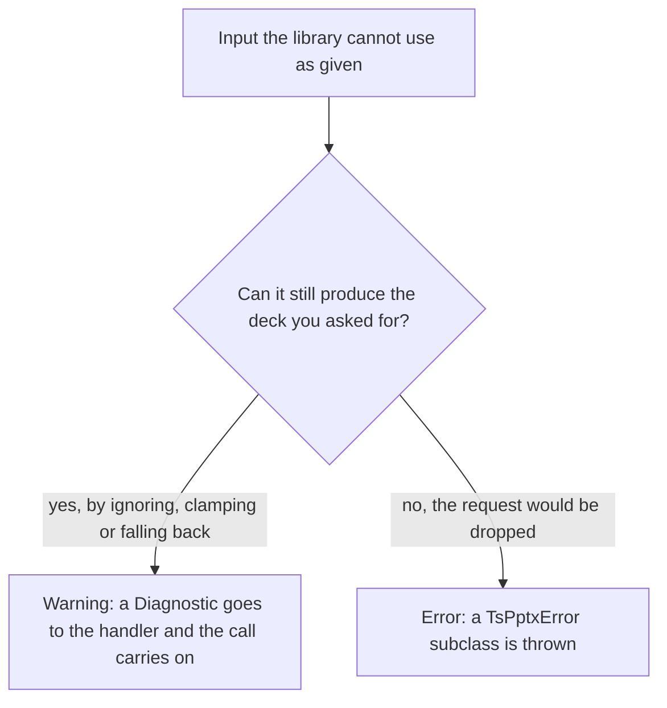

# Errors and warnings

When ts-pptx meets input it cannot use as given, it either warns or throws. What decides it is whether the deck can still come out as the one you asked for.



`shadow: { transparency: 120 }` is a warning, and the shadow paints at 100. `addImage()` with neither `data` nor `path` is an error, because there is nothing to place.

## Codes

Errors and warnings share one vocabulary, `TsPptxCode`. A code names a condition in `area/condition` form, such as `media/load-failed`.

- The code is API. Adding a code is back-compatible. Removing or renaming one is a breaking change, and the changelog records it.
- The message is not API. Its wording can change in any release. Do not parse it, and do not assert on it in tests.
- A condition keeps its code whichever way it reaches you. `media/load-failed` is a thrown `MediaError` by default and a warning under `onMediaError: 'placeholder'`.
- `DiagnosticCode` and `ErrorCode` are closed unions. An editor completes them, and TypeScript rejects a comparison against a code that does not exist.

## Errors

Every failure ts-pptx raises is a `TsPptxError`, thrown as one of five subclasses. Each one is also an `Error`, so a `catch` that only knows `Error` keeps working.

```ts
class TsPptxError extends Error {
	readonly code: ErrorCode
	readonly detail?: Readonly<Record<string, unknown>>
}
```

`name` is the subclass name, so a stack trace labels the error `InvalidOptionError` rather than `Error`. `detail` holds structured context when the throwing site has any. Most sites give none.

### The error classes

| Class | Thrown when | Code areas |
| --- | --- | --- |
| `InvalidOptionError` | You passed a value the library cannot use: a non-finite coordinate, an unknown enum value, a missing required option, an index out of range. | Most areas, including `coord/`, `color/`, `chart/`, `image/`, `table/` and `zip/` |
| `UnsupportedFeatureError` | The request is well formed, but an optional peer dependency is not installed, the runtime lacks a capability, or the library emits no OOXML for it. | `family/`, `font/`, `gradient/`, `group/`, `line/`, `math/`, `runtime/`, `shape/`, `zip/` |
| `PackageReadError` | The input bytes are not a readable package, or a part inside it is structurally malformed. | `diagram/`, `package/`, `shape/`, `slide/`, `table/`, `zip/` |
| `MediaError` | An image, font, audio or video resource could not be fetched, read or decoded. | `font/`, `media/` |
| `InternalError` | An invariant the library maintains itself did not hold. No input of yours should produce one. | `animation/`, `chart/`, `hyperlink/`, `import/`, `layout/`, `media/`, `ooxml/`, `oxml/`, `slide/` |

An area can appear under several classes, so match the whole code rather than its area. Each error code belongs to exactly one class, and the types enforce the pairing: `new MediaError('coord/non-finite', 'message')` does not compile. The code unions in the API reference list every code: [`InvalidOptionErrorCode`](reference/api/index/type-aliases/InvalidOptionErrorCode.md), [`UnsupportedFeatureErrorCode`](reference/api/index/type-aliases/UnsupportedFeatureErrorCode.md), [`PackageReadErrorCode`](reference/api/index/type-aliases/PackageReadErrorCode.md), [`MediaErrorCode`](reference/api/index/type-aliases/MediaErrorCode.md) and [`InternalErrorCode`](reference/api/index/type-aliases/InternalErrorCode.md).

### Branch on the class and the code

Branch on `instanceof` and on `code`, never on the message.

```ts
import { MediaError, PackageReadError, TsPptxError } from 'pptx-ts'

try {
	await buildDeck()
} catch (err) {
	if (err instanceof MediaError) {
		// an image, font or media file did not load: substitute it or retry
	} else if (err instanceof PackageReadError) {
		// the input is not a readable .pptx: reject the upload
	} else if (err instanceof TsPptxError && err.code === 'image/missing-source') {
		// one specific condition
	} else {
		throw err
	}
}
```

`buildDeck` stands for your own code. The class says who fixes the problem. An `InvalidOptionError` needs a change in the calling code, a `PackageReadError` a different input file, a `MediaError` a working resource, and an `InternalError` a fix in ts-pptx.

### `InternalError` asks to be reported

`InternalError` appends a notice to its own message, below the invariant that broke:

```text
makeXmlSlideRel: no slide at index 3

This is a bug in ts-pptx, not in your deck or your code. Please report it:
https://github.com/shbernal/ts-pptx/issues/new?template=agent-report.yml
```

The constructor adds the notice, so every `InternalError` carries it. No other class changes its message. The notice is still message text, so do not assert on it.

### Which failures are worth reporting

The project's bar is output that opens cleanly in Microsoft PowerPoint. It applies in both directions.

| You saw | Report it when |
| --- | --- |
| `InternalError` | always |
| `PackageReadError` | the file opens cleanly in PowerPoint |
| `MediaError` | the image, font, audio or video file loads in other tools |
| `UnsupportedFeatureError` | PowerPoint can express what you asked for |
| `InvalidOptionError` | the deck it refused is one PowerPoint can express |
| a diagnostic | it fires when it should not, stays silent when it should fire, or carries the wrong code |
| no error | PowerPoint repairs or misrenders the output, or a read and write round trip loses a construct |

Open an issue from the [new-issue chooser](https://github.com/shbernal/ts-pptx/issues/new/choose). Issues are public, so describe your project's need without its data.

The package ships the `ts-pptx-upstream` skill in its `skills` directory, and `npx skills add shbernal/ts-pptx` installs it. The skill walks through triage, reducing the failure to a script that builds its own deck, and filing the issue.

### The originating failure is kept on `cause`

An error that wraps a lower-level exception keeps it on the standard `cause` property. `readZip` on bytes that are not a zip archive throws `zip/not-a-zip-archive` with the decoder's error as `cause`. A media or font file that fails to load, read or parse, and LaTeX that fails to parse, do the same.

```ts
import { PackageReadError } from 'pptx-ts'

try {
	await buildDeck()
} catch (err) {
	if (err instanceof PackageReadError) console.error(err.code, err.cause)
}
```

### Importing the classes

The error classes and the code types are exported from `pptx-ts`, `pptx-ts/node`, `pptx-ts/browser`, `pptx-ts/read`, `pptx-ts/inspect`, `pptx-ts/measure`, `pptx-ts/script`, `pptx-ts/math`, `pptx-ts/zip` and `pptx-ts/html`. `pptx-ts/families` exports neither. Every entry resolves to one shared module, so `instanceof` works whichever entry you import from and whichever entry threw.

## Warnings

A warning is a `Diagnostic`. The library reports it to the diagnostic handler and carries on.

```ts
interface Diagnostic {
	readonly code: DiagnosticCode // e.g. 'chart/non-finite-value'
	readonly message: string
	readonly detail?: Readonly<Record<string, unknown>>
}
```

`detail` is sparse. A rejected OOXML enum value, such as a line dash type or a table cell's 3-D preset, carries `received`, the value you passed, and `valid`, the list of legal values. Which keys a code carries is not part of the contract, and most codes carry none, so read `detail` as optional.

### Routing warnings

By default each diagnostic is one `console.warn` line with a `ts-pptx:` prefix:

```text
ts-pptx: text `columns` must be a number 1-16 (ignoring value)
```

`setDiagnosticHandler` replaces that default:

```ts
import { setDiagnosticHandler, type Diagnostic } from 'pptx-ts'

const warnings: Diagnostic[] = []
setDiagnosticHandler((d) => warnings.push(d))
```

`setDiagnosticHandler(null)` restores the console default. `setDiagnosticHandler(() => {})` silences the library.

Some diagnostics fire when you call the method that takes the option, and others fire when the deck is written. Keep the handler installed until the write finishes.

### The handler is process-global

The handler is module state shared by every entry point. It is not attached to a presentation. A process that builds several decks at the same time cannot tell which deck a diagnostic came from. To attribute diagnostics, build one deck at a time and set the handler around each build.

### Escalating a warning to an error

There is no strict-mode option. A handler that throws does the same job, because the throw propagates out of the library call that emitted the diagnostic.

```ts
import { setDiagnosticHandler } from 'pptx-ts'

setDiagnosticHandler((d) => {
	// A bare number over 1000 is still read as inches. In this codebase that is always a mistake.
	if (d.code === 'coord/bare-number-is-inches') throw new Error(d.message)
	// Every chart warning fails the build.
	if (d.code.startsWith('chart/')) throw new Error(d.message)
})
```

The policy lives in your handler, so it can escalate in CI and log locally.

### Repeated conditions

Some conditions are reported once per distinct code and message. `fontSize: 4111` on two text boxes warns once, and `fontSize: 4222` warns again.

That record is process-global, like the handler. A second deck built in the same process stays silent about a condition the first deck already reported, which reads as "no problems" rather than "already reported". `resetDiagnosticState()` clears the record:

```ts
import { resetDiagnosticState } from 'pptx-ts'

resetDiagnosticState()
```

The record keeps one entry per distinct message until you clear it, and most of these messages include the offending value. A service that builds decks from user input should clear it between builds. `resetDiagnosticState()` leaves the handler in place.

## See also

- [Core concepts](getting-started/concepts.md)
- [Troubleshooting](troubleshooting.md)
- [Errors and diagnostics](https://github.com/shbernal/ts-pptx/blob/master/docs/contributing/development.md#errors-and-diagnostics), for adding a throw or warning site to the library
- API reference: [`TsPptxError`](reference/api/index/classes/TsPptxError.md), [`TsPptxCode`](reference/api/index/type-aliases/TsPptxCode.md), [`ErrorCode`](reference/api/index/type-aliases/ErrorCode.md), [`Diagnostic`](reference/api/index/interfaces/Diagnostic.md), [`DiagnosticCode`](reference/api/index/type-aliases/DiagnosticCode.md), [`setDiagnosticHandler`](reference/api/index/functions/setDiagnosticHandler.md), [`resetDiagnosticState`](reference/api/index/functions/resetDiagnosticState.md)
