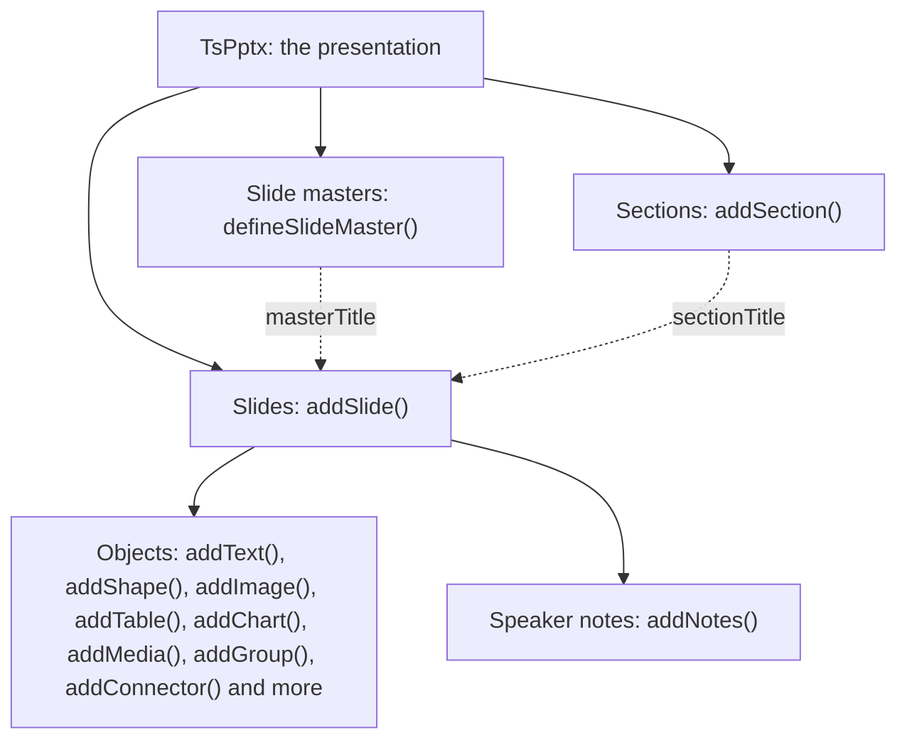

# Core concepts

What to understand before the feature guides. Each section is short and links the page that covers
its topic in full.

## Presentation, slides and objects



`new TsPptx()` creates the presentation. `addSlide()` appends a slide and returns it. Each `add*`
method on the slide places one object and returns the slide again, so calls can chain. Slides appear
in the order they were added, and objects on a slide stack in the order they were added, the last one
on top.

## Positions and sizes

Every object takes `x`, `y`, `w` and `h`: the top-left corner and the size, measured from the
top-left corner of the slide. A bare number is inches. A string names its unit:

| You write | It means |
| --- | --- |
| `1.5` | 1.5 inches |
| `"50%"` | half of the slide's width (for `x` and `w`) or height (for `y` and `h`) |
| `"2in"`, `"72pt"`, `"96px"`, `"914400emu"` | inches, points, pixels or EMUs, the unit PowerPoint stores |

The slide size is set once for the deck, through `layout`:

| `pptx.layout =` | Size in inches |
| --- | --- |
| `"LAYOUT_16x9"` (the default) | 10 × 5.625 |
| `"LAYOUT_16x10"` | 10 × 6.25 |
| `"LAYOUT_4x3"` | 10 × 7.5 |
| `"LAYOUT_WIDE"` | 13.333 × 7.5 |

For any other size, name one with `pptx.defineLayout({ name: "A4", width: 11.69, height: 8.27 })`
and then set `pptx.layout = "A4"`. A slide reports its own size as `slide.width` and `slide.height`.
[Layout units](../reference/layout-units.md) has the constants and conversion helpers.

## Options, colours and text

Each `add*` call takes its content first and then a single options object. Position, size and
formatting all go in that one object.

A colour is either a six-digit hex value such as `"1F3A5F"` (a leading `#` is accepted) or a theme
colour name: `tx1`, `tx2`, `bg1`, `bg2`, or `accent1` to `accent6`. A theme colour follows the deck's
theme rather than fixing one value.

Text is a plain string, or an array of runs when parts of it need different formatting. A run is
`{ text, options }`. `textRun(text, options)` builds one, and `textRuns([...])` gives an array held
in a variable the type `addText` expects:

```ts
import { textRuns } from "pptx-ts"

const headline = textRuns([
  { text: "Revenue ", options: { bold: true } },
  { text: "up 12%", options: { color: "2E7D32" } },
])
slide.addText(headline, { x: 1, y: 1, w: 6, h: 1, fontSize: 28 })
```

## Slide masters

A slide master holds what several slides share: a background, a logo, a footer. Define one with a
name, then base slides on it by that name:

```ts
pptx.defineSlideMaster({
  title: "Branded",
  background: { color: "1F3A5F" },
  objects: [
    { text: { text: "Acme Corp", options: { x: 0.5, y: 5.1, w: 4, h: 0.4, fontSize: 12, color: "FFFFFF" } } },
  ],
})

const slide = pptx.addSlide({ masterTitle: "Branded" })
```

PowerPoint lists each master defined this way as a layout under one shared slide master. That is a
different thing from `pptx.layout`, which is only the slide size.

## Getting the file out

| Call | Resolves to | Where it works |
| --- | --- | --- |
| `writeFile({ fileName })` | the file name, once the file is written to disk (Node) or the download has started (browser) | Node and browsers. Deno, Bun and edge workers throw `runtime/file-output-unavailable` |
| `write({ outputType })` | the deck in the type you name, a `Blob` by default | every runtime |
| `toBytes()` | the deck as a `Uint8Array` | every runtime |
| `toParts()` | the package's parts before zipping, each a path and its bytes | every runtime |

[Where it runs](runtime.md#which-build-the-bare-import-gives-you) explains which
build each runtime loads.

## Errors and warnings

When the library cannot produce the deck you asked for, it throws a `TsPptxError` subclass carrying a
stable `code` you can branch on. When it can, by ignoring, clamping or falling back on part of the
input, it reports a diagnostic and carries on. Diagnostics go to the console unless you route them
with `setDiagnosticHandler`. See [Errors and warnings](../errors-and-warnings.md).

## Two ways to start

`new TsPptx()` can author everything the library supports. `createPresentation({ use })` starts from
a smaller core and adds only the construct families you name, so a browser bundle carries only those.
For the same calls, both write the same deck. [Smaller bundles](../bundle-size.md) lists the families and
what each costs.

## Reading and converting

- `pptx-ts/read`: `Presentation.load(bytes)` opens an existing deck to read, edit and save. See
  [PPTX read and round-trip](../reference/pptx-read.md).
- `pptx-ts/inspect`: `inspectPptx` reports what a package holds without building the full model. See
  [PPTX inspection](../reference/pptx-inspection.md).
- `pptx-ts/script`: `readModelToIr` and `printScript` turn a deck into the TypeScript that rebuilds
  it. See [PPTX to script](../reference/pptx-to-script.md).
