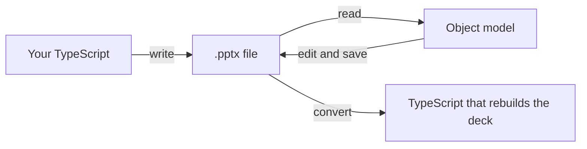

# Introduction

A `.pptx` file is a zip of XML parts. ts-pptx writes that zip: you describe slides in
TypeScript, and the library produces the package. PowerPoint does not run and no Office licence
is involved, so it works on a build server, in a serverless function or in a browser tab.

It works in three directions:

- **Write.** Build a deck from code. This is what most of these docs cover.
- **Read and edit.** Open a deck you already have, change it, save it. Parts you did not touch
  come out byte for byte as they went in. See [PPTX read and round-trip](../reference/pptx-read.md).
- **Convert.** Turn a deck into the TypeScript that would rebuild it, with a note for everything
  the conversion could not carry. See [PPTX to script](../reference/pptx-to-script.md).

## When to reach for it

Use it when a deck is built from data that changes: a monthly report, one deck per customer, a
nightly batch of hundreds, or a download button that hands someone a deck of what they are looking
at.

It does not render slides. There is no export to PNG or PDF, and it never drives a PowerPoint
installation. The [demos page](../demos.md) shows slides in the browser by handing the bytes to a
separate renderer, `pptx-html`.

## What you can build

| Area | What you get | Guide |
| --- | --- | --- |
| Text | Paragraphs, runs with their own formatting, bullets, hyperlinks | [API reference](../reference/api/index.md) |
| Text that fits | The box shrinks or grows to its text, measured against the real font before the file is written | [Measured text fit](../measured-text-fit.md) |
| Tables | Cell styles, borders, merged cells, and tables that continue across as many slides as they need | [Tables](../tables.md) |
| HTML tables | An existing `<table>` converted to slides, in a browser or under Node | [HTML tables to slides](../html-tables.md) |
| Shapes and connectors | Preset shapes, and lines that stay attached to the shapes they join | [Connectors](../connectors.md) |
| Groups | Objects grouped, and groups nested inside groups | [Groups](../groups.md) |
| Pictures | Images and SVGs, and a picture clipped to a shape | [Images in shapes](../image-in-shape.md) |
| Video and audio | Media embedded in the slide | [API reference](../reference/api/index.md) |
| Charts | Classic types such as bar, line and pie, newer ones such as waterfall and treemap, each with its data in an embedded workbook | [API reference](../reference/api/index.md) |
| Masters and layouts | Slide masters, layouts, sections and speaker notes | [API reference](../reference/api/index.md) |
| Backgrounds and fills | Solid, gradient, pattern and picture fills on shapes, backgrounds, tables and charts | [Fills and gradients](../fills-and-gradients.md) |
| Animations and transitions | Entrance, emphasis and exit effects, and slide transitions | [Animations and transitions](../animations-and-transitions.md) |
| Embedded objects | A workbook or document that opens in place when double-clicked | [OLE embedded objects](../ole-objects.md) |
| 3D models | A `.glb` model that PowerPoint shows live | [3D models](../3d-models.md) |
| Math | LaTeX or MathML turned into native PowerPoint equations | [Math equations](../math-latex.md) |
| Fonts | Font files embedded in the deck, so it looks the same on a machine without them | [Embedded fonts](../embedded-fonts.md) |

## What "works" means

The output opens cleanly in desktop PowerPoint, with no repair prompt. That is the bar every
change is tested against. Keynote, LibreOffice Impress and Google Slides import the same files,
on a best-effort basis: a difference that only shows up there is not treated as a defect when the
file itself is valid.

## Lineage

ts-pptx descends from [PptxGenJS](https://github.com/gitbrent/PptxGenJS), detached at its v4.0.1
in June 2025, and is not a drop-in continuation of that release line.
[ts-pptx vs PptxGenJS](../comparison.md) measures what each library emits by building the same
decks with both.

## Limits to know up front

It needs Node.js 24 or later, and ships as one ESM build that Node, bundlers, browsers and
`require()` all load. Two areas are outside what the maintainer actively develops. Reports there
are welcome but tend to wait:

| Area | Supported | Not actively developed |
| --- | --- | --- |
| Browser layout | Building decks in a browser, and converting an HTML table under any DOM | Output that has to match how a browser laid a page out: measured widths, the resolved CSS cascade, the fonts a browser picked |
| Other office suites | Files that open cleanly in desktop PowerPoint | Breakage that appears only after another application round-trips a file this library wrote correctly |

The full statement is the
[scope page](https://github.com/shbernal/ts-pptx/blob/master/docs/contributing/scope-and-policy.md#out-of-active-scope-contributions-welcome)
in the repository.

## Next

See what the output looks like on the [demos page](../demos.md), then
[install the package](installation.md).
