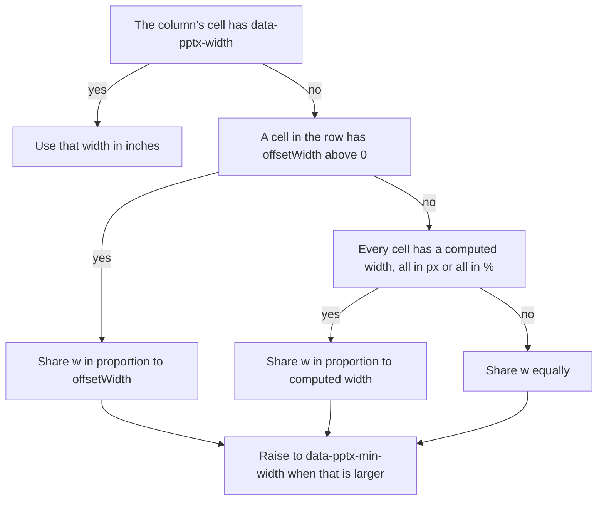

# HTML tables to slides

`tableToSlides` from `pptx-ts/html` copies an HTML `<table>` into a PowerPoint table and adds as
many slides as the rows need. It runs in a browser, and under Node with any DOM implementation.

```ts
import { TsPptx } from 'pptx-ts'
import { tableToSlides } from 'pptx-ts/html'
import { Window } from 'happy-dom'

const win = new Window()
win.document.body.innerHTML = `
  <table id="report">
    <thead><tr><th>Item</th><th>Qty</th></tr></thead>
    <tbody><tr><td>Bolts</td><td>40</td></tr></tbody>
  </table>`

const pptx = new TsPptx()
tableToSlides(pptx, 'report', { document: win.document })
await pptx.writeFile({ fileName: 'report.pptx' })
```

If the rows are data you already hold, skip the DOM and call `slide.addTable(rows, options)`.
See [Tables](tables.md).

## Options at a glance

`options` is a `TableToSlidesProps`, which extends the `addTable` options. These are the ones the
conversion reads.

| Option | Type | Default | Effect |
| --- | --- | --- | --- |
| `document` | `TableToSlidesDocument` | the global `document` | The document a string id is looked up in. Not read when you pass the element. |
| `x` | `Coord` | left slide margin | Left edge of the table on every page. |
| `y` | `Coord` | top slide margin | Top of the table on the first page. |
| `w` | `Coord` | from `x` to the right margin | Table width, shared out between the columns. |
| `h` | `Coord` | down to the bottom margin | Height a page fills before the rows continue on a new slide. |
| `slideMargin` | `Margin` | the master's margin, else 0.5in | Margins the pager keeps clear, in inches. |
| `masterTitle` | `string` | none | Slide master for every page, named by the `title` given to `defineSlideMaster`. |
| `autoPageRepeatHeader` | `boolean` | `false` | Repeat every `<thead>` row at the top of each continuation page. |
| `autoPageSlideStartY` | `number` | top margin | Top of the table, in inches, on pages after the first. |
| `autoPageLineWeight` | `number`, -1 to 1 | `0` | Adds to the height the pager allows per line. Positive values fit fewer lines on a page. |
| `autoPageCharWeight` | `number`, -1 to 1 | `0` | Adds to the characters the pager allows per line. Positive values wrap less. |
| `addImage`, `addShape`, `addTable`, `addText` | objects | none | Add the same object to every slide the conversion creates. |
| `verbose` | `boolean` | `false` | Log the width and paging arithmetic to the console. |

## Convert a table outside a browser

`tableToSlides` takes the `<table>` element itself or its id.

- Pass the element and no global DOM is read. Its own document supplies the computed styles.
- Pass an id together with `options.document` and the id resolves in that document.
- In a browser, `options.document` defaults to the global `document`, so `tableToSlides(pptx, 'report')`
  is enough. The browser build also has the method form `pptx.tableToSlides('report', options)`,
  which runs the same conversion.

```ts
const table = win.document.querySelector('#report')
if (table) tableToSlides(pptx, table)
```

The first argument needs only `addSlide` and `presLayout`, so any presentation object works.

Measuring rendered column widths is the one step that needs a browser. Cell text, `<br>` line
breaks, spans, colors, weight, alignment, padding, borders and paging behave the same under
any DOM.

## Style cells with CSS

Each cell takes its formatting from its computed style.

| Computed CSS | Becomes |
| --- | --- |
| `color` | Text color. Black when the value cannot be read. |
| `background-color` | Cell fill. White when the value is transparent or cannot be read. |
| `font-weight` | Bold at `bold` or at 500 and above. |
| `font-size` | Font size, converted at 96px per inch, so `16px` is 12pt. Left unset for `em`, `%` or a keyword. |
| `font-family` | The first family in the list. |
| `text-align` | `left`, `center` or `right`. `start` reads as left and `end` as right. Other values leave alignment alone. |
| `vertical-align` | `top`, `middle` or `bottom`. |
| `padding-*` | Cell margins, converted at 96px per inch. A value that is not in `px` insets by 0. |
| `border-*-width`, `border-*-color` | One border per side, in points, so `1px` is 0.75pt. A zero width draws no border. |
| `colspan`, `rowspan` | Merged cells. |

Colors are read from `rgb()`, `rgba()`, `#rgb` and `#rrggbb`. A browser always computes one of
those, but a DOM outside a browser can return a named color, and that falls back to the default.

## Size the columns

Widths come from the first row that has cells, with `<thead>` rows read first. Each column's
width is decided in this order:



- `offsetWidth` is real layout. It is above 0 only in a browser, and only while the table is
  rendered. A hidden table reads 0 and falls back like a table under Node.
- The computed width step needs a usable value on every cell of the row, and all of them in one
  unit: `px` (or bare numbers), or `%`. A single `auto` or `em` value, or a mix of units, skips
  straight to the equal split.
- A spanning cell's width divides equally across the columns it covers. That holds for a measured
  width, a CSS width and both `data-pptx-*` attributes.
- Columns beyond the end of that first row take the average share of the others.

The two measured bases do not measure the same box. `offsetWidth` is the border box and the
computed `width` is the content box, so padding and borders count in one and not in the other.
The same table can therefore get different proportions in a browser and outside one. With the
default `box-sizing: content-box` and no borders:

| Column | CSS | `offsetWidth` | Computed `width` |
| --- | --- | --- | --- |
| A | `width: 200px; padding: 0` | 200 | 200 |
| B | `width: 100px; padding: 0 50px` | 200 | 100 |
| Resulting split | | 1 : 1 | 2 : 1 |

## Pin column widths

When a browser and Node must agree, state the width on the cell.

```html
<table id="report">
  <thead>
    <tr>
      <th data-pptx-width="2.5">Item</th>
      <th data-pptx-min-width="1">Qty</th>
    </tr>
  </thead>
  <tbody>
    <tr><td>Bolts</td><td>40</td></tr>
  </tbody>
</table>
```

- `data-pptx-width` is the column width in inches. It wins on every path.
- `data-pptx-min-width` is a floor in inches. The proportional width is raised to it and never
  lowered.
- Put them on the row the widths are read from: the first `<thead>` row, or the first row of
  `<td>` cells when there is no `<thead>`.
- A pinned column does not shrink the others, so the columns can add up to more or less than `w`.

## Page a long table

The conversion always pages. Rows fill a slide down to the bottom margin and continue on a new
slide. `<thead>` rows come first, then `<tbody>` rows, with `<tfoot>` rows last. A row outside
any section counts as body, and the rows of a table nested inside a cell are left out.

```ts
pptx.defineSlideMaster({ title: 'REPORT', margin: [0.9, 0.5, 0.5, 0.5] })

tableToSlides(pptx, 'report', {
  document: win.document,
  masterTitle: 'REPORT',
  autoPageRepeatHeader: true,
  addText: { text: [{ text: 'Parts inventory' }], options: { x: 0.5, y: 0.2, w: 9, h: 0.5 } },
})
```

- Pages after the first start at `autoPageSlideStartY`. Without it they start at the top margin,
  or at `y` when `y` sits above the margin.
- Rows joined by a `rowspan` stay together on one page.

## Invalid input

| Condition | Warns or throws | Code |
| --- | --- | --- |
| An id is given, but there is no `options.document` and no global `document` | throws | `InvalidOptionError` `html/no-document` |
| No element has the id | throws | `InvalidOptionError` `html/table-not-found` |
| The table has no row with a `<td>` or `<th>` | throws | `InvalidOptionError` `html/table-has-no-cells` |
| A `colspan` or `rowspan` above 1000 | warns, reads it as 1 | `table/span-out-of-range` |
| A `colspan` or `rowspan` of 0, a negative number or text | reads it as 1, no warning | none |
| A `data-pptx-width` or `data-pptx-min-width` that is not a positive number | ignored, no warning | none |
| `h` leaves no room for one line | warns, uses the slide height | `table/autopage-height-too-small` |
| Rows joined by a `rowspan` are taller than a page | warns, keeps them together and runs past the bottom | `table/autopage-rowspan-too-tall` |
| `addImage.image` has neither `path` nor `data` | warns, skips the image | `html/image-missing-source` |

## Limits

- Column proportions follow the browser's layout only where `offsetWidth` is available.
- `colW`, `autoPage` and `autoPageHeaderRows` are not options of `tableToSlides`. The conversion computes its own widths, always pages, and repeats every `<thead>` row.
- Font sizes and padding in `em`, `%` or keywords are dropped.
- Without a browser, `text-transform` does not reach cell text.
- Reproducing how a browser laid out the rest of a page is outside what this project actively develops: see [the scope page](https://github.com/shbernal/ts-pptx/blob/master/docs/contributing/scope-and-policy.md#out-of-active-scope-contributions-welcome).

## Reading it back

The slides hold ordinary tables. Open the deck with `Presentation.load` and read a table through
`GraphicFrame.table`, as [Read object model](reference/read-object-model.md#tables) describes.

## See also

- [Tables](tables.md)
- [Errors and warnings](errors-and-warnings.md)
- [`TableToSlidesProps`](reference/api/index/interfaces/TableToSlidesProps.md)
- [`TableProps`](reference/api/index/interfaces/TableProps.md)
