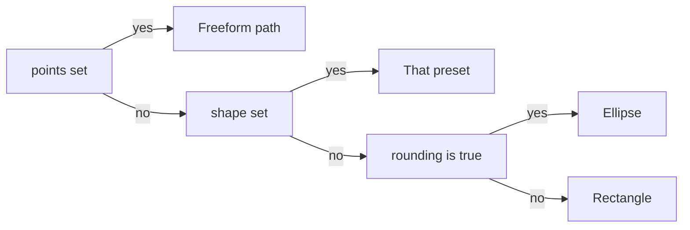

# Images in shapes

`slide.addImage()` clips a picture to an outline and, separately, controls how the source image
fills the picture's box.

```ts
import TsPptx from 'pptx-ts'

const pptx = new TsPptx()
const slide = pptx.addSlide()
slide.addImage({ path: 'avatar.png', x: 1, y: 1, w: 2, h: 2, shape: 'ellipse', sizing: { type: 'cover' } })
await pptx.writeFile({ fileName: 'avatar.pptx' })
```

## Options at a glance

| Option | Type | Default | Effect |
| --- | --- | --- | --- |
| `points` | `GeometryPoint[]` | none | Clip to a freeform path measured in the picture's own box. Wins over `shape` and `rounding`. |
| `shape` | `SHAPE_NAME` | `'rect'` | Clip to a PowerPoint preset such as `'roundRect'` or `'hexagon'`. Wins over `rounding`. |
| `rounding` | `boolean` | `false` | Clip to an ellipse. |
| `rectRadius` | `number`, inches | the preset's own radius | Corner radius for `'roundRect'` and the other rounded presets. |
| `shapeAdjust` | `ShapeAdjustValue` or an array | none | The preset's adjustment handles, each value a 0 to 1 fraction. |
| `sizing` | `{ type, x?, y?, w?, h? }` | none | How the source fills the box: `cover`, `contain`, `crop` or `stretch`. |
| `crop` | `{ l?, t?, r?, b? }` | none | Percent trimmed off each edge of the source. Wins over `sizing`. |
| `line` | `ShapeLineProps` | none | Outline drawn along the clip. |
| `shadow` | `ShadowProps` | none | Shadow under the picture. |
| `transparency` | `number`, 0 to 100 | `0` | Picture transparency in percent. |
| `duotone`, `grayscale`, `biLevel`, `clrChange` | see [Recolor a picture](#recolor-a-picture) | none | Recolor the picture. |

## Clip a picture to a shape

One clip applies, picked in this order:



```ts
// A preset with rounded corners
slide.addImage({ path: 'avatar.png', x: 1, y: 1, w: 2, h: 2, shape: 'roundRect', rectRadius: 0.25 })

// An ellipse
slide.addImage({ path: 'avatar.png', x: 4, y: 1, w: 2, h: 2, rounding: true })

// A freeform triangle
slide.addImage({
  path: 'photo.png', x: 7, y: 1, w: 2, h: 2,
  points: [{ x: 1, y: 0 }, { x: 2, y: 2 }, { x: 0, y: 2 }, { close: true }],
})
```

<svg viewBox="0 0 320 180" width="320" height="180" role="img" aria-label="A picture box placed on a slide, with a triangle clip inside it. Freeform points are measured from the picture box's top-left corner, labelled (0, 0), to its bottom-right corner, labelled (w, h), not from the corner of the slide." style="max-width:100%;height:auto">
  <rect x="4" y="4" width="312" height="172" fill="none" stroke="currentColor" stroke-dasharray="4 3" opacity="0.5"/>
  <text x="12" y="20" font-size="11" fill="currentColor" opacity="0.7">slide</text>
  <rect x="100" y="40" width="120" height="100" fill="none" stroke="currentColor"/>
  <polygon points="160,40 220,140 100,140" fill="currentColor" fill-opacity="0.15" stroke="currentColor" stroke-width="1.5"/>
  <circle cx="100" cy="40" r="3" fill="currentColor"/>
  <text x="94" y="34" font-size="11" fill="currentColor" text-anchor="end">(0, 0)</text>
  <circle cx="220" cy="140" r="3" fill="currentColor"/>
  <text x="226" y="156" font-size="11" fill="currentColor">(w, h)</text>
</svg>

- `points` are inches inside the picture's own box, `0` to `w` across and `0` to `h` down. They
  are not slide positions.
- Write `points` in inches. A percentage string resolves against the slide, not against the box.
- A path takes the same nodes as a freeform shape: plain points (the first moves the pen,
  `moveTo: true` starts a new subpath, the rest draw lines), a `curve` of type `cubic`,
  `quadratic` or `arc`, and `{ close: true }`.
- A clip changes only the outline. How the source fills the box is set by `sizing`.

## Fill the shape without distortion

With no `sizing`, a raster stretches to the box, so a photo whose ratio differs from the box
distorts. Pair the clip with a `sizing` mode.

| `sizing.type` | Scales the source | Crops | Distorts | Default for |
| --- | --- | --- | --- | --- |
| `stretch` | Each axis to the box on its own | No | Yes, when the ratios differ | A raster with no `sizing` |
| `cover` | Until it covers the whole box | Yes, the overflow, evenly on both sides | No | Nothing |
| `contain` | Until it fits inside the box | No, it leaves empty bands | No | A measurable SVG with no `sizing` |
| `crop` | Not at all: the image stays at `w` by `h` | Yes, to the `x`, `y`, `w`, `h` window | No | Nothing |

<svg viewBox="0 0 430 150" width="430" height="150" role="img" aria-label="A wide photo with a circle in it, placed in a tall box three ways. Cover scales the photo to the box height and crops the sides, and the circle stays round. Contain scales the photo to the box width and leaves bands above and below, and the circle stays round. Stretch squeezes the photo to the box, and the circle becomes a tall ellipse." style="max-width:100%;height:auto">
  <rect x="22.5" y="20" width="135" height="90" fill="none" stroke="currentColor" stroke-dasharray="4 3" opacity="0.5"/>
  <rect x="60" y="20" width="60" height="90" fill="currentColor" fill-opacity="0.15" stroke="currentColor"/>
  <circle cx="90" cy="65" r="30" fill="none" stroke="currentColor" stroke-width="1.5"/>
  <text x="90" y="135" font-size="12" fill="currentColor" text-anchor="middle">cover</text>
  <rect x="220" y="20" width="60" height="90" fill="none" stroke="currentColor"/>
  <rect x="220" y="45" width="60" height="40" fill="currentColor" fill-opacity="0.15"/>
  <circle cx="250" cy="65" r="13.3" fill="none" stroke="currentColor" stroke-width="1.5"/>
  <text x="250" y="135" font-size="12" fill="currentColor" text-anchor="middle">contain</text>
  <rect x="340" y="20" width="60" height="90" fill="currentColor" fill-opacity="0.15" stroke="currentColor"/>
  <ellipse cx="370" cy="65" rx="13.3" ry="30" fill="none" stroke="currentColor" stroke-width="1.5"/>
  <text x="370" y="135" font-size="12" fill="currentColor" text-anchor="middle">stretch</text>
</svg>

```ts
// A tall hexagon filled by a wide photo, cropped rather than squashed
slide.addImage({ path: 'photo.jpg', x: 1, y: 1, w: 2, h: 3, shape: 'hexagon', sizing: { type: 'cover' } })

// A 2in square window cut out of the photo as drawn at 4in by 3in
slide.addImage({ path: 'photo.jpg', x: 1, y: 1, w: 4, h: 3, sizing: { type: 'crop', x: 1, y: 0.5, w: 2, h: 2 } })
```

- `sizing.w` and `sizing.h` default to the picture's `w` and `h`. Any other value becomes the
  drawn size of the picture.
- `cover` and `contain` read the source's natural size from the image data: the PNG, JPEG, GIF,
  BMP or WebP header, or an SVG's `width` and `height`, else its `viewBox`. When that fails they
  use the box's own ratio and warn.
- `sizing: { type: 'crop' }` measures its window in inches on the image as drawn at `w` by `h`,
  and the picture shrinks to the window.
- The `crop` option trims the source by percentages, so it works on any format. With both `crop`
  and `sizing` set, `crop` applies and `sizing` is ignored with a warning.

## Place an SVG at its own aspect ratio

An SVG states its own ratio, so a vector source is placed differently from a raster:

1. `crop` is set: the percentage crop applies, as for a raster.
2. `sizing` is set: that mode applies. `cover` and `contain` use the SVG's `width` and `height`,
   else its `viewBox`. With neither, they use the box's ratio and warn.
3. No `sizing`, and the SVG has a `viewBox` or a `width` and `height`: the SVG is letterboxed
   inside the box, exactly as `contain` would place it. When the ratios already match, it simply
   fills the box.
4. No `sizing`, and the SVG has no intrinsic size: it stretches to the box, without a warning.

A raster with no `sizing` always stretches.

```ts
// A square icon in a 3in by 1in box sits centred at its true ratio
slide.addImage({ svg: iconMarkup, x: 1, y: 1, w: 3, h: 1 })

// Ask for stretch where the distortion is wanted
slide.addImage({ svg: bandMarkup, x: 0, y: 0, w: 13.33, h: 0.4, sizing: { type: 'stretch' } })
```

The SVG's ratio also fills in a missing dimension. Given only `w` or only `h`, the other side
follows the ratio, so `{ svg, w: 4 }` on a 2:1 `viewBox` is 4in by 2in. Given neither, the
picture is 1in by 1in: SVG user units are not read as pixels.

## Cut a half-disc with `clipPath()`

`clipPath(shape, w, h)` returns the `points` for a named silhouette, sized to a `w` by `h` box.
It has one silhouette, `half-disc`: a rectangle whose one side is replaced by an arc that bulges
toward the opposite edge. A cover-slide picture placeholder cuts the same outline.

```ts
import TsPptx, { clipPath } from 'pptx-ts'

const pptx = new TsPptx()
const slide = pptx.addSlide()
const w = 5.22
const h = 7.5

slide.addImage({
  path: 'cover-photo.jpg', x: 0, y: 0, w, h,
  points: clipPath({ kind: 'half-disc', flat: 'right' }, w, h),
  sizing: { type: 'cover' },
})
```

| Field | Values | Default | Effect |
| --- | --- | --- | --- |
| `kind` | `'half-disc'` | required | The silhouette. |
| `flat` | `'left'` or `'right'` | required | The edge the straight side sits on. The arc bulges toward the other edge. |
| `preset` | `'deep'` or `'shallow'` | `'deep'` | `'deep'`: the arc takes about 32% of the width, symmetric top to bottom. `'shallow'`: about 13%, with its tip just below mid-height. |

<svg viewBox="0 0 260 180" width="260" height="180" role="img" aria-label="Two half-disc clips with flat: right, each inside its box. The deep preset's arc takes about a third of the box width. The shallow preset's arc takes about an eighth." style="max-width:100%;height:auto">
  <g transform="translate(10 10)">
    <rect x="0" y="0" width="100" height="144" fill="none" stroke="currentColor" stroke-dasharray="4 3" opacity="0.5"/>
    <path d="M31.8 0 L100 0 L100 144 L31.8 144 L30.06 142.45 C11.59 125.04 0 99.92 0 72 C0 44.08 11.59 18.96 30.06 1.55 Z" fill="currentColor" fill-opacity="0.15" stroke="currentColor" stroke-width="1.5"/>
    <text x="50" y="162" font-size="12" fill="currentColor" text-anchor="middle">deep</text>
  </g>
  <g transform="translate(150 10)">
    <rect x="0" y="0" width="100" height="144" fill="none" stroke="currentColor" stroke-dasharray="4 3" opacity="0.5"/>
    <path d="M12.61 0 L100 0 L100 144 L11.13 144 L9.98 140.57 C3.52 119.88 0 97.52 0 74.21 C0 50.89 3.52 28.54 9.98 7.85 Z" fill="currentColor" fill-opacity="0.15" stroke="currentColor" stroke-width="1.5"/>
    <text x="50" y="162" font-size="12" fill="currentColor" text-anchor="middle">shallow</text>
  </g>
</svg>

- Pass the same `w` and `h` the picture is drawn at. The path is in that box's inches, so a
  picture of a different size gets the clip in the wrong place.
- Both presets are traced with two cubic curves, so neither is an exact half-ellipse.

### Draw the arc yourself

For a silhouette `clipPath` does not name, write the path by hand. This one is a right-flush
half-disc whose curved edge is a single `arc` node:

```ts
const fx = 0.3179 * w // x of the flat edge

slide.addImage({
  path: 'cover-photo.jpg', x: 0, y: 0, w, h,
  points: [
    { x: fx, y: 0 },
    { x: w, y: 0 },
    { x: w, y: h },
    { x: fx, y: h },
    // the curved left edge, from the bottom of the flat edge back to its top
    { curve: { type: 'arc', hR: h / 2, wR: fx, stAng: 90, swAng: 180 } },
    { close: true },
  ],
  sizing: { type: 'cover' },
})
```

- An `arc` node takes the radii `hR` and `wR` and the angles `stAng` and `swAng` in degrees. It
  has no end point: the arc starts at the pen and ends where the sweep lands. An `x` or `y` on it
  is ignored with a warning.
- Arc angles are not wrapped: `swAng: 400` sweeps 400 degrees, not 40.

## Recolor a picture

`line`, `shadow` and `transparency` work on a clipped picture as on any other, and `line` follows
the clip. Four options recolor the image:

| Option | Type | Effect |
| --- | --- | --- |
| `duotone` | `{ shadow: Color, highlight: Color }` | Maps dark tones to `shadow` and light tones to `highlight`. |
| `grayscale` | `boolean` | Turns every pixel gray. |
| `biLevel` | `{ threshold: number }` | Black and white: pixels at or above the 0 to 1 luminance threshold turn white, the rest black. |
| `clrChange` | `{ from: Color, to: Color }` | Repaints pixels of one color as another. |

Colors take a hex value or a theme color. Set one recolor option per picture: when several are
set, all of them are written, and `Picture.recolor` reads back only the first.

```ts
slide.addImage({
  path: 'photo.jpg', x: 1, y: 1, w: 3, h: 2,
  shape: 'roundRect',
  sizing: { type: 'cover' },
  line: { color: '0088CC', width: 2 },
  duotone: { shadow: '250F6B', highlight: 'FFFFFF' },
})
```

## Invalid input

"On write" means the check runs when the deck is generated, not when `addImage` is called.

| Condition | Warns or throws | Code |
| --- | --- | --- |
| `clipPath` gets a `kind`, `flat` or `preset` it does not know | throws | `InvalidOptionError` `clip/invalid-shape` |
| An `arc` node carries `x` or `y` | warns, ignores them | `geometry/arc-node-point-ignored` |
| An arc's `stAng` or `swAng` is not a finite number | throws on write | `InvalidOptionError` `geometry/arc-angle-non-finite` |
| `rectRadius` is not a finite number | warns, keeps the preset's radius | `geometry/invalid-shape-adjust` |
| A `shapeAdjust` entry lacks a string `name` or a finite `value` | warns, skips the entry | `geometry/invalid-shape-adjust` |
| `cover` or `contain` cannot read the source's natural size | warns, uses the box's ratio | `image/unmeasurable-natural-size` |
| Both `crop` and `sizing` are set | warns, ignores `sizing` | `image/crop-and-sizing-conflict` |
| A `sizing: { type: 'crop' }` window reaches past the image | throws on write | `InvalidOptionError` `image/crop-window-overflows` |
| A `crop` edge is outside 0 to 100 | throws on write | `InvalidOptionError` `image/crop-inset-out-of-range` |
| `crop` `l` plus `r`, or `t` plus `b`, reaches 100 | throws on write | `InvalidOptionError` `image/crop-insets-exceed-extent` |
| `biLevel.threshold` is outside 0 to 1 | warns, clamps it | `image/bilevel-threshold-out-of-range` |
| `biLevel.threshold` is not a number | throws on write | `InvalidOptionError` `percent/non-finite` |

## Limits

- `clipPath` has one silhouette, `half-disc`.
- A `clipPath` result fits one box size. Call it again for a different `w` or `h`.
- `cover` and `contain` crop evenly around the center. There is no focal point.
- An SVG given neither `w` nor `h` is placed at 1in by 1in.
- `rectRadius` is a length in inches, resolved against the shorter side of the box.

## Reading it back

Open the deck with `Presentation` from `pptx-ts/read`. A picture reports its clip, crop and
recolor:

```ts
import { readFile } from 'node:fs/promises'
import { Presentation } from 'pptx-ts/read'

const presentation = await Presentation.load(await readFile('avatar.pptx'))
for (const shape of presentation.slides[0]?.shapes ?? []) {
  if (shape.shapeType === 'picture') console.log(shape.presetGeometry, shape.crop, shape.recolor)
}
```

| Accessor | Returns |
| --- | --- |
| `presetGeometry` | The preset clip, such as `'ellipse'`. `'rect'` for an unclipped picture, `null` for a freeform clip. |
| `crop` | The source crop as fractions, `{ left, top, right, bottom }`, or `null` when there is none. |
| `recolor` | The first effect on the image: `duotone`, `clrChange`, `grayscale`, `biLevel`, or `alphaModFix` for `transparency`. A picture with `transparency` reports `alphaModFix` ahead of its recolor. |
| `setImage(bytes, { contentType, fit })` | Swaps the image. `fit: 'cover'`, `'contain'` or `'stretch'` recomputes the crop for the new image. |

The read model has no accessor for a picture's freeform clip path. See
[Read object model](reference/read-object-model.md#pictures-and-svg) for the rest of the `Picture` API.

## See also

- [Errors and warnings](errors-and-warnings.md)
- [`ImageProps`](reference/api/index/type-aliases/ImageProps.md) and [`ImageBaseProps`](reference/api/index/interfaces/ImageBaseProps.md)
- [`clipPath`](reference/api/index/functions/clipPath.md), [`ClipShape`](reference/api/index/type-aliases/ClipShape.md) and [`GeometryPoint`](reference/api/index/type-aliases/GeometryPoint.md)
- [Read and edit a deck](reading/read-and-edit.md)
