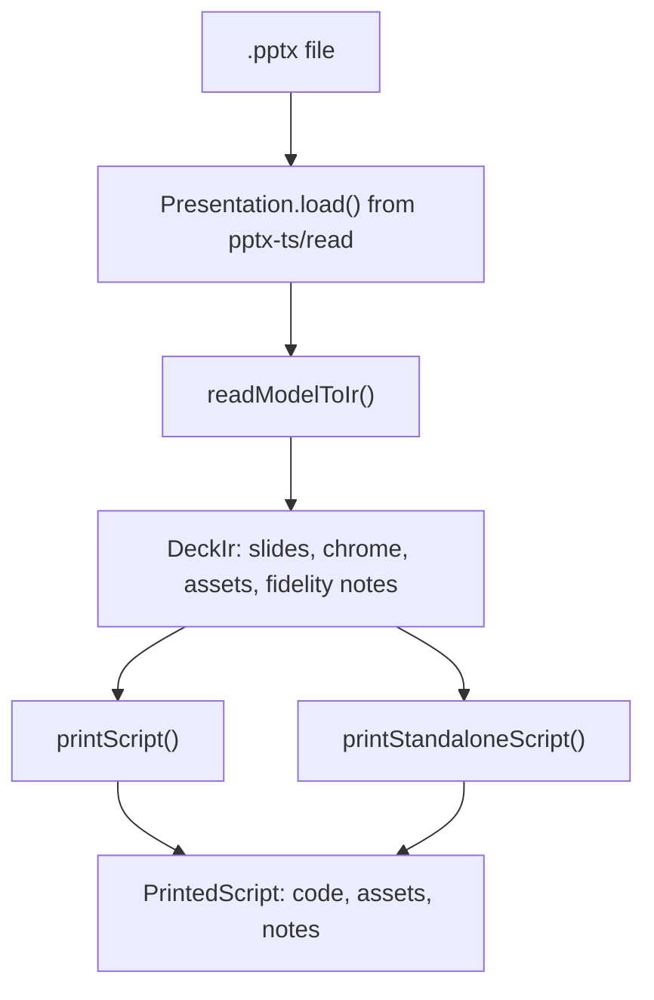
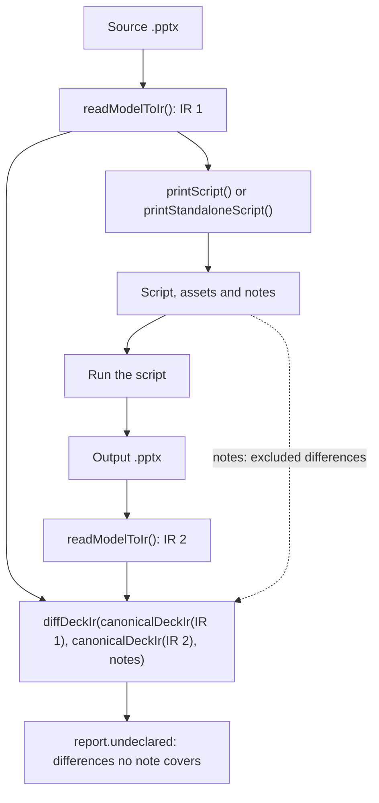

# Deck to script

`pptx-ts/script` reads a `.pptx` through `pptx-ts/read` and prints a TypeScript module that rebuilds the deck through the write API. With the module you get a list of fidelity notes, one for each construct the rebuilt deck does not carry.

```ts
import { copyFile, mkdir, readFile, writeFile } from 'node:fs/promises'
import { Presentation } from 'pptx-ts/read'
import { printScript, readModelToIr } from 'pptx-ts/script'

const deck = await Presentation.load(await readFile('source.pptx'))
const { code, assets, notes } = printScript(readModelToIr(deck))

await mkdir('out/assets', { recursive: true })
await writeFile('out/deck.ts', code)
for (const [name, bytes] of assets) await writeFile(`out/assets/${name}`, bytes)
// The template-anchored script loads the unmodified source deck from beside itself.
await copyFile('source.pptx', 'out/template.pptx')

for (const note of notes) console.log(note.slideNumber, note.construct, note.detail)
```

Run the printed module to write the deck:

```sh
node out/deck.ts
```

It writes `out/output.pptx`. Node runs the `.ts` file directly by stripping its types, so there is no build step. The module uses top-level `await` and imports `pptx-ts`, so run it where that package resolves, such as inside your project. Every path in the script resolves against the script's own location, not the working directory.

For a script that needs no template, call `printStandaloneScript` in place of `printScript` and skip the `copyFile` line.

## Two outputs

Both printers take the same `DeckIr`. They differ in where the deck's masters, layouts and theme come from.

| | Template-anchored | Standalone |
| --- | --- | --- |
| Printer | [`printScript`](api/script/functions/printScript.md) | [`printStandaloneScript`](api/script/functions/printStandaloneScript.md) |
| Masters, layouts and theme | The source deck's, unchanged. `Presentation.fromTemplate` removes only its slides | Re-authored as `pptx.theme` and one `defineSlideMaster` call per source layout |
| Ships beside the script | The unmodified source deck as `template.pptx`, and the media files the slides use | The media files the slides and layouts use, or nothing with `assets: 'inline'` |
| Entry calls | `Presentation.fromTemplate()`, then `deck.appendSlides()` for each run of slides that share a layout | `new TsPptx()`, then `pptx.addSlide({ masterTitle })` for each slide |
| Editable in the script | Slide content | Slide content, theme colours and fonts, and layouts |
| Charts | Rebuilt with `addChart` from the chart's cached values | Same |
| chartEx charts, SmartArt and undecoded graphic frames | The slide is copied from the source with `deck.importSlide()` | The slide is transcribed and the frame is dropped |
| Table styles | The source `a:tableStyleId` GUID, printed as `tableStyle` | Same |
| Document properties | All kept | Title, author, subject, revision and company. The rest are dropped |

Use the template-anchored output when the rebuilt deck has to look like the source and you can ship the source deck with the script. Use the standalone output when the script has to run with nothing but the package.

## How it works



[`readModelToIr()`](api/script/functions/readModelToIr.md) makes every mapping decision and returns a [`DeckIr`](api/script/interfaces/DeckIr.md). The IR is plain data, which `JSON.stringify` and `structuredClone` both round-trip. Each slide holds its content as write-API method names with literal option objects. Media bytes sit in `DeckIr.assets`, and an option refers to them as `{ $asset: name }`. A printer only spells out those values, and both printers share the code that prints a slide. So the two outputs print the same slide bodies from one IR, and you can inspect or change the IR before you print it.

### Geometry is EMU-exact

Positions and sizes print as `"<n>emu"` strings, which every `Coord` option accepts, so they reach the output unrounded. Four options take inches only: `colW`, `rowH`, `margin`, and the `width` and `height` of `defineLayout`. The converter prints those to six decimal places, which convert back to the source EMU value. The template-anchored script relies on this, because `appendSlides` throws when the generated slide size differs from the template's.

### Transitions are filtered against a closed vocabulary

A slide's transition prints as an assignment such as `slide.transition = { type: 'push', speed: 'slow', durationMs: 1250, variant: { dir: 'd' } }`. `speed` is always printed. Duration, advance on click, advance time, the type's own attributes and the sound appear only when the source sets them.

The write API names the 21 base ECMA-376 transitions. The converter keeps a transition only when its element is in the `p` namespace and has one of those names. PowerPoint's newer effects, such as Morph and Vortex in the `p14`, `p15` and `p159` namespaces, are dropped with a `slide.transition` note, and the slide advances with no effect.

A stop-previous sound (`p:endSnd`) carries in both outputs. An embedded start sound carries in the standalone output only. The template-anchored output drops it with a `slide.transitionSound` note.

### Theme colours

The write path accepts ten scheme colour tokens: `tx1`, `tx2`, `bg1`, `bg2` and `accent1` to `accent6`. A colour stated as one of them prints as that token and resolves against the output deck's theme. In the template-anchored output that theme is the source theme. In the standalone output it is the re-authored `pptx.theme`.

The other seven tokens (`dk1`, `lt1`, `dk2`, `lt2`, `hlink`, `folHlink` and `phClr`) print as the hex value they resolve to in the source, with a `*.schemeToken` note. Those colours stop following the theme.

## What the standalone output cannot rebuild

The template-anchored output reuses the source deck's masters, layouts and theme, so it keeps every row below. The standalone output rebuilds them through the write API. Each row lacks a read accessor, a write option, or both.

| Construct | Read accessor | Write option | Template-anchored output | Standalone output | Note |
| --- | --- | --- | --- | --- | --- |
| Theme format scheme (`a:fmtScheme`) | None | None. The write path emits Office's | Kept | Office's format scheme | `theme.fmtScheme` |
| Master text styles (`p:txStyles`) | None | `SlideMasterProps.textStyles` | Kept | Built-in defaults | `master.txStyles` |
| Shapes on a slide master | `SlideMaster.shapes` | None. `defineSlideMaster` creates a layout | Kept | Dropped | `master.decoration` |
| Colour map (`p:clrMap`) | `SlideMaster.colorMap` | None. The write path emits the identity map | Kept | Identity map | `master.colorMap` |
| More than one slide master | `Presentation.masters()` | One shared master | Kept | One master, with the first master's theme and colour map | `master.multiple` |
| Layout placeholders | `SlideLayout.placeholders` | `defineSlideMaster({ objects })`, left unused | Kept | Dropped | `master.placeholders` |
| Shapes on a layout | `SlideLayout.shapes` | `defineSlideMaster({ objects })` | Kept | Re-authored. A group becomes loose shapes and a table is dropped | `layout.*` |
| Layout background taken from the theme (`p:bgRef`) | The resolved fill | A colour or an image | Kept | The resolved fill, baked in | `master.background` |
| Layout names | `Presentation.layouts()` | `defineSlideMaster({ title })` | Kept | A repeated name gets a suffix. A tab or line break becomes a space | `master.nameCollision`, `master.name` |
| Document properties | `Presentation.coreProperties`, `Presentation.appProperties` | Title, author, subject, revision and company | Kept | Those five. A property the source left blank gets the library's value | `deck.docProps`, `deck.docPropsDefault` |
| Blank `DEFAULT` layout | Not applicable | Added by every `new TsPptx()` | Not added | Added ahead of the source layouts | `master.default` |

The standalone output leaves layout placeholders out on purpose. The write path gives every slide an empty shape for each layout placeholder the slide does not fill. The converter writes every source shape as positioned content, never into a placeholder, so declaring the placeholders would add empty shapes to every slide.

## Fidelity notes

Each construct an output does not carry becomes a [`FidelityNote`](api/script/interfaces/FidelityNote.md) in [`PrintedScript.notes`](api/script/interfaces/PrintedScript.md). The printed module repeats the list in a comment block at its top, grouped by deck and by slide.

```ts
interface FidelityNote {
  slideNumber: number | null // 1-based source slide, or null for a deck-level loss
  shapeName: string | null // the source shape's p:cNvPr/@name, '' when it has none, null when the loss is not about one shape
  construct: string // stable dotted key, such as 'line.width'
  disposition: 'dropped' | 'flattened' | 'approximated'
  cause: 'unread' | 'unwritable' | 'unsupported'
  detail: string // one sentence for a human
}
```

| Value | Meaning |
| --- | --- |
| `dropped` | Nothing in the output carries the construct |
| `flattened` | A value survives and the structure around it does not, such as a placeholder rebuilt as a plain shape |
| `approximated` | The structure survives with a different value, such as a chart rebuilt from its cached points |
| `unread` | `pptx-ts/read` has no accessor for the construct, so the converter never sees it |
| `unwritable` | The read model reports the construct and the write API has no option for it |
| `unsupported` | Both APIs handle the construct, and this output cannot carry it |

A note that repeats the same slide, shape, construct and text is recorded once.

### Which notes apply to each output

Read `PrintedScript.notes`, not `DeckIr.fidelity`. The IR holds every note the converter recorded. Each printer filters that list and adds notes of its own:

- The note catalogue marks each construct as applying to both outputs, to the standalone output only, or to the template-anchored output only. The master, theme and document-property notes and every construct under the `layout.` prefix apply to the standalone output only, because the template-anchored output keeps those parts of the source.
- `slide.carried` applies to the template-anchored output only. On a slide it copies, that output keeps `slide.carried` and the note for the frame that forced the copy (`chartEx.all`, `diagram.all` or `graphicFrame.unknown`). It drops the slide's other notes, because the copy keeps what they describe.
- Both printers add `slide.name` for a slide with its own name, which has no write-API setter.
- The template-anchored printer adds `slide.layout` when the slide's layout name is not unique, and `slide.transitionSound` for an embedded start sound.
- The standalone printer adds `slide.layout` when a slide's layout produced no master, `master.default` for the extra layout, and `deck.docPropsDefault` for properties the write path stamps.

Pass `PrintedScript.notes` to [`diffDeckIr()`](api/script/functions/diffDeckIr.md) when you [verify a conversion](#verifying-a-conversion).

## Known losses

The counts come from `pnpm run script:census`, run in a clone of the repository over `test/read/fixtures/`. That directory holds 57 `.pptx` fixtures, and all 57 convert. The census reads `.pptx` files only, so it skips the `template.potx` beside them.

A count is the number of fixtures that raise the note at least once. Each fixture targets a few constructs, so a count shows what the corpus exercises, not how often a construct occurs in real decks. The table lists only constructs some fixture raises. [`knownNoteConstructs()`](api/script/functions/knownNoteConstructs.md) returns the full catalogue.

The Output column says where the note fires. A construct that fires in both outputs has the same count in each. A construct under the `layout.` prefix is the slide construct of the same name, raised while re-authoring a layout's shapes. Across the corpus the standalone output raises 915 notes and the template-anchored output 488, which is 3 to 14 more per deck.

| Construct | Output | Cause | What happens | Fixtures |
| --- | --- | --- | --- | --- |
| `text.color.inherited` | Both | unsupported | A run with no colour of its own gets its inherited colour baked in, because the write path paints an uncoloured run black. It stops following theme changes | 39/57 |
| `line.width` | Both | unread | An outline taken from the theme line style (`p:style/a:lnRef`) keeps its colour and loses its width and dash | 10/57 |
| `shape.placeholder` | Both | unsupported | A placeholder becomes a plain shape with its inherited geometry and styling baked in | 10/57 |
| `shape.frameInherited` | Both | unsupported | A shape positioned by its layout or master gets that position baked in, and stops following edits to the layout or master | 9/57 |
| `slide.animation` | Both | unread | Build animations are dropped and every shape lands static | 7/57 |
| `chart.workbook` | Both | unsupported | The chart is rebuilt from its cached values. The plotted numbers match, and the workbook's formulas, extra columns and formatting are gone | 4/57 |
| `diagram.all` | Both | unwritable | No write API builds SmartArt. The template-anchored output copies the slide, and the standalone output drops the diagram | 2/57 |
| `group.childSpace` | Both | unsupported | The children of a group that scales them are printed pre-scaled, so resizing the group no longer rescales them | 2/57 |
| `group.transform` | Both | unsupported | A group's rotation and flips are baked into its children. They render the same and no longer rotate with the group | 2/57 |
| `image.recolor` | Both | unwritable | Duotone, colour change and greyscale recolouring are dropped | 2/57 |
| `media.audioVideo` | Both | unread | Embedded audio or video becomes a still image of its poster frame | 2/57 |
| `shape.empty` | Both | unsupported | A shape with no text and no geometry of its own, such as an unfilled placeholder, is omitted | 2/57 |
| `text.equation` | Both | unread | An OMML equation is dropped from its shape | 2/57 |
| `text.hyperlink.underline` | Both | unwritable | A link that states no underline comes back stating `u="sng"`. It looks the same | 2/57 |
| `chart.combo` | Both | unsupported | A combo chart becomes a single bar chart | 1/57 |
| `chart.xLabels` | Both | unwritable | A scatter or bubble chart plotted against text X labels plots at the same positions, and the labels are gone | 1/57 |
| `connector.binding` | Both | unsupported | A connector no longer follows the shapes it was attached to | 1/57 |
| `fill.gradient.path` | Both | unwritable | A `rect` path gradient becomes radial | 1/57 |
| `fill.schemeToken` | Both | unwritable | A fill colour outside the ten mapped scheme tokens is baked to hex | 1/57 |
| `graphicFrame.unknown` | Both | unread | A graphic frame the reader does not decode, such as a 3D model, an OLE object or ink, is dropped. The template-anchored output copies the slide | 1/57 |
| `image.svg` | Both | unsupported | An SVG picture keeps its vector part. The write path generates a new raster fallback in place of the source's | 1/57 |
| `line.arrowSize` | Both | unwritable | Arrowheads render at the default width and length | 1/57 |
| `line.schemeToken` | Both | unwritable | An outline colour outside the ten mapped scheme tokens is baked to hex | 1/57 |
| `shape.custGeom.guides` | Both | unread | A freeform, or a picture clipped to one, keeps its path and loses its guides, adjust handles and connection sites | 2/57 |
| `slide.background` | Both | unwritable | A slide background taken from the theme (`p:bgRef`) is baked to the fill it resolves to | 1/57 |
| `table.cell.fill.picture.geometry` | Both | unwritable | A cell's picture fill keeps its image. Its tiling, destination inset, DPI and rotate-with-shape setting do not carry | 1/57 |
| `table.rowAuto` | Both | unsupported | Auto-height rows get an even share of the table height instead of fitting their content | 1/57 |
| `table.style` | Both | unsupported | A table with no style ID takes the output deck's default table style | 1/57 |
| `text.bullet.schemeToken` | Both | unwritable | A bullet colour outside the ten mapped scheme tokens is baked to hex | 1/57 |
| `text.field` | Both | unread | The text of a slide number, date or footer field is dropped | 1/57 |
| `text.paraSpaceZero` | Both | unwritable | An explicit zero space before or after a paragraph is dropped, so the list style's spacing comes back | 1/57 |
| `slide.carried` | Template-anchored | unwritable | A slide holding a frame the write API cannot author is copied from the source. It renders the same, and the script does not describe its contents | 3/57 |
| `slide.layout` | Template-anchored | unsupported | Several source layouts share the slide's layout name, so the slide binds to a gallery position | 1/57 |
| `slide.transitionSound` | Template-anchored | unsupported | An embedded transition start sound is dropped | 1/57 |
| `deck.docProps` | Standalone | unwritable | Keywords, description, category, content status and last-modified-by are dropped | 57/57 |
| `deck.docPropsDefault` | Standalone | unwritable | A title, author, subject, revision or company the source left blank gets the library's value | 57/57 |
| `master.default` | Standalone | unsupported | The layout gallery gains a blank `DEFAULT` layout ahead of the source layouts | 57/57 |
| `master.placeholders` | Standalone | unsupported | Layout placeholder definitions are not reproduced | 57/57 |
| `master.txStyles` | Standalone | unread | Placeholder text falls back to built-in size, face, colour, indent and bullet per list level | 57/57 |
| `theme.fmtScheme` | Standalone | unread | The theme's fill, line and effect style lists become Office's | 57/57 |
| `master.background` | Standalone | unwritable | A layout background taken from the theme is baked to the fill it resolves to | 56/57 |
| `master.decoration` | Standalone | unwritable | Shapes on a slide master are dropped | 6/57 |
| `master.name` | Standalone | unwritable | A tab or line break in a layout name becomes a space | 5/57 |
| `layout.text.color.inherited` | Standalone | unsupported | As `text.color.inherited`, on a layout shape | 4/57 |
| `master.colorMap` | Standalone | unwritable | A remapped colour map becomes the identity map, so scheme colours resolve to different hex values | 4/57 |
| `layout.group` | Standalone | unwritable | A group on a layout becomes loose shapes in the same positions | 2/57 |
| `layout.fill.gradient.schemeToken` | Standalone | unwritable | A gradient stop colour on a layout shape, outside the ten mapped tokens, is baked to hex | 1/57 |
| `layout.fill.schemeToken` | Standalone | unwritable | As `fill.schemeToken`, on a layout shape | 1/57 |
| `layout.shape.custGeom.guides` | Standalone | unread | As `shape.custGeom.guides`, on a layout shape | 1/57 |
| `master.multiple` | Standalone | unsupported | Several slide masters collapse into one, with the first master's theme and colour map | 1/57 |
| `master.nameCollision` | Standalone | unsupported | A repeated layout name gets a suffix, such as `Title Slide (2)` | 1/57 |

### Carried without a note

These constructs carry in both outputs and raise no note.

| Source construct | What the script writes |
| --- | --- |
| A paragraph with no bullet element of its own | `bullet: 'inherit'` |
| Paragraph left margin and first-line indent (`a:pPr/@marL`, `@indent`) | `paraMarginLeft` and `paraIndent`, in points, or `'inherit'` |
| Numbering start, bullet font, bullet size percentage and bullet colour | `numberStartAt`, `fontFace`, `size` and `color` inside `bullet` |
| An explicit off: `u="none"`, `strike="noStrike"`, `cap="none"` | `underline: { style: 'none' }`, `strike: 'noStrike'`, `caps: 'none'` |
| Superscript and subscript | `baseline` |
| A baked autofit scale (`a:normAutofit/@fontScale`, `@lnSpcReduction`) | `fit: { type: 'shrink', fontScale, lnSpcReduction }`. A bare `<a:normAutofit/>` is `fit: 'shrink'` |
| A table cell with a fill of its own | `fill` on the cell. A styled cell with no fill of its own is left to `tableStyle` |
| A picture fill on a shape or cell | `fill: { type: 'image', image: { data, crop }, transparency }` |
| A picture's crop | `crop` on `addImage` |
| A picture cropped to a preset shape | `shape` and `shapeAdjust` on `addImage` |
| An outline's cap (`a:ln/@cap`) | `line.cap` |
| A transition's type, speed, duration, advance and sound | `slide.transition` |
| Position and size | `"<n>emu"` strings |
| Shapes on a layout, standalone output | `defineSlideMaster({ objects })` |

A crop with a negative inset, or with opposite insets that add up to 100% or more, has no `crop` spelling and raises `image.crop` or `fill.picture.geometry`. An autofit percentage outside 0 to 100 raises `text.autofit.fontScale` or `text.autofit.lnSpcReduction`.

### Reader gaps

`pptx-ts/read` has no accessor for these, so neither output can carry them. Their notes have the cause `unread`:

- The theme's format scheme (`a:fmtScheme`), and with it the width and dash of an outline taken from the theme
- Master text styles (`p:txStyles`)
- Build animations
- The media part of embedded audio and video
- OMML equations and text fields
- Freeform guides, adjust handles and connection sites
- Graphic frames other than tables, charts and SmartArt

## Verifying a conversion

[`diffDeckIr()`](api/script/functions/diffDeckIr.md) checks a conversion. Convert the source, run the printed script, convert the output, and compare the two IRs with the printed notes as the exclusion list.



```ts
import { readFile } from 'node:fs/promises'
import { Presentation } from 'pptx-ts/read'
import { canonicalDeckIr, diffDeckIr, printScript, readModelToIr } from 'pptx-ts/script'

const ir = readModelToIr(await Presentation.load(await readFile('source.pptx')))
const printed = printScript(ir)
// Write printed.code and its assets, then run the script, as in the first example.

const rebuilt = readModelToIr(await Presentation.load(await readFile('out/output.pptx')))
const report = diffDeckIr(canonicalDeckIr(ir), canonicalDeckIr(rebuilt), printed.notes)
for (const difference of report.undeclared) {
  console.log(difference.slideNumber, difference.shapeName, difference.path, difference.expected, difference.actual)
}
```

[`canonicalDeckIr()`](api/script/functions/canonicalDeckIr.md) removes values that mean the same as their absence in OOXML, such as `bold: false`, and compares media by content. `report.added` lists values the write path states where the source inherited one. `diffDeckIr` accepts a fixed set of those write-path defaults and reports any other as undeclared.

A difference no note covers is a converter defect. In a clone of the repository, `pnpm run script:roundtrip -- --dir <path>` runs the check over a folder of decks. The [testing guide](https://github.com/shbernal/ts-pptx/blob/master/docs/contributing/testing.md#converter-and-read-coverage-harnesses) lists its options.

### What a clean run does not prove

Both IRs come from the same reader. A construct the reader does not see is missing from both and compares equal. Two source constructs that map to the same call also compare equal. A clean report means nothing the converter can see was lost, not that nothing was lost.

## Options

Both printers take the first four options. See [`CommonPrintOptions`](api/script/interfaces/CommonPrintOptions.md) and [`PrintScriptOptions`](api/script/interfaces/PrintScriptOptions.md).

| Option | Default | Effect |
| --- | --- | --- |
| `outputPath` | `'./output.pptx'` | Where the script writes the deck |
| `assets` | `'file'` | `'file'` returns media bytes in `PrintedScript.assets` for you to write. `'inline'` embeds them in the script as `data:` URIs, at about 4/3 the byte size, and returns an empty map |
| `assetDir` | `'./assets'` | Where the script reads media files from when `assets` is `'file'` |
| `packageName` | `'pptx-ts'` | The import specifier the script uses. Point it at a local build or a fork |
| `templatePath` | `'./template.pptx'` | `printScript` only. Where the script loads the unmodified source deck from |

The script resolves every path against its own location.

## Known limitations

- The template-anchored output drops an embedded transition start sound, because the append path does not register the audio part.
- The standalone output drops a table on a layout (`layout.decoration`) and turns a group on a layout into loose shapes (`layout.group`).
- A slide master's own shapes have no write-side target (`master.decoration`).
- Connectors print as straight connectors with no note, because the reader does not report the bends a connector preset implies.
- The package has no command-line converter. Call the functions from your own script.
- The published counts measure the construct-targeted corpus. Run `pnpm run script:census -- --dir <path>` in a clone to count notes on your own decks.

## See also

- [Build on a template](../reading/build-on-a-template.md): `fromTemplate` and `appendSlides`, which the template-anchored script calls.
- [Copy slides between decks](../reading/copy-between-decks.md): `importSlide`, which copies the slides the converter cannot transcribe.
- [Read and edit a deck](../reading/read-and-edit.md): the read model the converter starts from.
- [Read object model](read-object-model.md): every accessor the converter reads.
- API reference: [`script`](api/script/README.md), [`readModelToIr`](api/script/functions/readModelToIr.md), [`printScript`](api/script/functions/printScript.md), [`printStandaloneScript`](api/script/functions/printStandaloneScript.md), [`diffDeckIr`](api/script/functions/diffDeckIr.md), [`canonicalDeckIr`](api/script/functions/canonicalDeckIr.md), [`FidelityNote`](api/script/interfaces/FidelityNote.md), [`PrintedScript`](api/script/interfaces/PrintedScript.md).
- [Architecture](https://github.com/shbernal/ts-pptx/blob/master/docs/contributing/architecture.md): how `src/script/` is built and why.
