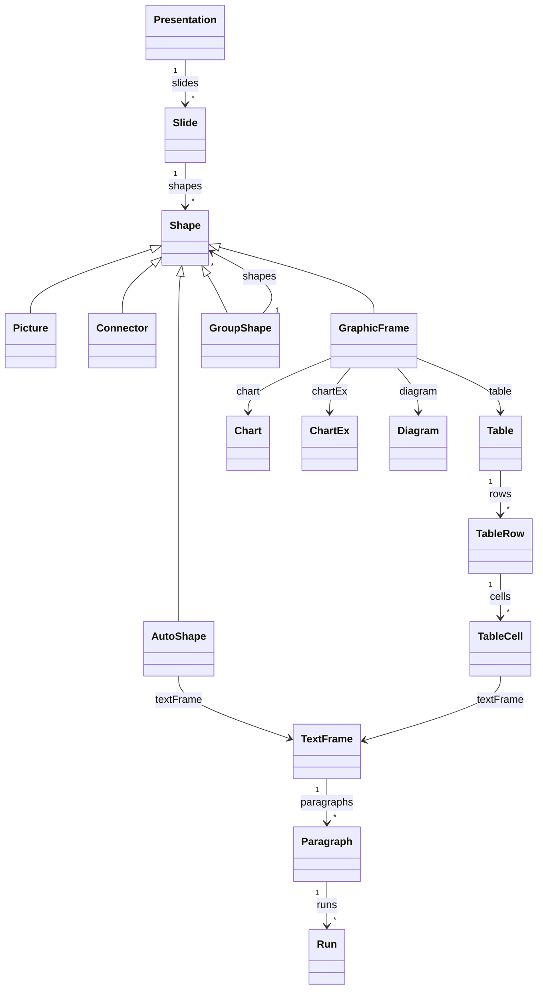
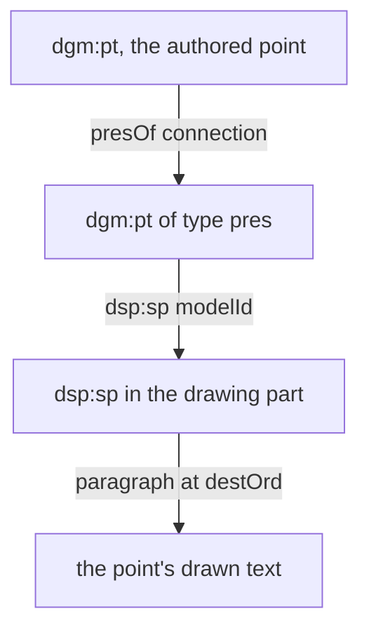

# Read object model

[`Presentation.load()`](api/read/classes/Presentation.md#load) returns a typed view of a deck. This page states how that view behaves: what each getter reads, what it inherits, and when it returns `null`. Each member links to its signature in the API reference.

Tasks are in the reading guides: [read and edit a deck](../reading/read-and-edit.md), [copy slides and shapes between decks](../reading/copy-between-decks.md) and [build on a template](../reading/build-on-a-template.md). What `save()` writes is on [Round-trip guarantee](round-trip.md).

## Object model



- A proxy reads its DOM element on every access and caches nothing. A collection getter builds new proxies each time, so `slide.shapes[0] !== slide.shapes[0]`. The same holds for `paragraphs`, `runs`, `rows`, `cells` and `points`.
- Two proxies over one element see each other's edits. Key a `Map` or a `Set` on a part name, a shape `id` or a point `modelId`, not on a proxy.
- Positions and sizes are in EMU: 914,400 per inch, 12,700 per point.
- A setter or an editing method writes to the DOM and marks the part that holds the element dirty.
- Every class exposes its element as `element_`, with a `markDirty()` beside it. [Read and edit a deck](../reading/read-and-edit.md#edit-the-xml-directly) covers editing through them.
- A shape's [`host`](api/read/classes/Shape.md#host) is the [`Slide`](api/read/classes/Slide.md), [`SlideLayout`](api/read/classes/SlideLayout.md), [`SlideMaster`](api/read/classes/SlideMaster.md) or [`NotesSlide`](api/read/classes/NotesSlide.md) whose part holds its shape tree. All four have `shapes`, returning the same five shape classes.
- `shapes` unwraps `mc:AlternateContent`. It reports the shape in the first `mc:Choice` that holds one, else the shape in `mc:Fallback`. ChartEx charts, 3D models, zoom frames and inline math arrive this way.

## Presentation

- [`slides`](api/read/classes/Presentation.md#slides) follows `p:sldIdLst`. An entry whose relationship names a missing part throws `package/relationship-target-missing`.
- [`slideSize`](api/read/classes/Presentation.md#slidesize) reports EMU and inches, and is `null` when `p:sldSz` is absent or incomplete.
- [`presentationPart`](api/read/classes/Presentation.md#presentationpart) resolves the main part through the package `officeDocument` relationship. It throws when there is not exactly one.
- [`embeddedFonts`](api/read/classes/Presentation.md#embeddedfonts) lists `p:embeddedFontLst` with each face's partname, and is `[]` when the deck embeds none. It skips an entry with no typeface and a face whose relationship is missing. See [Embedded fonts](../embedded-fonts.md#reading-it-back).
- [`masters()`](api/read/classes/Presentation.md#masters) and [`layouts()`](api/read/classes/Presentation.md#layouts) enumerate the chrome and copy nothing: see [Masters, layouts and themes](#masters-layouts-and-themes).

The methods that add, remove and copy slides are tasks:

| Methods | Guide |
| --- | --- |
| [`cloneSlide()`](api/read/classes/Presentation.md#cloneslide), [`importSlide()`](api/read/classes/Presentation.md#importslide), [`importSlides()`](api/read/classes/Presentation.md#importslides), [`importShape()`](api/read/classes/Presentation.md#importshape), [`importShapes()`](api/read/classes/Presentation.md#importshapes), [`importSlideMasters()`](api/read/classes/Presentation.md#importslidemasters) | [Copy slides and shapes between decks](../reading/copy-between-decks.md#choose-a-method) |
| [`fromTemplate()`](api/read/classes/Presentation.md#fromtemplate), [`appendSlides()`](api/read/classes/Presentation.md#appendslides), [`removeSlide()`](api/read/classes/Presentation.md#removeslide) | [Build on a template](../reading/build-on-a-template.md#add-generated-slides) |

### Document properties

| Getter | Part | When the part is absent | What it reports |
| --- | --- | --- | --- |
| [`coreProperties`](api/read/classes/Presentation.md#coreproperties) | `docProps/core.xml` | `{}` | Each [`CoreProperties`](api/read/interfaces/CoreProperties.md) field that has an element. An empty element reads `''`. `created`, `modified` and `lastPrinted` stay the W3CDTF strings the file holds, not `Date` objects, so no time zone conversion happens. |
| [`appProperties`](api/read/classes/Presentation.md#appproperties) | `docProps/app.xml` | `{}` | `application`, `appVersion`, `company` and `titlesOfParts`. `titlesOfParts` is the flat vector as written: fonts, then themes, then slide titles. `HeadingPairs`, which partitions it, is not read. The statistics are [kept but not decoded](round-trip.md#kept-but-not-decoded). |
| [`customProperties`](api/read/classes/Presentation.md#customproperties) | `docProps/custom.xml` | `[]` | `{ name, value }` pairs in file order. String types read as `string`, integer and real types as `number`, `vt:bool` as `boolean`, and `vt:filetime` and `vt:date` as the raw string. An unknown type reads as its text. |

The write side authors all three parts, from `pptx.title`, `subject`, `author` (read back as `creator`), `revision`, `company` and `setCustomProperty()`. `company` is the only `appProperties` field a caller sets. The library writes the other three about itself.

### Tags

- [`presentation.tags`](api/read/classes/Presentation.md#tags) and [`slide.tags`](api/read/classes/Slide.md#tags) return [`Tag`](api/read/interfaces/Tag.md) pairs from the `ppt/tags` parts the owner's `tags` relationships name. PowerPoint exposes the same data as `Presentation.Tags` and `Slide.Tags`.
- An owner with several tag parts reads them in relationship order. An owner with none reads `[]`.
- Nothing writes tags, on the write side or through the read model. Tag parts load and save byte-identical.

## Slide

A [`Slide`](api/read/classes/Slide.md) is one slide part, with its [`index`](api/read/classes/Slide.md#index) in deck order, [`slideId`](api/read/classes/Slide.md#slideid), [`partName`](api/read/classes/Slide.md#partname), [`relationships`](api/read/classes/Slide.md#relationships) and [`name`](api/read/classes/Slide.md#name). `name` is `null` when the slide is unnamed.

- [`shapes`](api/read/classes/Slide.md#shapes) lists the top-level shapes. [`shapeById()`](api/read/classes/Slide.md#shapebyid), [`shapeByName()`](api/read/classes/Slide.md#shapebyname) and [`placeholder()`](api/read/classes/Slide.md#placeholder) search top-level shapes only. [`shapeByIdDeep()`](api/read/classes/Slide.md#shapebyiddeep) also searches groups, visiting a group before its children.
- [`text`](api/read/classes/Slide.md#text) joins the slide's text in document order with `\n`: every text-bearing shape, shapes inside groups, table rows with their cells joined by a tab, and SmartArt text. It leaves out speaker notes and chart text.
- [`notesText`](api/read/classes/Slide.md#notestext), [`notesTextFrame`](api/read/classes/Slide.md#notestextframe), [`notesSlide`](api/read/classes/Slide.md#notesslide) and [`addNotes()`](api/read/classes/Slide.md#addnotes) are the speaker notes. [Read and edit a deck](../reading/read-and-edit.md#read-and-write-speaker-notes) describes them.
- [`layout`](api/read/classes/Slide.md#layout), [`master`](api/read/classes/Slide.md#master), [`theme`](api/read/classes/Slide.md#theme) and [`showMasterSp`](api/read/classes/Slide.md#showmastersp) reach the chrome: see [Masters, layouts and themes](#masters-layouts-and-themes).
- [`transition`](api/read/classes/Slide.md#transition) reads and writes `p:transition`. [`hasAnimations`](api/read/classes/Slide.md#hasanimations) and [`flattenAnimations()`](api/read/classes/Slide.md#flattenanimations) check for and remove build animations. See [Animations and transitions](../animations-and-transitions.md#reading-it-back).
- [`addTextBox()`](api/read/classes/Slide.md#addtextbox) and [`addPicture()`](api/read/classes/Slide.md#addpicture) add content. [Read and edit a deck](../reading/read-and-edit.md#add-and-remove-shapes) covers them.

### Hidden slides

- [`hidden`](api/read/classes/Slide.md#hidden) reads `p:sld/@show`, an `xsd:boolean` that defaults to `true`. A slide with no `show` attribute reads `false`. `show="0"` and `show="false"` read `true`.
- Setting `true` writes `show="0"`. Setting `false` removes the attribute. Either marks the slide part dirty.
- A slideshow skips hidden slides, and so does a PDF export from PowerPoint or LibreOffice. Once an earlier slide is hidden, rendered page N is no longer `slides[N]`:

```ts
const hidden = presentation.slides.filter((slide) => slide.hidden).length
const renderedPages = presentation.slides.length - hidden
```

### Background and slide number

[`background`](api/read/classes/Slide.md#background) is the background the slide renders. It walks [the inheritance chain](#the-inheritance-chain): the slide's own `p:bg`, else its layout's, else its master's. `source` names the tier that supplied it, and the getter is `null` when no tier defines one. [`SlideLayout.background`](api/read/classes/SlideLayout.md#background) and [`SlideMaster.background`](api/read/classes/SlideMaster.md#background) report only that part's own `p:bg`.

| `type` | Element | Fields |
| --- | --- | --- |
| `solid` | `a:solidFill` in `p:bgPr` | `colorRef` |
| `gradient` | `a:gradFill` in `p:bgPr` | `gradient` |
| `pattern` | `a:pattFill` in `p:bgPr` | `preset`, `foreground`, `background` |
| `image` | `a:blipFill` in `p:bgPr` | `relId`, `partName`, `picture` |
| `themeRef` | `p:bgRef` | `idx`, `colorRef`, `resolvedFill` |
| `none` | `p:bgPr` with `a:noFill` or no fill the reader recognizes | none |

- The write side authors `solid`, `gradient`, `pattern` and `image` backgrounds. It puts `p:bgRef idx="1001"` on its default layout, so a slide authored without a background reads `{ type: 'themeRef', source: 'layout', idx: 1001 }`, with a solid white `resolvedFill`.
- An `image` background's relationship resolves against the part that holds the `p:bg`. A background inherited from the layout resolves through the layout's relationships.
- A `themeRef` keeps its `idx` and resolves it in `resolvedFill`. An `idx` of 1000 or more selects entry `idx` minus 1000 of the theme's `a:bgFillStyleLst`, counting from 1. A lower `idx` selects that entry of `a:fillStyleLst`. The entry's `phClr` takes the colour inside `p:bgRef`, and an image entry resolves through the theme part's relationships.
- `resolvedFill` is `null` when the theme has no `a:fmtScheme`, the entry does not exist, or the colour does not resolve.

[`slideNumberPlaceholder`](api/read/classes/Slide.md#slidenumberplaceholder) returns the slide's own `sldNum` placeholder, which the write-side `slide.slideNumber` option creates. A slide number defined with `defineSlideMaster({ slideNumber })` sits on the layout, so this getter reads `null` for it. Read it from [`slide.layout.placeholders`](api/read/classes/SlideLayout.md#placeholders).

### Comments

PowerPoint has two comment formats. A deck uses one of them, and the getters of the other read `[]`.

| Format | Slide getter | Deck getter | Parts | Written by `pptx-ts` |
| --- | --- | --- | --- | --- |
| Legacy | [`comments`](api/read/classes/Slide.md#comments), returning [`Comment`](api/read/interfaces/Comment.md) | [`commentAuthors`](api/read/classes/Presentation.md#commentauthors), returning [`CommentAuthor`](api/read/interfaces/CommentAuthor.md) | `commentN.xml` under `ppt/comments/`, and `ppt/commentAuthors.xml` | Yes, by `slide.addComment()` |
| Modern (2018) | [`modernComments`](api/read/classes/Slide.md#moderncomments), returning [`ModernComment`](api/read/interfaces/ModernComment.md) | [`modernCommentAuthors`](api/read/classes/Presentation.md#moderncommentauthors), returning [`ModernCommentAuthor`](api/read/interfaces/ModernCommentAuthor.md) | `modernComment_*.xml` under `ppt/comments/`, and `ppt/authors.xml` | No |

- [`commentSchema`](api/read/classes/Presentation.md#commentschema) reports `'modern'` when the deck has a modern comments part, else `'legacy'` when it has a legacy one, else `'none'`.
- Both formats are read-only in the read model. Each getter parses the part on every call and returns plain objects. Changing a returned object changes nothing in the deck, and no method adds, edits or removes a comment. Comment parts load and save byte-identical.
- A legacy comment resolves `authorId` against `commentAuthors` to `author` and `authorInitials`, which are `null` when no author matches. It carries `idx` (the author's comment number), `text`, the marker position `x` and `y` in EMU, and `date` as written.
- A modern comment's `id` and `authorId` are GUID strings. `author` and `authorInitials` resolve against `modernCommentAuthors`, whose entries also carry `userId` and `providerId`. `created` is the timestamp as written, and `text` joins the comment's paragraphs with `\n`.
- A modern comment's `replies` holds its replies in thread order. A reply has `x` and `y` of `null` and no replies of its own.

## Masters, layouts and themes

A slide resolves colours, fonts, placeholder positions and its background against three shared parts: its layout, that layout's master, and the master's theme.


- [`slide.layout`](api/read/classes/Slide.md#layout) follows the slide's `slideLayout` relationship, [`layout.master`](api/read/classes/SlideLayout.md#master) the layout's `slideMaster` relationship, and [`master.theme`](api/read/classes/SlideMaster.md#theme) the master's `theme` relationship. Each is `null` when its relationship or part is missing.
- `slide.master` is `slide.layout?.master`, and `slide.theme` is `slide.layout?.master?.theme`. [`layout.theme`](api/read/classes/SlideLayout.md#theme) is `layout.master?.theme`.
- From the deck side, [`presentation.masters()`](api/read/classes/Presentation.md#masters) lists masters in `p:sldMasterIdLst` order, and [`master.layouts`](api/read/classes/SlideMaster.md#layouts) lists a master's layouts in `p:sldLayoutIdLst` order. [`presentation.layouts()`](api/read/classes/Presentation.md#layouts) lists every layout as a [`LayoutHandle`](api/read/interfaces/LayoutHandle.md).

### The inheritance chain

Every getter below takes the first tier that defines a value.

| Value | Getter | Tiers, in order | Reports the tier |
| --- | --- | --- | --- |
| Background | [`Slide.background`](api/read/classes/Slide.md#background) | Slide `p:bg`, layout `p:bg`, master `p:bg` | `source` |
| Placeholder position and size | [`Shape.resolvedFrame`](api/read/classes/Shape.md#resolvedframe) | The shape's own `a:xfrm`, the matching layout placeholder's, the matching master placeholder's | `source` |
| Vertical text anchor | [`TextFrame.resolvedAnchor`](api/read/classes/TextFrame.md#resolvedanchor) | The frame's own `a:bodyPr/@anchor`, the matching layout placeholder's, the matching master placeholder's | No |
| Run colour | [`Run.resolvedColor`](api/read/classes/Run.md#resolvedcolor) | The run's own fill, the shape's `p:style/a:fontRef`, then the list-style tiers | No |
| Run typeface | [`Run.resolvedFontFace`](api/read/classes/Run.md#resolvedfontface) | The run's own `a:latin`, the shape's `p:style/a:fontRef`, then the list-style tiers. A `+mj-*` or `+mn-*` token resolves through the theme font scheme. | No |
| Run size, bold and italic | [`resolvedSizePt`](api/read/classes/Run.md#resolvedsizept), [`resolvedBold`](api/read/classes/Run.md#resolvedbold), [`resolvedItalic`](api/read/classes/Run.md#resolveditalic) | The run's own `a:rPr` attribute, then the list-style tiers | No |

- The list-style tiers are: the paragraph's `a:pPr/a:defRPr`, the text body's `a:lstStyle` for the paragraph level, the matching layout placeholder's `a:lstStyle`, the matching master placeholder's `a:lstStyle`, the master's `p:txStyles`, and the presentation's `p:defaultTextStyle`. A run outside a placeholder skips the three placeholder tiers.
- A run whose own fill is not a solid colour, such as `a:noFill` or a gradient, reads `null` from `resolvedColor`.
- A table cell's text inherits differently: see [Tables](#tables).
- A `schemeClr` token resolves through the colour map of the tier that holds the shape, then the theme's colour scheme.

A slide placeholder inherits from the layout or master placeholder that matches its `p:ph`:

- `dt`, `ftr`, `sldNum` and `hdr` match only a placeholder of the same type.
- Any other type matches, in order: the same `idx` in the same category, then the same `idx`, then the same category. It never matches one of the four types above.
- The categories are title (`title`, `ctrTitle`), body (`body`, `subTitle`, `obj`, or no type) and other.
- An absent `idx` counts as `0`.

The write side puts an `a:xfrm` on every placeholder it authors, so `resolvedFrame.source` reads `'own'` on a deck this library wrote. PowerPoint leaves `a:xfrm` off a placeholder the user never moved, and `resolvedFrame` then reports the layout's or master's box.

`resolvedFrame` fills in inherited geometry and does not compose groups. [`absoluteFrame`](#absolute-frame-and-groups) composes groups and does not inherit.

### Owned vs shared

- A slide's own shapes belong to that slide alone.
- Its layout, master and theme are shared. Every slide bound to a layout reads the same layout part, and every layout under a master reads the same master and theme.
- An edit to a layout or master, through its shapes, its placeholders or `element_`, or an edit to a theme, marks that shared part dirty. It changes every slide that uses the part.

Copying a page follows the same split. Two copies of one page, from [`cloneSlide()`](api/read/classes/Presentation.md#cloneslide), from importing the same page twice, or from naming it twice in one `importSlides()` batch, share some parts and each own the rest. [`importShape()`](api/read/classes/Presentation.md#importshape) applies the same rule to one shape.

| Shared by the copies | Owned, so each copy gets its own |
| --- | --- |
| Slide layout, slide master, theme and theme override | A chart or chartEx chart, with its embedded workbook and its `chartUserShapes` drawing |
| Notes master, handout master, presentation properties, view properties and table styles | The five SmartArt parts: data, layout, quick style, colours and drawing |
| Images, audio, video, 3D models and fonts | OLE embeddings, tags and comments |
| The legacy and modern comment author lists | The notes slide, and its relationship back to the page |
| Another slide a jump link points at, and external hyperlink targets | Every other part |

- Ownership passes down: a part a page owns owns its own subtree, down to the media at the leaves.
- The rule lists what may be shared and copies everything else, so a relationship type it does not know is copied. A wrongly shared part makes a deck PowerPoint refuses to open; a wrongly copied one only duplicates bytes.
- PowerPoint refuses to open a package in which two slides resolve to one chart or one diagram, and the schema validator accepts such a package.
- [Copy slides and shapes between decks](../reading/copy-between-decks.md#choose-a-method) covers the copy methods.

### Master and layout shapes

- [`SlideMaster.shapes`](api/read/classes/SlideMaster.md#shapes) and [`SlideLayout.shapes`](api/read/classes/SlideLayout.md#shapes) return every shape in that tier's tree, as the same five classes `Slide.shapes` returns. A template's bands, rules and logos are here.
- [`placeholders`](api/read/classes/SlideLayout.md#placeholders) lists the placeholder shapes of the same tree as [`Placeholder`](api/read/classes/Placeholder.md) objects, with type, `idx`, name, id, own position and size, and text frame.
- Read a placeholder through `placeholders` to place it. Read the same element through `shapes` to draw it, because only the shape carries the paint getters. Both views resolve text inheritance the same way.
- [`Placeholder.idx`](api/read/classes/Placeholder.md#idx) is `null` when the attribute is absent. [`AutoShape.placeholder`](api/read/classes/AutoShape.md#placeholder) reports `'0'` for the same element.
- A colour token on a master shape resolves through the master's colour map and theme. On a layout shape it resolves through the layout's master and theme.
- `defineSlideMaster({ objects })` writes its non-placeholder objects into the layout's tree and nothing into the master's. A deck this library wrote reads `master.shapes` as `[]`.
- A master's or layout's [`name`](api/read/classes/SlideLayout.md#name) is `''` when it is unnamed.

### Whether master shapes are drawn

- [`Slide.showMasterSp`](api/read/classes/Slide.md#showmastersp) and [`SlideLayout.showMasterSp`](api/read/classes/SlideLayout.md#showmastersp) read `@showMasterSp`, which defaults to `true`.
- PowerPoint writes `showMasterSp="0"` on section dividers and full-bleed layouts. It hides the master's non-placeholder shapes and leaves its placeholders.
- A renderer that paints `master.shapes` has to check both tiers:

```ts
const drawMasterShapes = slide.showMasterSp && (slide.layout?.showMasterSp ?? true)
```

- Both getters are read-only, and the write side authors neither attribute.
- The object model does not stack the tiers for you. Painting master shapes under layout shapes under slide shapes is the caller's job.

### Theme, colour map and layout type

- [`Theme.colorScheme`](api/read/classes/Theme.md#colorscheme) reports the twelve slots as 6-digit hex. An `a:sysClr` slot reads its `lastClr`, and a missing slot reads `null`. [`color()`](api/read/classes/Theme.md#color) reads one slot.
- [`Theme.fontScheme`](api/read/classes/Theme.md#fontscheme) reports the major (heading) and minor (body) faces for Latin, East Asian and complex script. An empty `typeface` reads `null`, and the per-script `a:font` list is not read. The getter is `null` when the theme has no font scheme.
- [`SlideMaster.colorMap`](api/read/classes/SlideMaster.md#colormap) maps each of the twelve tokens, such as `tx1`, to a theme slot. A token the map omits reads `null`.
- [`SlideLayout.type`](api/read/classes/SlideLayout.md#type) reads `p:sldLayout/@type`. The write side authors none, so a deck this library wrote reads `null`.

## Shapes

| Element | Class | `shapeType` |
| --- | --- | --- |
| `p:sp` | [`AutoShape`](api/read/classes/AutoShape.md) | `autoShape` |
| `p:pic` | [`Picture`](api/read/classes/Picture.md) | `picture` |
| `p:cxnSp` | [`Connector`](api/read/classes/Connector.md) | `connector` |
| `p:graphicFrame` | [`GraphicFrame`](api/read/classes/GraphicFrame.md) | `graphicFrame` |
| `p:grpSp` | [`GroupShape`](api/read/classes/GroupShape.md) | `group` |

- `shapes` returns [`AnyShape`](api/read/type-aliases/AnyShape.md), the union of the five classes. Narrow it on `shapeType` or with [`isAutoShape()`](api/read/functions/isAutoShape.md) and the other guards.
- Only an `AutoShape` with a `p:txBody` has a [`textFrame`](api/read/classes/Shape.md#textframe). [`hasTextFrame`](api/read/classes/Shape.md#hastextframe) is `false` for every other shape, and setting [`text`](api/read/classes/Shape.md#text) on one throws `shape/no-text-frame`.
- [`presetGeometry`](api/read/classes/Shape.md#presetgeometry) reads `a:prstGeom/@prst` on pictures and connectors as well as auto shapes. A group reads `null`. [`adjustValues`](api/read/classes/Shape.md#adjustvalues) maps each adjust guide name to its formula.
- [`hidden`](api/read/classes/Shape.md#hidden) reads `p:cNvPr/@hidden`. [`description`](api/read/classes/Shape.md#description) is the alt text, and setting `''` removes it. [`title`](api/read/classes/Shape.md#title) and [`isDecorative`](api/read/classes/Shape.md#isdecorative) are read-only.
- [`delete()`](api/read/classes/Shape.md#delete) removes the shape from its tree or group and marks the host part dirty. It also removes the build animations of every shape it removes, and drops each connector binding (`a:stCxn`, `a:endCxn`) that named one.

### Geometry

- [`left`](api/read/classes/Shape.md#left), [`top`](api/read/classes/Shape.md#top), [`width`](api/read/classes/Shape.md#width) and [`height`](api/read/classes/Shape.md#height) read the shape's own transform in EMU. They are `null` when the shape has none, as for a placeholder that inherits its box.
- For a shape inside a group they are in the group's child coordinates: see [Absolute frame and groups](#absolute-frame-and-groups).
- A setter creates the transform when it is absent: `p:xfrm` on a graphic frame, `a:xfrm` in `p:grpSpPr` on a group, `a:xfrm` in `p:spPr` on the rest. It rounds to whole EMU.
- `left` and `top` reject a value that is not finite, with `coord/non-finite`. `width` and `height` also reject zero and negatives, with `coord/not-positive`.
- [`rotation`](api/read/classes/Shape.md#rotation) is in degrees. It is `null` without an own transform and `0` for a transform with no `rot`. It is not converted to a signed angle: `rot="19216344"` reads `320.27`, not `-39.73`.
- [`flipH`](api/read/classes/Shape.md#fliph) and [`flipV`](api/read/classes/Shape.md#flipv) are `false` when unset or when the shape has no own transform.
- [`resolvedFrame`](api/read/classes/Shape.md#resolvedframe) adds inherited placeholder geometry: see [The inheritance chain](#the-inheritance-chain).

### Absolute frame and groups

A group states two boxes on its `a:xfrm`: where it sits on the slide (`a:off`, `a:ext`), and the child coordinate space its shapes are placed in (`a:chOff`, `a:chExt`). A child's `left`, `top`, `width` and `height` are in that child space, so they cannot be placed on the slide directly.

- [`absoluteFrame`](api/read/classes/Shape.md#absoluteframe) maps the shape through each enclosing group, innermost first, as `off + (p - chOff) * (ext / chExt)`. It then applies each group's flips, and its rotation about the group centre.
- The result is the unrotated box PowerPoint writes when you ungroup, rounded to whole EMU. `rotation` is the combined rotation in degrees, from 0 up to 360, and `flipH` and `flipV` are the flips combined along the chain.
- For a shape at slide level, the box equals its own `left`, `top`, `width` and `height`.
- [`absoluteFrameFailure`](api/read/classes/Shape.md#absoluteframefailure) says why `absoluteFrame` is `null`:

| `absoluteFrameFailure` | Meaning |
| --- | --- |
| `null` | The frame resolved. |
| `'no-own-transform'` | The shape has no complete `a:xfrm`, typically a placeholder that inherits its box. The deck is fine: read `resolvedFrame`. |
| `'group-transform-missing'` | An enclosing group lacks a complete `a:off`, `a:ext`, `a:chOff` and `a:chExt` set, so its child space is unknown. |
| `'group-transform-degenerate'` | An enclosing group's `a:chExt` is zero on an axis, so the mapping would divide by zero. |

- When one chain holds both group failures, `'group-transform-missing'` is reported.
- `pptx-ts/inspect` warns with `inspect/group-transform-missing` and `inspect/group-transform-degenerate`, and stays silent for `'no-own-transform'`.
- [`GroupShape.childFrame`](api/read/classes/GroupShape.md#childframe) returns the group's `a:chOff` and `a:chExt` box, and is `null` when either is incomplete. A consumer that rebuilds the group needs it to reproduce the child scaling. A consumer that paints needs only `absoluteFrame`.
- [`GroupShape.shapes`](api/read/classes/GroupShape.md#shapes) lists the shapes directly inside the group.

### Fill and line

| Kind | Fill: read | Fill: set | Line: read | Line: set |
| --- | --- | --- | --- | --- |
| `AutoShape` | `p:spPr` | Yes | `a:ln` in `p:spPr` | Yes |
| `Connector` | `p:spPr` | Yes | `a:ln` in `p:spPr` | Yes |
| `Picture` | `p:spPr`, not the image | No: `shape/fill-unsupported` | `a:ln` in `p:spPr`, the border | Yes |
| `GroupShape` | `p:grpSpPr` | Yes | Always `null`: `p:grpSpPr` has no `a:ln` | No: `shape/line-unsupported` |
| `GraphicFrame` | Always `null`: a graphic frame has no `p:spPr` | No: `shape/fill-unsupported` | Always `null` | No: `shape/line-unsupported` |

- The setters are [`fillColor`](api/read/classes/Shape.md#fillcolor), [`fillSchemeColor`](api/read/classes/Shape.md#fillschemecolor), [`noFill()`](api/read/classes/Shape.md#nofill), [`lineColor`](api/read/classes/Shape.md#linecolor) and [`lineSchemeColor`](api/read/classes/Shape.md#lineschemecolor).
- A `*Color` setter takes 6-digit hex, with or without `#`, and stores it upper-cased. Malformed input throws. A `*SchemeColor` setter takes a theme token such as `accent2`.
- A fill or line holds one solid colour, so setting the hex clears the token and setting the token clears the hex.
- Setting `null` removes the `a:solidFill`, and the shape inherits from its `p:style` or placeholder again. `noFill()` writes `<a:noFill/>` instead: a transparent surface, not an inherited one. [`fillNoFill`](api/read/classes/Shape.md#fillnofill) and [`lineNoFill`](api/read/classes/Shape.md#linenofill) report an explicit no-fill.
- Setting `null` never throws, even on a kind the table marks No, so a fill a deck wrote on a picture can still be cleared.
- A setter creates `p:spPr` or `p:grpSpPr`, `a:ln` and `a:solidFill` in schema order when they are absent.
- A table or chart in a graphic frame has its own fill model: see [Tables](#tables) and [Charts](#charts).

The other paint getters are read-only:

- [`resolvedFill`](api/read/classes/Shape.md#resolvedfill) resolves a solid fill to hex. With no fill in `p:spPr` it falls back to the `p:style/a:fillRef` fill. It is `null` for a gradient, pattern, image or `a:noFill` fill.
- [`resolvedLine`](api/read/classes/Shape.md#resolvedline) resolves the line's solid fill. An `a:ln` with no fill of its own falls back to the `p:style/a:lnRef` colour, because PowerPoint layers such an `a:ln` over the style line one property at a time.
- [`gradientFill`](api/read/classes/Shape.md#gradientfill), [`gradientStops`](api/read/classes/Shape.md#gradientstops), [`patternFill`](api/read/classes/Shape.md#patternfill) and [`pictureFill`](api/read/classes/Shape.md#picturefill) decode the fills `resolvedFill` does not. The write side authors pattern fills with `fill: { type: 'pattern' }` and picture fills with `fill: { type: 'image' }`.
- [`lineWidthPt`](api/read/classes/Shape.md#linewidthpt), [`lineDash`](api/read/classes/Shape.md#linedash), [`lineCap`](api/read/classes/Shape.md#linecap), [`lineAlign`](api/read/classes/Shape.md#linealign), [`lineEnds`](api/read/classes/Shape.md#lineends) and [`lineGradient`](api/read/classes/Shape.md#linegradient) describe the line.

### Colours

Every read value that carries a colour carries a [`ColorRef`](api/read/interfaces/ColorRef.md).

- At most one of `srgb`, `scheme` and `preset` is set, naming the colour model the file used. `a:sysClr` and `a:hslClr` set none of the three and report only through `resolved`.
- An absent colour has every field `null`, so a `ColorRef` itself is never `null`.
- `resolved` is a [`ResolvedColor`](api/read/interfaces/ResolvedColor.md): the base `hex`, the `transforms` in document order, `effectiveHex` with the transforms applied, and `alpha` when a transform sets opacity.
- `resolved` is `null` when the colour cannot be made literal, for an unmapped token or an `a:scrgbClr`. It is always `null` in a chart part, which the reader reads without a theme.
- `effectiveHex` is the colour a renderer paints. To re-author the colour against a different theme, carry `scheme` and `transforms` instead: a literal `effectiveHex` stops following the theme.
- [`readColorRef()`](api/read/functions/readColorRef.md) reads one colour element.

### Picture fill

[`pictureFill`](api/read/classes/Shape.md#picturefill) decodes an `a:blipFill` used as a fill: in a shape's `p:spPr` or a group's `p:grpSpPr`, a table's `a:tblPr`, a cell's `a:tcPr`, or a background's `p:bgPr`. It is a different thing from a `Picture`, whose image is its own `p:blipFill`.

- `resolvedFill` reports `null` for an image fill, so an image-filled shape reads as unfilled there. Read `pictureFill`.
- `partName` resolves the relationship through the part that holds the fill. It is `null` for an external or missing target.
- `srcRect` and `fillRect` are per-edge fractions, where `0.1` is 10 percent. `fillRect` can be negative, when the image extends past that edge. An explicit empty `a:srcRect` reads zeros, not `null`.
- `tile` offsets are EMU, and its scales are fractions where `1` is 100 percent. `alpha` is a fraction, and `null` when the fill sets none.
- See [`PictureFill`](api/read/interfaces/PictureFill.md) for every field.

### Effects

| Effect | Getter | Element in `a:effectLst` | The library writes it | The library reads it |
| --- | --- | --- | --- | --- |
| Outer shadow | [`shadow`](api/read/classes/Shape.md#shadow) | `a:outerShdw` | Yes, from `shadow: { type: 'outer' }` on shapes, text boxes and images | Yes |
| Inner shadow | [`innerShadow`](api/read/classes/Shape.md#innershadow) | `a:innerShdw` | Yes, from `shadow: { type: 'inner' }` | Yes |
| Glow | [`glow`](api/read/classes/Shape.md#glow) | `a:glow` | No. The write-side `glow` option puts `a:glow` in the text run properties, which no getter reads. | Yes |
| Reflection | [`reflection`](api/read/classes/Shape.md#reflection) | `a:reflection` | No | Yes |
| Soft edge | [`softEdge`](api/read/classes/Shape.md#softedge) | `a:softEdge` | No | Yes |

- Each getter returns `null` when the shape has no such element.
- Distances are points (EMU divided by 12,700), and angles are degrees.
- An attribute the file does not state is left off the result, not set to zero. A soft edge with no `rad` reads `radiusPt: 0`.
- A shadow's or glow's opacity is `colorRef.resolved.alpha`: `transparency: 25` on the write side reads back as `alpha` 0.75.
- Reflection alpha and position fields are fractions from 0 to 1. A reflection carries no colour.

### Custom geometry

[`customGeometry`](api/read/classes/Shape.md#customgeometry) reads `a:custGeom/a:pathLst`, and is `null` for a shape with preset geometry or none. Every shape class has it, as with `presetGeometry`: a picture clipped to a freeform reads its clip path, and a group reads `null`.

- It returns one entry per `a:path`, each with `w`, `h`, `fill`, `stroke` and its [`GeometryCommand`](api/read/type-aliases/GeometryCommand.md) list in document order. An absent attribute reads its schema default: `w` and `h` of `0`, `fill` of `'norm'`, `stroke` of `true`.
- Coordinates are path units from `0` to `w` and `0` to `h`, not EMU. Scale them against the path's `w` and `h` and the shape's box.
- A coordinate that is not a number, such as a guide name, reads `0`.
- `arcTo` angles are degrees.
- The command names match the write-side `GeometryPoint` list, one to one.
- PowerPoint writes one `a:path` per shape, and a shape with a hole as two contours in that one path. A list with several `a:path` elements comes from other producers, such as SVG import.

### Pictures and SVG

- [`imageRelId`](api/read/classes/Picture.md#imagerelid) and [`imagePartName`](api/read/classes/Picture.md#imagepartname) name the raster image, from `a:blip/@r:embed`.
- [`svgRelId`](api/read/classes/Picture.md#svgrelid) and [`svgPartName`](api/read/classes/Picture.md#svgpartname) name the SVG, from the `asvg:svgBlip` extension.
- PowerPoint usually pairs an SVG with a raster fallback. Some exporters write an SVG with no raster, where `imagePartName` is `null` and only `svgPartName` resolves.
- [`mediaKind`](api/read/classes/Picture.md#mediakind) reports `'raster'`, `'svg'`, `'both'` or `'none'`. [`mediaPartName`](api/read/classes/Picture.md#mediapartname) is the raster part, else the SVG part.
- A partname getter is `null` when the id is absent, when the part's relationships lack it, or when it points outside the package, as for a linked image.
- [`crop`](api/read/classes/Picture.md#crop) reads `a:srcRect` as fractions, and [`recolor`](api/read/classes/Picture.md#recolor) reads the first recolour effect on the blip.
- [`setImage()`](api/read/classes/Picture.md#setimage) replaces the image: see [Read and edit a deck](../reading/read-and-edit.md#replace-the-image-of-a-picture).

### Connector endpoints

- [`startConnection`](api/read/classes/Connector.md#startconnection) and [`endConnection`](api/read/classes/Connector.md#endconnection) decode `a:stCxn` and `a:endCxn` into a [`ConnectionSite`](api/read/interfaces/ConnectionSite.md): `shapeId`, `siteIndex` and `boundShape`.
- An unbound end reads `null`. So does an end whose `id` or `idx` is not a number.
- `boundShape` finds the shape with that id in the connector's host tree, groups included. It is `null` when no shape carries the id.
- The write-side `addConnector({ startShape, endShape })` writes the binding, with `idx="0"` when `startShapeIdx` or `endShapeIdx` is omitted. See [Connectors](../connectors.md#reading-it-back).

## Text frames, paragraphs and runs

- [`TextFrame.text`](api/read/classes/TextFrame.md#text) joins its paragraphs with `\n`. Setting it collapses the frame to one paragraph and one run, keeping the first run's `a:rPr`.
- [`Paragraph.text`](api/read/classes/Paragraph.md#text) joins run and field text in document order, with each `a:br` as `\n`. Setting it replaces that paragraph with one run, keeping its first run's `a:rPr` and its `a:pPr`, and leaves the other paragraphs alone.
- [`Run.text`](api/read/classes/Run.md#text) is the `a:t` text as written. Setting a value with leading or trailing whitespace adds `xml:space="preserve"`.
- [`Paragraph.runs`](api/read/classes/Paragraph.md#runs) lists `a:r` elements only. Fields and breaks are not runs.
- [`bodyProperties`](api/read/classes/TextFrame.md#bodyproperties) reports only the insets, anchor, wrap and direction the frame states. An absent inset is PowerPoint's default.
- [`level`](api/read/classes/Paragraph.md#level) is `0` when unset. [`align`](api/read/classes/Paragraph.md#align), [`lineSpacing`](api/read/classes/Paragraph.md#linespacing), [`spaceBeforePt`](api/read/classes/Paragraph.md#spacebeforept), [`spaceAfterPt`](api/read/classes/Paragraph.md#spaceafterpt), [`marginLeftPt`](api/read/classes/Paragraph.md#marginleftpt) and [`indentPt`](api/read/classes/Paragraph.md#indentpt) are `null` when unset.
- `spaceBeforePt` and `spaceAfterPt` are also `null` for spacing given as a percentage. `lineSpacing` reports either form: `{ type: 'points', valuePt }` or `{ type: 'percent', percent }`, where `150` is 1.5 lines.
- [`bulletDetail`](api/read/classes/Paragraph.md#bulletdetail) reports the bullet as `none`, `char`, `autoNum` or `picture`, with the bullet's own font, size and colour. It is `null` when the paragraph inherits its bullet.

A run's own getters and its resolved getters answer different questions:

| Own value, `null` when the run does not set it | Effective value, through [the inheritance chain](#the-inheritance-chain) |
| --- | --- |
| [`fontSizePt`](api/read/classes/Run.md#fontsizept) | [`resolvedSizePt`](api/read/classes/Run.md#resolvedsizept) |
| [`bold`](api/read/classes/Run.md#bold), [`italic`](api/read/classes/Run.md#italic) | [`resolvedBold`](api/read/classes/Run.md#resolvedbold), [`resolvedItalic`](api/read/classes/Run.md#resolveditalic) |
| [`fontName`](api/read/classes/Run.md#fontname), possibly a theme token | [`resolvedFontFace`](api/read/classes/Run.md#resolvedfontface) |
| [`color`](api/read/classes/Run.md#color), [`schemeColor`](api/read/classes/Run.md#schemecolor) | [`resolvedColor`](api/read/classes/Run.md#resolvedcolor) |

- `bold` and `italic` are `null` when the attribute is absent, which means inherited, not `false`.
- At most one of `color` and `schemeColor` is set. Setting one clears the other, and setting `null` removes the run's solid fill.
- `fontSizePt` takes points and rejects zero, negatives and non-finite values. `bold`, `italic`, `fontSizePt`, `underline` and `fontName` remove the attribute when set to `null`.
- [`underline`](api/read/classes/Run.md#underline) takes an `ST_TextUnderlineType` token such as `sng`, and throws `text/invalid-underline` for any other value.
- [`strike`](api/read/classes/Run.md#strike) and [`caps`](api/read/classes/Run.md#caps) report the raw token, because the attribute has three states. [`baselinePct`](api/read/classes/Run.md#baselinepct) is a percent: the write side's superscript is `30` and its subscript `-40`.
- [`charSpacingPt`](api/read/classes/Run.md#charspacingpt) and [`highlight`](api/read/classes/Run.md#highlight) are read-only.

### Autofit

- [`autofit`](api/read/classes/TextFrame.md#autofit) reads the `a:bodyPr` autofit child as `'none'`, `'normAutofit'` or `'spAutoFit'`. A `a:bodyPr` with no autofit child reads `'none'`, and a frame with no `a:bodyPr` reads `null`.
- [`autofitFontScale`](api/read/classes/TextFrame.md#autofitfontscale) and [`autofitLineSpaceReduction`](api/read/classes/TextFrame.md#autofitlinespacereduction) read the percentages stored on `a:normAutofit`.
- The write-side `fit: 'shrink'` writes a bare `<a:normAutofit/>`, so `autofitFontScale` reads `null`: PowerPoint computes the scale when the text is next edited. `fit: { type: 'shrink', fontScale, lnSpcReduction }` stores the values. See [Text that fits](../text-fit.md).

### Hyperlinks

- [`Run.hyperlink`](api/read/classes/Run.md#hyperlink) reads `a:hlinkClick` into a [`RunHyperlink`](api/read/interfaces/RunHyperlink.md), and is `null` when the run has no link.
- `relId` resolves through the relationships of the part that holds the text. An external target fills `url`. An internal target, such as a slide jump, fills `targetPartName`.
- Runs in shapes, table cells, speaker notes and SmartArt points all resolve their links.
- Text in a SmartArt drawing cache is read without relationships, so its links report `relId`, `action` and `tooltip` only.
- An empty `action` or `tooltip` attribute reads `null`.

## Tables

[`GraphicFrame.table`](api/read/classes/GraphicFrame.md#table) is set when [`hasTable`](api/read/classes/GraphicFrame.md#hastable) is `true`. [Tables](../tables.md#reading-it-back) lists the members and covers reading and editing a table as tasks. The notes below are how the getters behave.

- [`Table.cell(row, column)`](api/read/classes/Table.md#cell) counts `a:tc` elements in the row, and is `null` outside the table. A merged cell's covered positions are cells too, marked by [`isMergeContinuation`](api/read/classes/TableCell.md#ismergecontinuation).
- [`columnCount`](api/read/classes/Table.md#columncount) counts `a:gridCol` elements. [`TableRow.heightEmu`](api/read/classes/TableRow.md#heightemu) is `null` when `a:tr` has no `h`.
- [`styleId`](api/read/classes/Table.md#styleid) is the raw `a:tableStyleId` GUID, the same string the write-side `tableStyle` option takes.
- [`resolvedStyle`](api/read/classes/Table.md#resolvedstyle) looks the id up in `ppt/tableStyles.xml`. It is `null` when that part does not define the style, as for a built-in style PowerPoint has not written into the deck.
- [`TableCell.resolvedFill`](api/read/classes/TableCell.md#resolvedfill) is the cell's own solid fill. A cell with no fill of its own takes the table style's fill for its region: header row, banding or whole table. A cell with another kind of fill (`a:blipFill`, `a:gradFill`, `a:pattFill`, `a:noFill`) reads `null`.
- [`hasOwnFill`](api/read/classes/TableCell.md#hasownfill) tells a cell's own fill from the style's. [`fillNoFill`](api/read/classes/TableCell.md#fillnofill), [`pictureFill`](api/read/classes/TableCell.md#picturefill), [`gradientFill`](api/read/classes/TableCell.md#gradientfill) and [`patternFill`](api/read/classes/TableCell.md#patternfill) read the other kinds.
- [`Table.resolvedFill`](api/read/classes/Table.md#resolvedfill) and its sibling getters read the table's own background in `a:tblPr`, which shows through cells with no fill.
- [`borders`](api/read/classes/TableCell.md#borders) is `null` when the cell has no `a:tcPr` or no edge element. Otherwise each of the four edges and two diagonals is a [`CellBorder`](api/read/interfaces/CellBorder.md) or `null`.
- An edge with `noFill: true` is explicitly suppressed. That is not the same as an edge the cell leaves to the table style.
- A cell run's colour, typeface, bold and italic come from the table style's text style for the cell's region. When the style names no colour or typeface, they are the theme's `tx1` and minor font, with or without a table style.
- A cell run's size, and its bold and italic where the table style is silent, come from the master's `p:otherStyle`, not from `p:defaultTextStyle`.

## Charts

[`GraphicFrame.chart`](api/read/classes/GraphicFrame.md#chart) resolves the frame's chart part, and is `null` when the part is missing.

- Charts are read-only. The values are the caches the chart part stores (`c:numCache`, `c:strCache`), not the embedded workbook.
- The chart part is read without a theme. A series colour reports `colorRef.srgb` or an unresolved `colorRef.scheme`, and `colorRef.resolved` is always `null`.
- [`chartType`](api/read/classes/Chart.md#charttype) is the first plot group's type. [`chartTypes`](api/read/classes/Chart.md#charttypes) lists every group, several for a combo chart.
- [`Chart.categories`](api/read/classes/Chart.md#categories) and [`categoryLevels`](api/read/classes/Chart.md#categorylevels) come from the first series.
- [`Chart.dataLabels`](api/read/classes/Chart.md#datalabels) is the first plot group's labels block. [`ChartSeries.dataLabels`](api/read/classes/ChartSeries.md#datalabels) is the series' own. A pie keeps the flags the user set on the series, and an all-off block on the group.
- A bar or area series has no `a:ln` by default, so its [`line`](api/read/classes/ChartSeries.md#line) reads `null`.

| Series | Where the data is |
| --- | --- |
| Category charts (bar, line, pie and the rest) | [`values`](api/read/classes/ChartSeries.md#values) and [`categories`](api/read/classes/ChartSeries.md#categories) |
| Scatter or bubble with numeric X | [`xValues`](api/read/classes/ChartSeries.md#xvalues), [`yValues`](api/read/classes/ChartSeries.md#yvalues), and [`bubbleSizes`](api/read/classes/ChartSeries.md#bubblesizes) on a bubble. `values` is `[]`. |
| Scatter or bubble whose X column holds any text | `xValues` is `null` at every point, and [`xLabels`](api/read/classes/ChartSeries.md#xlabels) holds the text. PowerPoint plots the points at X = 1, 2 and so on, even for labels that read as numbers. |
| Scatter or bubble with no X values | `xValues` is `[]`, `xLabels` is `null`, and PowerPoint plots the points at X = 1, 2 and so on. |
| Multi-level categories | [`categoryLevels`](api/read/classes/ChartSeries.md#categorylevels), leaf level first. Every level is as long as the leaf, and an outer level names each group once, at its first category, with `null` for the rest. `categories` is the leaf level. |

## ChartEx charts

[`GraphicFrame.chartEx`](api/read/classes/GraphicFrame.md#chartex) reads the Office 2016 chart family: waterfall, funnel, treemap, sunburst, histogram, pareto, box and whisker, and region map. [`hasChartEx`](api/read/classes/GraphicFrame.md#haschartex) is `true` for a frame whose `a:graphicData/@uri` is the `cx` namespace.

- A chartEx chart is a separate part from a classic chart: `cx:chartSpace`, content type `application/vnd.ms-office.chartex+xml`, behind Microsoft's chartEx relationship. Its frame sits in `mc:AlternateContent`, which `shapes` unwraps.
- [`layoutIds`](api/read/classes/ChartEx.md#layoutids) lists the raw `cx:series/@layoutId` tokens, and [`layoutId`](api/read/classes/ChartEx.md#layoutid) is the first. They are not mapped to a write-side chart type: a histogram and a pareto both read `clusteredColumn`, and a pareto adds a `paretoLine` series.
- [`ChartEx.categories`](api/read/classes/ChartEx.md#categories) and [`ChartExSeries.categories`](api/read/classes/ChartExSeries.md#categories) read the first `cx:lvl`, which is the leaf level: a treemap reads its leaf labels, not the parent groups.
- Series data lives in `cx:chartData`. A series finds its block through [`dataId`](api/read/classes/ChartExSeries.md#dataid). [`ownerIndex`](api/read/classes/ChartExSeries.md#ownerindex) names the series a derived series comes from.
- [`ChartExAxis.kind`](api/read/classes/ChartExAxis.md#kind) comes from the scaling child, `cx:catScaling` or `cx:valScaling`. [`gapWidth`](api/read/classes/ChartExAxis.md#gapwidth) is a fraction where `1` is 100 percent, unlike a classic axis's integer percent.
- The embedded workbook and the style, colours and geography parts are [kept but not decoded](round-trip.md#kept-but-not-decoded).

## SmartArt

A SmartArt graphic is a `p:graphicFrame` whose `a:graphicData/@uri` is the diagram namespace. The frame holds only a `dgm:relIds` element naming its parts. [`GraphicFrame.diagram`](api/read/classes/GraphicFrame.md#diagram) resolves the data part it names, and is `null` when that part is missing.

- [`Diagram.points`](api/read/classes/Diagram.md#points) lists every `dgm:pt` in document order, unfiltered.
- [`connections`](api/read/classes/Diagram.md#connections) lists every `dgm:cxn`, and [`point()`](api/read/classes/Diagram.md#point) finds a point by the `modelId` a connection names.
- [`DiagramPoint.textFrame`](api/read/classes/DiagramPoint.md#textframe) reads `dgm:t` through the ordinary text classes, run formatting included.
- [`layoutTypeId`](api/read/classes/Diagram.md#layouttypeid) names the SmartArt layout, such as `urn:microsoft.com/office/officeart/2005/8/layout/hList1`.
- [`Slide.text`](api/read/classes/Slide.md#text) includes each diagram's `text`, as it includes table text.

| Point `type` | What it is | In `Diagram.text` | In `Diagram.nodes` |
| --- | --- | --- | --- |
| `node` | A user's node | Yes | Yes |
| `asst` | An assistant node, drawn off the main branch in an org chart | Yes | Yes |
| `parTrans`, `sibTrans` | The label on an edge, empty unless the layout labels its arrows | When it has text | No: reach it through [`DiagramConnection`](api/read/interfaces/DiagramConnection.md) `parentTransitionId` and `siblingTransitionId` |
| `doc` | The diagram root | No | No: the roots of `nodes` hang off it |
| `pres` | A point PowerPoint's layout engine generated to draw another | No | No |

- [`Diagram.text`](api/read/classes/Diagram.md#text) also leaves out points marked as unfilled placeholders ([`isPlaceholder`](api/read/classes/DiagramPoint.md#isplaceholder)), and skips points with no text.
- [`Diagram.nodes`](api/read/classes/Diagram.md#nodes) builds the tree from `parOf` connections: `sourceId` is the parent, `destinationId` the child, and `sourceOrder` the child's place among its siblings. Roots come in `sourceOrder` order.
- `presOf` and `presParOf` connections bind a node to the `pres` points that draw it. They are the layout engine's records, not the tree.
- A `parOf` cycle throws `diagram/parent-edge-cycle`, including a cycle no root reaches.

```ts
import type { DiagramNode } from 'pptx-ts/read'

const outline = (node: DiagramNode): string[] => [
  `${'  '.repeat(node.level)}${node.point.text}`,
  ...node.children.flatMap(outline),
]

for (const shape of slide.shapes) {
  if (shape.shapeType === 'graphicFrame' && shape.diagram) {
    console.log(shape.diagram.nodes.flatMap(outline).join('\n'))
  }
}
```

### SmartArt: data model and drawing cache

A diagram stores each string twice. The data part (`dgm:dataModel`) is what PowerPoint reads, and PowerPoint redraws the diagram from it on open. The drawing part (`dsp:drawing`) holds a copy of every drawn string, and a renderer with no SmartArt layout engine paints that copy: LibreOffice, Google Slides, thumbnailers and web previews.

[`DiagramPoint.drawnShape`](api/read/classes/DiagramPoint.md#drawnshape) links a point to its drawn text, and [`Diagram.drawingPart`](api/read/classes/Diagram.md#drawingpart) is the drawing part. The link runs through a `pres` point:



- A `dsp:sp` carries a `pres` point's `modelId`, never the authored point's. A lookup by the node's own id finds nothing.
- One drawn shape can draw several points. The connection's `destOrd` is the paragraph index, and it can disagree with document order, so editing the drawn shape's whole text frame would overwrite the other points' text. [`DiagramDrawnShape.paragraphIndex`](api/read/interfaces/DiagramDrawnShape.md#paragraphindex) names the point's paragraph.
- One point can have several `presOf` connections, such as an org chart box and the connector under it. `drawnShape` takes the one that reaches a `dsp:sp` with a text body.
- An `asst` point resolves the same way as a `node`.
- `drawnShape` is `null` when the deck has no drawing part, when the point has no `presOf` connection (every unlabelled edge label), when the `pres` point draws no `dsp:sp`, or when that shape has no text body, as for a connector or a picture node.

### Editing diagram text

Setting [`DiagramPoint.text`](api/read/classes/DiagramPoint.md#text) writes both copies: the `dgm:t` PowerPoint reads, and the drawn paragraph other renderers paint. It marks the data part and the drawing part dirty. Like the other `text` setters, it collapses the point to one run and keeps the first run's `a:rPr`.

```ts
for (const node of diagram.nodes) node.point.text = node.point.text.toUpperCase()
```

- Geometry is not recomputed. A drawn shape keeps its cached size, so a longer string overflows its box in renderers without a layout engine until PowerPoint opens and saves the deck.
- A point that resolves to no drawn paragraph still gets the data-model edit, and a `diagram/drawing-cache-not-updated` warning says the cache is stale.
- A point with no `dgm:t` is left unchanged, with a `diagram/point-has-no-text-body` warning. A layout with no room for an edge label stores that label this way, and PowerPoint strips text put on it at the next save.
- An edit through `DiagramPoint.textFrame` changes the data model only, and the drawing cache keeps the old text. Use `textFrame` for per-run formatting, and `text` for an edit other renderers show.
- `pnpm run test:lo` renders both cases in LibreOffice, which paints only the cache. See [LibreOffice render check](https://github.com/shbernal/ts-pptx/blob/master/docs/contributing/testing.md#libreoffice-render-check-testlo).
- The library does not author a diagram from nothing. The layout part is a program PowerPoint's layout engine runs, and the tree of `pres` points it generates cannot be derived from the user's content.
