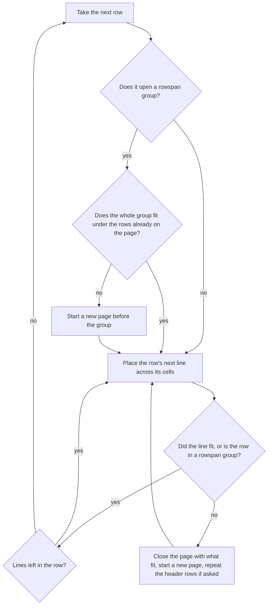

# Tables

`slide.addTable(rows, options)` draws a PowerPoint table from an array of rows, each an array of cells.

```ts
import { TsPptx } from 'pptx-ts'

const pptx = new TsPptx()
pptx.addSlide().addTable(
  [
    [{ text: 'Region' }, { text: 'Q1' }, { text: 'Q2' }],
    [{ text: 'North' }, { text: '120' }, { text: '145' }],
    [{ text: 'South' }, { text: '98' }, { text: '110' }],
  ],
  { x: 1, y: 1, w: 8, hasHeader: true },
)
await pptx.writeFile({ fileName: 'table.pptx' })
```

`addTable` returns the slide, so calls chain. A table also takes `objectName`, `altText` and `placeholder`, like any other slide object.

## Options at a glance

Table options (`TableProps`):

| Option | Type | Default | Effect |
| --- | --- | --- | --- |
| `x`, `y` | `Coord` | `0.5` | Top-left corner. |
| `w` | `Coord` | from `x` to the right slide margin, in whole inches | Table width, split evenly when `colW` is unset. |
| `h` | `Coord` | none | Table height. Fixes every row. |
| `colW` | `number \| number[]` | even split of `w` | Column widths in inches. |
| `rowH` | `number \| (number \| null)[]` | none | Row heights in inches. |
| `fitColumns` | `'shrink'` | none | Scales columns down to fit between `x` and the right margin. |
| `fit` | `'shrink'` | none | `fit` for every cell that sets none. |
| `slideMargin` | `Margin` | the master's margin, else `0.5` | Margins for the default width, `fitColumns` and auto-paging. |
| `headerRow` | `TableCellProps` | none | Formatting for every cell of row 0. Implies `hasHeader`. |
| `columns` | `TableCellProps[]` | none | Formatting for every cell that starts in column `i`. |
| `fill` | `FillOption` | none | Fill copied onto every cell that sets none. |
| `tableFill` | `FillOption` | none | One background behind the whole table. |
| `border` | `BorderProps` or a 4-tuple | no line, unless `tableStyle` is set | Every cell's own four edges. |
| `outerBorder` | `BorderProps` or a 4-tuple | none | The table's perimeter only. |
| `margin` | `Margin` | `[0.05, 0.1, 0.05, 0.1]` | Cell insets in inches, top, right, bottom, left. |
| `fontSize` | `number` | `12` | Text size in points. |
| `color` | `Color` | `'000000'`, or the theme text colour when a cell has a hyperlink | Text colour. |
| `tableStyle` | `TableStyle` | none | A built-in PowerPoint table style. |
| `hasHeader`, `hasFooter` | `boolean` | `false` | Turn on the style's first-row and last-row regions. |
| `hasBandedRows`, `hasBandedColumns` | `boolean` | `false` | Turn on the style's banding. |
| `hasFirstColumn`, `hasLastColumn` | `boolean` | `false` | Turn on the style's first-column and last-column regions. |
| `rtl` | `boolean` | `false` | Mirrors the column order for right-to-left scripts. |
| `autoPage` | `boolean` | `false` | Continues a table too tall for its slide onto the following slides. |
| `autoPageRepeatHeader` | `boolean` | `false` | Repeats the header rows on each continuation slide. |
| `autoPageHeaderRows` | `number` | `1` | How many leading rows make up the header. |
| `autoPageSlideStartY` | `number` | the top margin | Where the table starts on continuation slides, in inches. |
| `autoPagePlaceholder` | `boolean` | `false` | Copies the source slide's filled placeholders onto continuation slides. |
| `autoPageCharWeight` | `number` | `0` | Nudges the pager's characters-per-line estimate. |
| `autoPageLineWeight` | `number`, `-1` to `1` | `0` | Nudges the pager's line-height estimate. |

Cell options (`TableCellProps`) add these to every text option (`bold`, `italic`, `color`, `fontFace`, `fontSize`, `align`, `valign`, `textDirection`, `hyperlink` and the rest):

| Option | Type | Default | Effect |
| --- | --- | --- | --- |
| `colspan`, `rowspan` | `number` | `1` | Merge the cell across columns or rows. |
| `fill` | `FillOption` | inherited | Cell fill. |
| `border` | `BorderProps` or a 4-tuple | inherited | The cell's four edges. Replaces the table's `border` whole. |
| `diagonal` | `TableCellDiagonals` | none | Corner-to-corner rules. |
| `margin` | `Margin` | inherited | Cell insets in inches. |
| `anchorCtr` | `boolean` | `false` | Centres the block of text in the cell, whatever `align` says. |
| `horzOverflow` | `'clip' \| 'overflow'` | PowerPoint clips | What a single glyph wider than the cell does. |
| `cell3D` | `TableCell3DProps` | none | A bevel on the cell. |
| `fit` | `'shrink'` | the table's `fit` | Shrinks text that overflows a fixed row. |
| `autoPageCharWeight` | `number` | the table's | The pager nudge for this cell. |

## Write cells

A cell is an object with `text` and optional `options`. `text` is a string or an array of runs, and each run has the same `{ text, options }` shape:

```ts
import type { TableRow } from 'pptx-ts'

const row: TableRow = [
  { text: 'plain' },
  { text: 'styled', options: { bold: true, color: 'C00000' } },
  { text: [{ text: 'mixed ' }, { text: 'runs', options: { bold: true } }] },
  { text: [{ text: 'line one', options: { breakLine: true } }, { text: 'line two' }] },
]
```

- `TableRow` is `TableCell[]`, so TypeScript rejects a bare string or number as a cell. Plain JavaScript that passes one still works.
- A row under a `rowspan` lists only the cells that start in it. See [Merge cells](#merge-cells).
- The first row decides how many columns the table has.

## Style cells

Formatting resolves per property. The highest source that sets a property wins:

| # | Source | Applied |
| --- | --- | --- |
| 1 | the cell's own `options` | as authored |
| 2 | `headerRow` | to every cell of row 0 |
| 3 | `columns[i]` | to every cell starting in column `i` |
| 4 | table-level options | to every cell that set none |
| 5 | library defaults | stamped onto every cell as direct formatting |
| 6 | `tableStyle` | by the built-in style's own region rules |

- The merge happens per property, not per object. A header cell can take `bold` from `headerRow` and `fill` from its column.
- A cell's own `false` or `0` counts as set, so `bold: false` on a cell beats `bold: true` on the table.
- Fifteen table options reach the cells: `align`, `bold`, `border`, `charSpacing`, `color`, `fill`, `fontFace`, `fontSize`, `italic`, `lineSpacing`, `lineSpacingMultiple`, `margin`, `textDirection`, `underline` and `valign`. No other table option styles a cell.
- `columns[i]` goes to the cell that starts in grid column `i`, counting the `colspan`s earlier in its row and any `rowspan` from a row above.
- `headerRow` sets `hasHeader: true` unless you set `hasHeader` yourself.

Tier 5 writes four defaults onto every cell. They are direct formatting, so they beat a table style, and anything you set in tiers 1 to 4 beats them:

| Property | Default on every cell |
| --- | --- |
| `border` | no line on all four sides, on a table without `tableStyle` |
| `color` | `'000000'` |
| `fontSize` | `12` |
| `margin` | `[0.05, 0.1, 0.05, 0.1]` inches |

A hyperlink in any cell switches the black default off for the whole table. Otherwise the words after a link would stay black instead of taking the theme text colour.

To brand a table, use direct formatting:

```ts
slide.addTable(rows, {
  hasHeader: true,
  border: { type: 'solid', color: 'D9D9D9', width: 0.5 },
  headerRow: { fill: { color: '1A2B3C' }, color: 'FFFFFF', bold: true },
})
```

For a graduated header band, put the shared typography in `headerRow` with no fill, and give each column its own fill:

```ts
slide.addTable(rows, {
  headerRow: { color: 'FFFFFF', bold: true, align: 'center' },
  columns: [{}, { fill: { color: 'BBD3FB' } }, { fill: { color: '4B7BE5' } }],
})
```

For banded rows in brand colours, set `fill` on the cells of every other row as you build the data.

## Apply a built-in table style

```ts
import { TableStyle } from 'pptx-ts'

slide.addTable(rows, {
  tableStyle: TableStyle.MEDIUM_STYLE_2_ACCENT_1,
  hasHeader: true,
  hasBandedRows: true,
})
```

- The `has*` flags choose which regions of the style paint. Without `tableStyle` they paint nothing.
- `hasHeader` also marks the first row as a header for PowerPoint's accessibility checker, so set it on any table with a header row.
- PowerPoint paints only its own built-in styles. It looks the style up in its gallery and never reads a style definition from the file, so a custom table style cannot render. Brand colours go through `headerRow`, `columns`, `fill` and cell options.
- A styled table with no `border` leaves every edge to the style. Set `border: { type: 'none' }` to keep the style's fills and drop its grid.

## Fill cells and the table background

`fill` and `tableFill` usually look alike. They differ in where the paint lands:

- `fill` is copied onto each cell that gets no fill from its own options, `headerRow` or `columns`.
- `tableFill` is one background under the whole table. A cell with no fill of its own shows it.

Use `tableFill` when some cells should show the background, or to match a deck read back from PowerPoint, which stores its table background that way.

Both take a `FillOption`, as a cell's `fill` does:

```ts
import { SchemeColor, type FillOption } from 'pptx-ts'

const fills: FillOption[] = [
  'F2F2F2',
  { color: '0088CC', transparency: 50 },
  { color: SchemeColor.accent1 },
  {
    type: 'gradient',
    gradient: {
      kind: 'linear',
      angle: 90,
      stops: [
        { position: 0, color: 'FFFFFF' },
        { position: 100, color: '4B7BE5' },
      ],
    },
  },
  { type: 'pattern', pattern: { preset: 'diagCross', fgColor: '1A2B3C' } },
  { type: 'image', image: { path: 'logo.png' } },
]
```

- A bare colour string is a solid fill.
- A picture stretches to the cell and is embedded once, however many cells share it. It must be a raster image.
- [Fills and gradients](fills-and-gradients.md) covers every fill kind, and which ones a table takes.

## Draw borders

`border` styles each cell's own four edges, so a rule on it repeats across the grid. For the table's outline, use `outerBorder`.

<svg role="img" aria-label="Two three-by-three tables. On the left, border draws every cell edge. On the right, outerBorder draws only the outside of the table." viewBox="0 0 360 130" width="360" style="max-width:100%;height:auto">
<rect x="20" y="20" width="140" height="80" fill="none" stroke="currentColor" stroke-width="2"/>
<line x1="67" y1="20" x2="67" y2="100" stroke="currentColor" stroke-width="2"/>
<line x1="113" y1="20" x2="113" y2="100" stroke="currentColor" stroke-width="2"/>
<line x1="20" y1="47" x2="160" y2="47" stroke="currentColor" stroke-width="2"/>
<line x1="20" y1="73" x2="160" y2="73" stroke="currentColor" stroke-width="2"/>
<rect x="200" y="20" width="140" height="80" fill="none" stroke="currentColor" stroke-width="2"/>
<line x1="247" y1="20" x2="247" y2="100" stroke="currentColor" stroke-width="1" stroke-dasharray="3 3" opacity="0.35"/>
<line x1="293" y1="20" x2="293" y2="100" stroke="currentColor" stroke-width="1" stroke-dasharray="3 3" opacity="0.35"/>
<line x1="200" y1="47" x2="340" y2="47" stroke="currentColor" stroke-width="1" stroke-dasharray="3 3" opacity="0.35"/>
<line x1="200" y1="73" x2="340" y2="73" stroke="currentColor" stroke-width="1" stroke-dasharray="3 3" opacity="0.35"/>
<text x="90" y="120" fill="currentColor" font-size="12" font-family="monospace" text-anchor="middle">border</text>
<text x="270" y="120" fill="currentColor" font-size="12" font-family="monospace" text-anchor="middle">outerBorder</text>
</svg>

```ts
// Every cell edge: a full grid.
slide.addTable(rows, { border: { type: 'solid', color: 'D9D9D9', width: 0.5 } })

// Only the outside: a box with no interior lines.
slide.addTable(rows, { outerBorder: { type: 'solid', color: '1A2B3C', width: 1 } })

// Light lines between rows, and a heavier rule above and below the table.
const hairline = { type: 'solid', color: 'D9D9D9' } as const
const none = { type: 'none' } as const
slide.addTable(rows, {
  border: [hairline, none, hairline, none],
  outerBorder: [{ type: 'solid', width: 2 }, undefined, { type: 'solid', width: 2 }, undefined],
})
```

Each side of a cell ends up in one of these states:

| The side gets | What is written | Table style shows through |
| --- | --- | --- |
| nothing, on a table without `tableStyle` | an explicit no-line (the default) | no |
| nothing, on a table with `tableStyle` | nothing | yes |
| `null` in a tuple | nothing | yes |
| `{ type: 'none' }` | an explicit no-line | no |
| a `BorderProps` | that rule | no |

- A single `BorderProps` covers all four sides. A tuple reads `[top, right, bottom, left]`.
- A cell's own `border` replaces the table's `border` whole. The two do not merge side by side.
- A rule with keys left out draws `solid`, colour `666666`, 1 pt wide.
- `outerBorder` applies last, and only on the perimeter. An `undefined` side leaves that edge as `border` drew it.
- The perimeter follows grid position, so a merged cell that reaches the last column gets the right-hand rule.

### Use a dash style

`type` is `'solid'`, `'dash'` or `'none'`. `dashType` takes any of PowerPoint's preset dashes and wins over `type`, except that `type: 'none'` removes the line first:

```ts
slide.addTable(rows, { border: { type: 'solid', color: '999999', dashType: 'lgDashDot' } })
```

An unknown `dashType` warns and falls back to what `type` implies: `'dash'` draws `sysDash`, and anything else draws solid.

### Strike a cell with a diagonal

```ts
import type { TableCell } from 'pptx-ts'

const struck: TableCell = { text: 'n/a', options: { diagonal: { tlToBr: { type: 'solid', color: 'C00000' } } } }
const crossed: TableCell = { text: '', options: { diagonal: { tlToBr: { type: 'solid' }, blToTr: { type: 'solid' } } } }
```

- A merged cell draws its diagonal once, corner to corner across the whole region.
- A diagonal with no `color` draws in `363636`, not the edge default.

## Merge cells

```ts
slide.addTable(
  [
    [{ text: 'Wide', options: { colspan: 3 } }],
    [{ text: 'Tall', options: { rowspan: 2 } }, { text: 'B2' }, { text: 'C2' }],
    [{ text: 'B3' }, { text: 'C3' }],
  ],
  { x: 1, y: 1, w: 9 },
)
```

<svg role="img" aria-label="The merged table from the example: Wide spans the three columns of the first row, Tall spans the first column of the second and third rows, and B2, C2, B3 and C3 fill the rest." viewBox="0 0 240 100" width="240" style="max-width:100%;height:auto">
<rect x="10" y="10" width="220" height="80" fill="none" stroke="currentColor" stroke-width="1.5"/>
<line x1="10" y1="37" x2="230" y2="37" stroke="currentColor" stroke-width="1.5"/>
<line x1="83" y1="63" x2="230" y2="63" stroke="currentColor" stroke-width="1.5"/>
<line x1="83" y1="37" x2="83" y2="90" stroke="currentColor" stroke-width="1.5"/>
<line x1="157" y1="37" x2="157" y2="90" stroke="currentColor" stroke-width="1.5"/>
<text x="120" y="28" fill="currentColor" font-size="11" font-family="monospace" text-anchor="middle">Wide</text>
<text x="46" y="67" fill="currentColor" font-size="11" font-family="monospace" text-anchor="middle">Tall</text>
<text x="120" y="54" fill="currentColor" font-size="11" font-family="monospace" text-anchor="middle">B2</text>
<text x="193" y="54" fill="currentColor" font-size="11" font-family="monospace" text-anchor="middle">C2</text>
<text x="120" y="81" fill="currentColor" font-size="11" font-family="monospace" text-anchor="middle">B3</text>
<text x="193" y="81" fill="currentColor" font-size="11" font-family="monospace" text-anchor="middle">C3</text>
</svg>

- Put `colspan` or `rowspan` on the cell that starts the span.
- A row under a `rowspan` leaves out the covered cell. The library builds the full grid.
- A covered position repeats the origin's fill and edges. It never renders, but it holds the region's outer edges, which is where PowerPoint reads them.
- A span is a whole number from 1 to 1000. Anything else warns and becomes 1. A span that reaches past the table's edge warns and stops at the edge.
- A cell that starts past the last column is dropped with a warning.

## Set column widths

```ts
slide.addTable(rows, { x: 0.5, y: 1, colW: [1.5, 4, 4, 4], fitColumns: 'shrink' })
```

- `colW: 2` gives every column 2 inches, and the table is as wide as its columns.
- An array sets each column. An array whose length differs from the column count warns and splits `w` evenly. A one-entry array applies to every column. A slot that is not a number warns and takes an even share of the table width.
- Without `colW`, `w` is split evenly. Without `w` either, the table runs from `x` to the right slide margin, rounded down to whole inches.
- `fitColumns: 'shrink'` scales every column by the same factor when the table is wider than the space from `x` to the right margin. It never widens a column and sets no minimum width.
- `slideMargin` replaces the master's margins in these calculations.

## Set row heights

Whether a row is fixed decides whether it grows with its text and whether `fit: 'shrink'` can act on it:

| You set | The row is | `fit: 'shrink'` |
| --- | --- | --- |
| a `rowH` entry above zero for the row | fixed at that entry | applies |
| a single `rowH` number above zero | fixed at that number, like every row | applies |
| `h`, and no usable `rowH` entry for the row | fixed at `h` divided by the row count | applies |
| neither | auto: it grows to fit its text | never |

```ts
slide.addTable(rows, { x: 1, y: 1, w: 8, rowH: [0.6, null, null, 0.4] })
```

- A `null` or missing slot is silent. `0`, a negative or a non-number warns, then the row falls through to the next line of the table above.
- An unfixed row in a table with `h` gets `h` divided by the row count, not the height the fixed rows left over. Mixing `rowH` entries with `h` can make the rows add up to more or less than `h`.
- A table bound to a layout `placeholder` takes the placeholder's height when you give no `h`, and that fixes its rows.
- `pptx.tableLayout(rows, options)` returns each cell's rectangle without adding the table. It estimates auto rows and marks them `heightExact: false`.

## Fit text in a fixed row

`fit: 'shrink'` on a cell or on the table bakes a smaller font size into a cell whose wrapped text is taller than its fixed row. [Text that fits](text-fit.md) has the full rules.

```ts
await pptx.registerFontMetrics('Aptos', fontBytes)
slide.addTable(rows, { x: 1, y: 1, w: 8, rowH: 0.4, fontFace: 'Aptos', fit: 'shrink' })
```

- It needs font metrics registered with `registerFontMetrics`. With none registered at all, it does nothing and reports nothing.
- It skips auto rows, which grow instead. `'resize'` is accepted on cells and ignored.
- Cell text always wraps. `horzOverflow: 'overflow'` only lets a single glyph wider than the cell draw past its edge.

## Page a long table across slides

```ts
const first = pptx.addSlide()
first.addTable(rows, {
  x: 0.5,
  y: 1.2,
  w: 9,
  autoPage: true,
  autoPageRepeatHeader: true,
  autoPageSlideStartY: 0.5,
})
for (const next of first.newAutoPagedSlides ?? []) {
  next.addText('continued', { x: 0.5, y: 0.1, w: 3, h: 0.3 })
}
```

The pager walks the rows in order and places each one line at a time:



- A page is `h` tall when `h` is set. Otherwise it runs from the start `y` to the slide's bottom margin.
- The first page starts at `y`. Later pages start at `autoPageSlideStartY`, or at the top margin, or at `y` when `y` is higher on the slide than the margin.
- A row that does not fit splits between lines, and the rest of it continues on the next page.
- Rows joined by a `rowspan` stay on one page. A group taller than a page is kept whole, runs past the bottom, and warns.
- The pager estimates. It counts characters per line from the column width and font size, and prices each line from the font size plus the row's margins. `autoPageCharWeight` and `autoPageLineWeight` nudge those two estimates when a font breaks differently.
- It never breaks inside a word. A word wider than its column overflows it, so widen the column, lower `fontSize`, or add a `breakLine`.
- Continuation pages go on the slides after this one. A slide that already exists there gets the table on top of its content, and missing slides are added with the same layout. `slide.newAutoPagedSlides` lists them.
- `headerRow` formatting and the `hasHeader` marker apply to the first page only, unless the header rows repeat. `columns` applies on every page, and `rowH` entries stay with their rows.
- `autoPagePlaceholder: true` copies the placeholders you filled on the source slide, such as its title, onto each continuation slide.

## Invalid input

| Condition | Result | Code |
| --- | --- | --- |
| `rows` is empty or not an array | throws `InvalidOptionError` | `table/rows-not-an-array` |
| a row is not an array | throws `InvalidOptionError` | `table/rows-not-nested` |
| `border` is a string, on the table or a cell | warns, and that border is ignored | `table/invalid-border` |
| `outerBorder` is a string | warns, ignored | `table/invalid-outer-border` |
| unknown `dashType` | warns, falls back to `type` | `border/invalid-dash-type` |
| an unknown key on a border object | warns | `border/unknown-key` |
| `horzOverflow` outside `'clip'` and `'overflow'` | warns, ignored | `table/invalid-horz-overflow` |
| a `cell3D` value outside its list, a negative size, or a `lightRig` missing `rig` or `dir` | warns, that part ignored | `table/invalid-cell3d` |
| a single `colW` that is not a positive number | warns, default width | `table/invalid-col-width` |
| a `colW` slot that is not a number | warns, even share | `table/invalid-col-width` |
| a `colW` array of the wrong length | warns, even split | `table/col-width-count-mismatch` |
| a `rowH` entry that is `0`, negative or not a number | warns, row not fixed by it | `table/invalid-row-height` |
| `margin` that is not a number or four numbers | warns, default margin | `table/invalid-margin` |
| a margin of 1 or more | warns (likely points, not inches) | `margin/legacy-points` |
| `colspan` or `rowspan` not a whole number from 1 to 1000, or past the table's edge | warns, 1 or cut at the edge | `table/span-out-of-range` |
| a cell starting past the last column | warns, cell dropped | `table/cell-past-grid` |
| `autoPageHeaderRows` not a whole number from 1 to the row count | warns, uses 1 | `table/invalid-header-row-count` |
| `h` too small to hold one line | warns, uses the slide height | `table/autopage-height-too-small` |
| a rowspan group taller than a page | warns, kept together | `table/autopage-rowspan-too-tall` |
| an empty string as a colour | warns, ignored | `color/empty-string` |
| an SVG picture fill | warns, ignored | `image-fill/svg-unsupported` |
| `fit: 'shrink'` on a font it cannot measure | warns | `measure/shrink-unmeasured` |

Editing an existing table throws instead of warning. See [Reading it back](#reading-it-back).

## Limits

- Only PowerPoint's built-in table styles render. A custom table style never does.
- Cell text always wraps. PowerPoint has no per-cell no-wrap.
- Screen-reader links from a cell to its header cells cannot be authored. PowerPoint deletes them on the first save, and `hasHeader` is the header marker it keeps.
- No table-level effects, such as a shadow on the whole table. PowerPoint has no control for one.
- A span covers at most 1000 columns or rows.
- The first row sets the column count.
- Auto-paging estimates text size and never breaks inside a word.
- `fit: 'shrink'` needs registered font metrics and a fixed row.
- `fitColumns` only shrinks, with no minimum width.
- `pptx.tableLayout()` does not model auto-paging.

## Reading it back

`pptx-ts/read` opens a table in any deck, including one this library did not write:

```ts
import { readFile, writeFile } from 'node:fs/promises'
import { Presentation } from 'pptx-ts/read'

const deck = await Presentation.load(await readFile('deck.pptx'))
for (const slide of deck.slides) {
  for (const shape of slide.shapes) {
    if (shape.shapeType !== 'graphicFrame' || !shape.table) continue
    const table = shape.table
    const corner = table.cell(0, 0)
    if (corner) {
      console.log(corner.text, corner.resolvedFill?.effectiveHex, corner.hasOwnFill)
      corner.text = 'Region'
      corner.setFillColor('1A2B3C')
    }
    table.addRow()
  }
}
await writeFile('deck-edited.pptx', await deck.save())
```

- `Table` has `rows`, `rowCount`, `columnCount`, `columnWidths` (EMU), `styleId`, `resolvedStyle`, `firstRowHeader`, `bandedRows`, and its background through `resolvedFill`, `gradientFill`, `patternFill` and `pictureFill`.
- `TableCell` has `text`, `textFrame`, `gridSpan`, `rowSpan`, `isMergeContinuation`, `borders` (four edges and two diagonals), `marginsEmu`, `anchor`, `anchorCtr`, `verticalText`, `horzOverflow`, `cell3D`, and its fill.
- `resolvedFill` is the colour a cell renders, table style banding included. `hasOwnFill` says whether that colour is the cell's own. Check it before copying a colour, or the copy stops following its style.
- A stored table has a cell for every grid position, with covered cells present and marked `isMergeContinuation`.
- Cells edit through `setAnchor`, `setVerticalText`, `setHorzOverflow`, `setAnchorCtr`, `setMarginsEmu`, `setBorder`, `setFillColor`, `setFillSchemeColor` and `noFill`. The table edits its structure through `addRow`, `removeRow`, `addColumn`, `removeColumn`, `mergeCells` and `unmergeCell`.
- `setBorder(edge, null)` and `setFillColor(null)` remove the setting so the style shows again. `setBorder(edge, { noFill: true })` and `noFill()` write an explicit "none" that hides it.
- Inserting a row or column inside a merge extends the merge. Removing a merge's origin hands the region to its next cell. `mergeCells` refuses a range that cuts through an existing merge, and `unmergeCell` refuses a covered cell.
- An invalid edit throws `InvalidOptionError` instead of leaving the deck unchanged: `table/invalid-cell-anchor`, `table/invalid-cell-vert`, `table/invalid-cell-overflow`, `table/invalid-cell-margin`, `table/invalid-cell-border`, `table/row-index-out-of-range`, `table/column-index-out-of-range` or `table/merge-range-invalid`. A bad colour throws `color/invalid-hex` or `color/invalid-scheme-token`.

[Read object model](reference/read-object-model.md#tables) lists every member.

## See also

- [Text that fits](text-fit.md)
- [Fills and gradients](fills-and-gradients.md)
- [HTML tables to slides](html-tables.md)
- [Read and edit a deck](reading/read-and-edit.md)
- [Errors and warnings](errors-and-warnings.md)
- API reference: [`TableProps`](reference/api/index/interfaces/TableProps.md), [`TableCellProps`](reference/api/index/interfaces/TableCellProps.md), [`TableCell`](reference/api/index/interfaces/TableCell.md), [`TableRow`](reference/api/index/type-aliases/TableRow.md), [`TableCellDiagonals`](reference/api/index/interfaces/TableCellDiagonals.md), [`TableCell3DProps`](reference/api/index/interfaces/TableCell3DProps.md), [`BorderProps`](reference/api/index/type-aliases/BorderProps.md), [`FillOption`](reference/api/index/type-aliases/FillOption.md), [`TableStyle`](reference/api/index/enumerations/TableStyle.md), [`TableLayoutResult`](reference/api/index/interfaces/TableLayoutResult.md)
