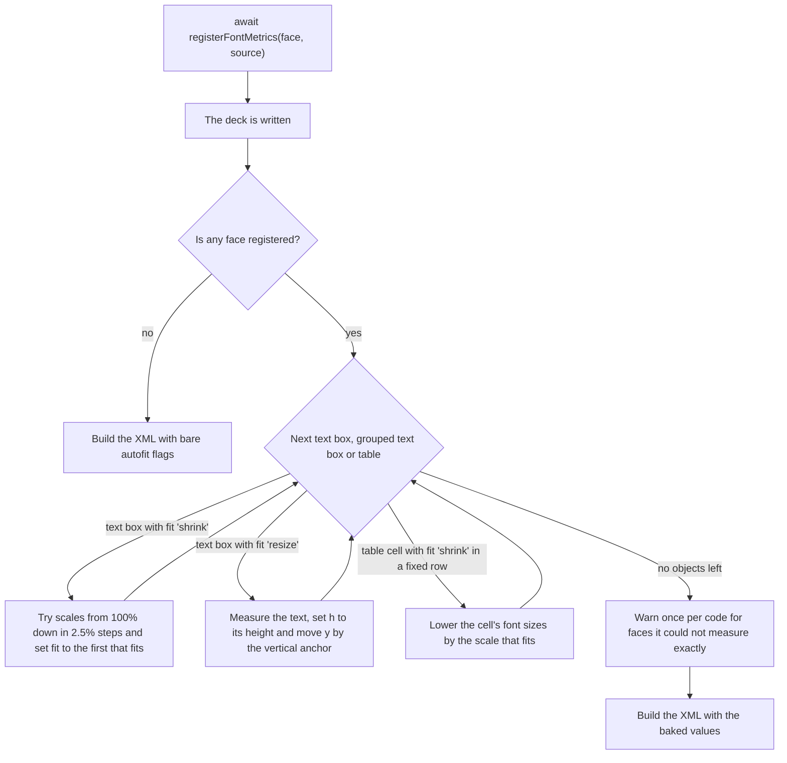

# Text that fits

`fit: 'shrink'` and `fit: 'resize'` ask for text that fits its box. Register the box's font with `registerFontMetrics`, and the library measures the wrapped text as it writes the deck and stores the result in the file: `'shrink'` writes the font scale that fits, and `'resize'` writes the height the text needs.

```ts
import { TsPptx } from 'pptx-ts'

const pptx = new TsPptx()
await pptx.registerFontMetrics('Aptos', '/fonts/Aptos.ttf')
pptx.addSlide().addText('Quarterly results for the northern region, by product line', {
  x: 1,
  y: 1,
  w: 3,
  h: 1,
  fontFace: 'Aptos',
  fontSize: 28,
  fit: 'shrink',
})
await pptx.writeFile({ fileName: 'fit.pptx' })
```

With no font registered, `'shrink'` and `'resize'` write the bare autofit flag, `<a:normAutofit/>` or `<a:spAutoFit/>`, with no result in it. PowerPoint computes the fit only after the text or the box is edited.

## Options at a glance

| Option | Type | Default | Effect |
| --- | --- | --- | --- |
| `fit` on a text box | `'none' \| 'shrink' \| 'resize' \| TextFitShrinkProps` | `'none'` | `'shrink'` bakes a font scale, `'resize'` bakes a height, and the object form is written as given. |
| `fit` on a table or a cell | `'shrink'` | none | Bakes a smaller font size into a cell whose text overflows its fixed row. |
| `registerFontMetrics(face, …)` | `string` | required | The family name your `fontFace` options use. Case is ignored. |
| `registerFontMetrics(…, source)` | `string \| Uint8Array \| ArrayBuffer` | required | A font file path or URL, or its bytes: `.ttf`, `.otf`, `.ttc` or `.otc`. |
| `bold`, `italic` | `boolean` | `false` | Registers the metrics for that variant. |
| `font` | `number \| string` | `face` for a collection, the only font otherwise | Which font of a collection: an index from 0, or a name. |

`measureText` and `overflowsBox` take `MeasureTextOptions`:

| Option | Type | Default | Effect |
| --- | --- | --- | --- |
| `wIn` | `number` | required | Width available to the text, in inches. |
| `insetIn` | `number` | `0` | Taken off both sides of `wIn`, so `wIn` can be the box width. |
| `fontSize` | `number` | required | Size in points. |
| `fontFace` | `string` | none | The family to measure. Without it the text cannot be measured. |
| `bold`, `italic` | `boolean` | `false` | The variant to measure. |
| `charSpacing` | `number` | `0` | Points added after every character. |
| `lineSpacing` | `number` | single spacing | Exact line pitch in points. Wins over `lineSpacingMultiple`. |
| `lineSpacingMultiple` | `number` | `1` | Line pitch as a multiple of single spacing. |
| `paraSpaceBefore`, `paraSpaceAfter` | `number` | `0` | Points before and after each paragraph. |
| `hIn` | `number` | required by `overflowsBox` | The inner height to test against, in inches. |

## Register font metrics

```ts
await pptx.registerFontMetrics('Aptos', '/fonts/Aptos.ttf')
await pptx.registerFontMetrics('Aptos', '/fonts/Aptos-Bold.ttf', { bold: true })
```

- A string `source` is a file path, or an `http` or `https` URL. It is never base64: pass bytes instead.
- Register each weight and style your fitted text uses. A bold run with no bold registration is measured with the face's regular metrics, or with any variant registered for that face.
- `registerFontMetrics` returns a promise, and the measuring that follows is synchronous. Await every registration before you write the deck or call `measureText`.
- One registration turns measuring on for the whole deck. [Handle a face with no metrics](#handle-a-face-with-no-metrics) covers the boxes whose face you did not register.

## Register one font from a collection

A `.ttc` or `.otc` file holds several fonts. `msgothic.ttc` holds MS Gothic, MS UI Gothic and MS PGothic.

```ts
import { readFile } from 'node:fs/promises'
import { listFontFaces } from 'pptx-ts/measure'

const bytes = new Uint8Array(await readFile('C:/Windows/Fonts/msgothic.ttc'))
console.log(listFontFaces(bytes).map((f) => `${f.index} ${f.family}`))
// [ '0 MS Gothic', '1 MS UI Gothic', '2 MS PGothic' ]

await pptx.registerFontMetrics('MS PGothic', bytes)
await pptx.registerFontMetrics('Gothic body', bytes, { font: 0 })
```

- In a collection, `face` picks the font when `font` is not set. It matches the family, full or PostScript name, ignoring case.
- `font` picks by index from 0, or by the same names. Use it when your `fontFace` differs from the name inside the file.
- A name or index that matches no font throws. The library does not fall back to the first font, because the wrong font's widths look as plausible as the right one's: MS Gothic sets an English pangram 15% wider than MS PGothic at the same size.
- A plain `.ttf` or `.otf` counts as a list of one. It registers under any `face`, and a `font` other than `0` or the file's own name throws.
- `isFontCollection(bytes)` tells a collection from a plain font.

## Embed the font too

`registerFontMetrics` and `embedFont` both take a font file and a family name, and they do different jobs:

| | `registerFontMetrics(face, source, options)` | `embedFont({ path, data, typeface, style })` |
| --- | --- | --- |
| Job | reads advance widths to measure text | copies the font into the `.pptx` |
| Adds to the file | nothing | the font part |
| A string source | a path or URL | `path` is a path or URL, `data` is base64 |
| Variants | `bold` and `italic` flags | `style`: `'regular'`, `'bold'`, `'italic'` or `'boldItalic'` |

Registering does not make a machine without the font draw it, and embedding does not turn on measuring. To fit text and ship its font, call both with the same family name. See [Embedded fonts](embedded-fonts.md).

## Choose shrink or resize

- The box has a fixed place in the layout, such as a card or a column: use `'shrink'`. The box stays as drawn and the text gets smaller.
- The text size is fixed and the box can change height: use `'resize'`. The box takes the height of its text, taller or shorter than you drew it.
- Other shapes are laid out around the box, such as a card background or an icon: `'resize'` moves only the text box. Measure the text first and size every shape from the result, as in [Measure text before export](#measure-text-before-export).
- Neither the size nor the box may change: leave `fit` off and check the text with `overflowsBox`.
- A table cell: `'shrink'` is the only choice. See [Shrink text in a table cell](#shrink-text-in-a-table-cell).

When the deck is written, one pass runs before any XML is built:



## Shrink text into its box

- The pass lays the text out at 100%, 97.5%, 95% and so on, and writes the first scale at which it fits, such as `<a:normAutofit fontScale="85000"/>` for 85%.
- Text that fits at 100% keeps the bare `<a:normAutofit/>`.
- The scale stops at 25%. Text that still overflows there gets 25%.
- Only the font scale changes. PowerPoint also reduces line spacing by up to 20% to keep a larger font, and the pass does not, so its scale is never larger than PowerPoint's and can be smaller.
- With `wrap: false`, each paragraph is one line, and the widest line also has to fit the box width.
- The vertical anchor does not change the scale.
- Text boxes inside a group are measured at their authored size, like any other.
- `fit: { type: 'shrink', fontScale: 85 }` is written as given and never measured.

## Resize the box to its text

```ts
slide.addText(body, { x: 1, y: 1, w: 4, h: 1, fontFace: 'Aptos', fontSize: 14, fit: 'resize', valign: 'top' })
```

- The pass sets `h` to the measured text height plus the top and bottom insets, and keeps `<a:spAutoFit/>` beside it.
- The box grows when the text needs more room and shrinks when it needs less.
- `valign` decides which edge stays put:

| `valign` | `y` moves by | The box |
| --- | --- | --- |
| `'top'` | nothing | grows down |
| `'middle'`, or unset | half the height change | grows both ways |
| `'bottom'` | the whole height change | grows up |

- Nothing holds a bottom-anchored box at the slide edge. A box that grows by more than its distance from the top gets a negative `y`.
- The width never changes. With `wrap: false`, a line wider than the box runs past its edge, where PowerPoint would widen the box.

## Shrink text in a table cell

```ts
await pptx.registerFontMetrics('Aptos', fontBytes)
slide.addTable(rows, { x: 1, y: 1, w: 8, rowH: 0.4, fontFace: 'Aptos', fit: 'shrink' })
```

- PowerPoint has no autofit inside a table cell, so the pass writes a smaller font size into the cell's runs, rounded down to 0.1 pt.
- Only cells in fixed-height rows shrink. A row with no `rowH` entry and no table `h` grows instead.
- `'resize'` and the object form are ignored on cells.
- [Tables](tables.md#fit-text-in-a-fixed-row) covers which rows are fixed and how `fit` passes from the table to its cells.

## Handle a face with no metrics

| Case | Result | Warning |
| --- | --- | --- |
| The deck registered no face | bare flags on every text box, table cells unchanged | none |
| The box's `fontFace` is registered | measured | none |
| Another face is registered, but not the box's `fontFace` | measured with average character widths, biased wide | `measure/heuristic-metrics` |
| Another face is registered, and the box has no `fontFace` | bare flag, table cell unchanged | `measure/shrink-unmeasured` or `measure/resize-unmeasured` |
| A registered face has no glyph for a character | measured with the font's missing-glyph width | `measure/uncovered-codepoints` |

- Each warning fires once per write and lists the faces or characters.
- Text with no `fontFace` takes the theme font, and the pass does not work out which face the theme names. Set `fontFace` on fitted text.
- PowerPoint draws a character the named font lacks from a substitute font, at that font's width. The missing-glyph width can be wider or narrower. Narrower loses a line, and the text overflows. Register a face that covers the text.

## Measure text before export

`pptx.measureText(text, options)` lays text out with the same model the pass uses, so you can size shapes before you add them:

```ts
import { TsPptx } from 'pptx-ts'

const pptx = new TsPptx()
await pptx.registerFontMetrics('Aptos', '/fonts/Aptos.ttf')

const title = 'Quarterly results for the northern region'
const m = pptx.measureText(title, { wIn: 4, insetIn: 0.1, fontSize: 24, fontFace: 'Aptos' })
const textH = m.heightIn + 0.1 // plus the default top and bottom insets

const slide = pptx.addSlide()
slide.addShape('roundRect', { x: 1, y: 1, w: 4, h: textH + 0.4, fill: { color: 'F2F2F2' } })
slide.addText(title, { x: 1, y: 1.2, w: 4, h: textH, fontFace: 'Aptos', fontSize: 24 })
```

| Member | Returns |
| --- | --- |
| `heightIn` | the laid-out height in inches, without insets |
| `lineCount` | the number of wrapped lines |
| `widestLineIn` | the widest line in inches. With a very large `wIn`, the width of the text on one line |
| `measurable` | `false` when there is no `fontFace` or the run array is empty |
| `approximatedFaces` | the named faces measured with average character widths |
| `uncoveredCodepoints` | sorted code points a registered face has no glyph for |
| `fitsBox(hIn)` | whether the text fits an inner height of `hIn` inches at full size |
| `shrinkScaleFor(hIn)` | the percent scale `'shrink'` would bake for that inner height, `100` when it fits |

`pptx.overflowsBox(text, { ...options, hIn })` is `true` when the text can be measured and does not fit `hIn`. Text it cannot measure returns `false`.

- `wIn` is the width inside the insets. To pass the box width, add `insetIn`. A text box's default insets are 0.1 in on the left and right and 0.05 in at the top and bottom.
- Results err tall: each width counts 3% wide and the height 4% tall, the same margins the pass bakes with. `overflowsBox` can report overflow for text PowerPoint fits, so treat it as a warning.
- A non-empty `uncoveredCodepoints` means the height can come out short.
- With at least one face registered, `measureText` and the pass share one run converter, one font lookup and one layout. `shrinkScaleFor(h)` equals the scale the pass bakes for that inner box, and `heightIn` equals the height `'resize'` bakes, less the insets.
- They differ when no face is registered. `measureText` still measures every named face with average character widths and lists it in `approximatedFaces`, while the pass writes bare flags. Check `approximatedFaces` when you need an exact number.

`measureText`, `overflowsBox` and `tableLayout` come from the `measure` family. `new TsPptx()` has them. A deck from `createPresentation` has them only when it asks, and without them the call throws `family/not-composed`. The fit pass runs either way.

```ts
import { createPresentation } from 'pptx-ts'
import { measure } from 'pptx-ts/families'

const deck = createPresentation({ use: [measure] })
```

## Measure without a presentation

`pptx-ts/measure` exports the model as plain functions, for layout code that has no `TsPptx`:

```ts
import { readFile } from 'node:fs/promises'
import { FontMetricsRegistry, measureText, parseFontMetrics } from 'pptx-ts/measure'

const registry = new FontMetricsRegistry()
registry.set('Aptos', await parseFontMetrics(new Uint8Array(await readFile('/fonts/Aptos.ttf'))))
const m = measureText(registry, 'Quarterly results', { wIn: 2.8, fontSize: 24, fontFace: 'Aptos' })
```

| Export | Use |
| --- | --- |
| `measureText(registry, text, options)` | the measurement `pptx.measureText` makes, against your registry |
| `FontMetricsRegistry` | metrics by face: `set(face, metrics, { bold, italic })`, `get`, `hasFace`, `hasCodepoint` |
| `parseFontMetrics(bytes, { font })` | parses a font file, or one font of a collection |
| `listFontFaces(bytes)`, `isFontCollection(bytes)` | what a font file holds |
| `getHeuristicFontMetrics()` | the average character widths used for a face without metrics |
| `makeRegistryResolver(registry)`, `buildFitParagraphs(runs, options)` | the font lookup and run converter the pass uses |
| `measureLayout`, `measureHeightPt`, `solveShrink`, `solveResize` | the layout and both solvers, in points |
| `SINGLE_LINE_PITCH`, `FONT_SCALE_STEP_PCT`, `MIN_FONT_SCALE_PCT`, `WIDTH_SAFETY_FACTOR`, `HEIGHT_SAFETY_FACTOR` | the model's constants |

`parseFontMetrics` loads opentype.js the first time it runs. Importing the subpath does not load it.

## Invalid input

| Condition | Result | Code |
| --- | --- | --- |
| `source` is not a string, `Uint8Array` or `ArrayBuffer` | throws `InvalidOptionError` | `font/missing-source` |
| a path that cannot be read, or base64 text, under Node | throws `MediaError` | `font/read-failed` |
| a URL that does not load | throws `MediaError` | `font/fetch-failed` |
| bytes that are not a font the parser reads | throws `MediaError` | `font/parse-failed` |
| a `font` index outside the file | throws `InvalidOptionError` | `font/collection-index-out-of-range` |
| a `font` name, or a collection's `face`, that names no font in the file | throws `InvalidOptionError` | `font/collection-face-not-found` |
| fitted text with no `fontFace`, in a deck with a registered face | warns, bare flag | `measure/shrink-unmeasured`, `measure/resize-unmeasured` |
| a `fontFace` with no metrics, in a deck with a registered face | warns, measured with average widths | `measure/heuristic-metrics` |
| a character the registered face has no glyph for | warns, measured with the missing-glyph width | `measure/uncovered-codepoints` |
| `wIn`, `insetIn` or `hIn` that is not a finite number | throws `InvalidOptionError` | `coord/non-finite` |
| `wIn` not wider than twice `insetIn`, or `hIn` not above 0 | throws `InvalidOptionError` | `coord/not-positive` |
| `measureText`, `overflowsBox` or `tableLayout` on a deck composed without `measure` | throws `UnsupportedFeatureError` | `family/not-composed` |

## Limits

Chinese and Japanese text breaks between any two characters and Korean text breaks at spaces, as in PowerPoint. Everything else below is an approximation:

| Approximation | Which way it errs |
| --- | --- |
| Widths add up each character's advance, with no kerning or ligatures | wide: text shrinks a little more, or grows a little taller, than in PowerPoint |
| Widths count 3% wide and heights 4% tall | wide and tall |
| Single line spacing is 1.2117 times the font size, measured on Aptos, Aptos SemiBold, Calibri, Tahoma and Arial | not checked on other fonts |
| `'shrink'` never reduces line spacing | small: a lower scale than PowerPoint picks |
| A face with no metrics uses average character widths | wide |
| A character the registered face lacks takes the missing-glyph width | either way, and it is reported |
| No kinsoku: the model breaks before `、` where PowerPoint hangs it past the edge | the same line count, and a narrower `widestLineIn` |
| A tab counts as one space | narrow: a line with tabs can measure short |
| Bullets and paragraph indents are not read | narrow: indented text can measure short |
| Text columns and vertical text are not read | either way |
| Right-to-left text and scripts that need shaping are not modeled | either way |
| `'resize'` never changes the width | a `wrap: false` line wider than the box runs past its edge |
| The theme font is not resolved | text with no `fontFace` is not measured |

The model and its calibration against PowerPoint-authored decks are described in the [design notes](https://github.com/shbernal/ts-pptx/blob/master/docs/contributing/design/text-fit.md).

## Reading it back

A deck opened through `pptx-ts/read` reports what was baked on a shape's `textFrame`:

| Member | Returns |
| --- | --- |
| `autofit` | `'none'`, `'normAutofit'` or `'spAutoFit'` |
| `autofitFontScale` | the baked font scale in percent, or `null` for a bare flag |
| `autofitLineSpaceReduction` | the baked line spacing reduction in percent, or `null` |

A resized box's baked height is the shape's `height`, in EMU. See [Read object model](reference/read-object-model.md#autofit).

## See also

- [Tables](tables.md)
- [Groups](groups.md)
- [Embedded fonts](embedded-fonts.md)
- [Smaller bundles](bundle-size.md)
- [Read and edit a deck](reading/read-and-edit.md)
- [Errors and warnings](errors-and-warnings.md)
- API reference: [`TsPptx`](reference/api/index/classes/TsPptx.md), [`TextFitShrinkProps`](reference/api/index/interfaces/TextFitShrinkProps.md), [`MeasureTextOptions`](reference/api/index/interfaces/MeasureTextOptions.md), [`OverflowBoxOptions`](reference/api/index/interfaces/OverflowBoxOptions.md), [`TextMeasurement`](reference/api/index/interfaces/TextMeasurement.md)
